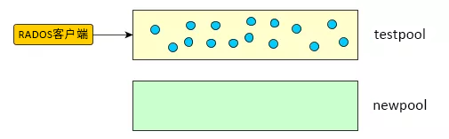
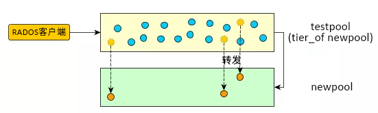
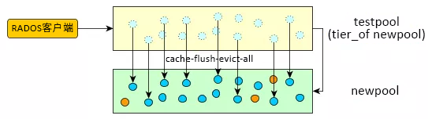
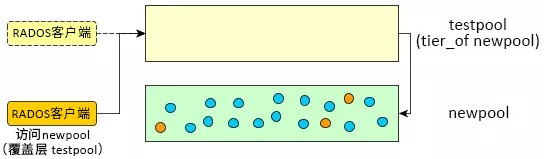
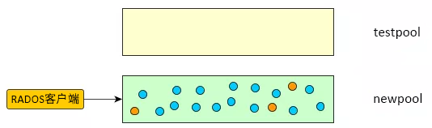
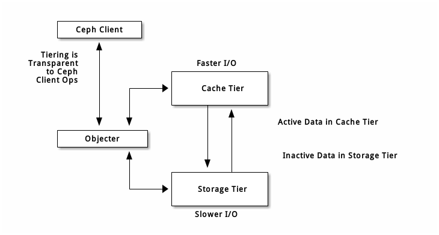

# SES 运维手册

- \[x\]: 仔细测试
- \[???\]: 未完成

## 简介

《SES（SUSE Enterprise Storage）5 运维手册》汇总了在使用 SUSE 企业存储产品中常见的运维和操作问题，主要用于指导运维人员的相关工作。

本书的内容主要参考了 Ceph 官方文档，技术博客，SUSE 官网提供的 support 案例及其他相关文档。具体参考来源如下：

- [Ceph 官方文档提供的故障处理案例](http://docs.ceph.com/docs/master/rados/troubleshooting/)
    - [Ceph 中文文档](http://docs.ceph.org.cn/)
- [Ceph 运维手册](https://lihaijing.gitbooks.io/ceph-handbook/content/)
- SUSE 官方文档
    - [SES 5 文档提供的故障处理案例](https://www.suse.com/documentation/suse-enterprise-storage-5/singlehtml/book_storage_admin/book_storage_admin.html#part.troubleshooting)
    - [SES 5 支持页面的案例目录](https://www.suse.com/zh-cn/support/kb/?id=SUSE_Enterprise_Storage&q=&doctype%5B%5D=&bu_suse=true&advanced=false&from=&to=&searchFor=all&sortby=relevance)
- [RedHat Troubleshooting Guide](https://access.redhat.com/documentation/en-us/red_hat_ceph_storage/3/html/troubleshooting_guide/)


## SES 安装

### 集群部署和升级

#### 使用DeepSea/Salt部署

集群部署过程包括多个阶段。首先，需要通过配置 Salt 来准备集群的所有节点，然后部署并配置 Ceph。

##### 集群准备过程

下面详细说明了集群准备过程。

1. 在集群的每个节点上安装并注册 SUSE Linux Enterprise Server 12 SP3 以及 SUSE Enterprise Storage 扩展。

2. 列出现有的软件储存库，确认是否已安装并注册正确的产品。该列表与以下输出类似：

```sh
root@minion > zypper lr -E
    #  | Alias   | Name                              | Enabled | GPG Check | Refresh
    ---+---------+-----------------------------------+---------+-----------+--------
     4 | [...]   | SUSE-Enterprise-Storage-5-Pool    | Yes     | (r ) Yes  | No
     6 | [...]   | SUSE-Enterprise-Storage-5-Updates | Yes     | (r ) Yes  | Yes
     9 | [...]   | SLES12-SP3-Pool                   | Yes     | (r ) Yes  | No
    11 | [...]   | SLES12-SP3-Updates                | Yes     | (r ) Yes  | Yes
```

3. 在每个节点上配置网络设置，包括正确的 DNS 名称解析。Salt Master 和所有 Salt Minion 需要根据各自的主机名相互解析。有关配置网络的详细信息，请参见 https://www.suse.com/documentation/sles-12/book_sle_admin/data/sec_basicnet_yast.html 。有关配置 DNS 服务器的详细信息，请参见 https://www.suse.com/documentation/sles-12/book_sle_admin/data/cha_dns.html 。

4. 配置、启用并启动 NTP 时间同步服务器：

```sh
root@master > systemctl enable ntpd.service
root@master > systemctl start ntpd.service
```

在 https://www.suse.com/documentation/sles-12/book_sle_admin/data/sec_netz_xntp_yast.html 中可以找到有关设置 NTP 的详细信息。

5. 检查 AppArmor 服务是否正在运行，并在每个集群节点上禁用该服务。启动 YaST AppArmor 模块，选择设置，然后取消选择启用 Apparmor 复选框。点击完成进行确认。

请注意，在启用 AppArmor 的情况下，SUSE Enterprise Storage 将无法正常工作。

6. 在 Salt Master 节点上安装 salt-master 和 salt-minion 包：

```sh
root@master > zypper in salt-master salt-minion
```

检查 salt-master 服务是否已启用并启动，并根据需要将它启用并启动：

```sh
root@master > systemctl enable salt-master.service
root@master > systemctl start salt-master.service
```

7. 如果要使用防火墙，请确认 Salt Master 节点是否为所有 Salt Minion 节点打开了端口 4505 和 4506。如果这些端口处于关闭状态，可以使用 yast2 firewall 命令并通过允许 SaltStack 服务来打开这些端口。

**警告： 使用防火墙时 DeepSea 阶段失败**

当防火墙处于活动状态（甚至只是配置了防火墙）时，DeepSea 部署阶段会失败。要正确通过该阶段，需要运行以下命令关闭防火墙

```sh
root@master > systemctl stop SuSEfirewall2.service
```

或在 /srv/pillar/ceph/stack/global.yml 中将 FAIL_ON_WARNING 选项设为“False”：

```txt
FAIL_ON_WARNING: False
```

8. 在所有 Minion 节点上安装 salt-minion 包。

```sh
root@minion > zypper in salt-minion
```

请确保所有其他节点都可将每个节点的完全限定的域名解析为公共网络 IP 地址。

9. 将所有 Minion（包括 Master Minion）配置为连接到 Master。如果无法通过主机名 salt 访问 Salt Master，请编辑文件 /etc/salt/minion，或创建包含以下内容的新文件 /etc/salt/minion.d/master.conf：

```txt
master: host_name_of_salt_master
```

如果对上述配置文件执行了任何更改，请在所有 Salt Minion 上重启动 Salt 服务：

```sh
root@minion > systemctl restart salt-minion.service
```

10. 检查所有节点上是否已启用并启动 salt-minion 服务。根据需要启用并启动该服务：

```sh
root@minion > systemctl enable salt-minion.service
root@minion > systemctl start salt-minion.service
```

11. 校验每个 Salt Minion 的指纹，如果指纹匹配，则接受 Salt Master 上的所有 Salt 密钥。

查看每个 Minion 的指纹：

```sh
root@minion > salt-call --local key.finger
    local:
    3f:a3:2f:3f:b4:d3:d9:24:49:ca:6b:2c:e1:6c:3f:c3:83:37:f0:aa:87:42:e8:ff...
```

收集到所有 Salt Minion 的指纹后，将列出 Salt Master 上所有未接受 Minion 密钥的指纹：

```sh
root@master # salt-key -F
    [...]
    Unaccepted Keys:
    minion1:
    3f:a3:2f:3f:b4:d3:d9:24:49:ca:6b:2c:e1:6c:3f:c3:83:37:f0:aa:87:42:e8:ff...
```

如果 Minion 的指纹匹配，则接受这些密钥：

```sh
root@master # salt-key --accept-all
```

12. 校验是否已接受密钥：

```sh
root@master # salt-key --list-all
```

13. 在部署 SUSE Enterprise Storage 之前，请确保以前的集群用作 OSD 的所有磁盘均为空且不包含分区。为确保这一点，您需要手动擦除所有磁盘。请记得将“X”替换为正确的盘符：

a. 停止使用特定磁盘的所有进程。

b. 确认磁盘上是否装入任何分区，并视需要进行卸载。

c. 如果磁盘由 LVM 管理，请停用整个 LVM 基础架构并将其删除。有关更多详细信息，请参见 https://www.suse.com/documentation/sles-12/stor_admin/data/cha_lvm.html。

d. 如果磁盘是 MD RAID 的一部分，请停用 RAID。有关更多详细信息，请参见 https://www.suse.com/documentation/sles-12/stor_admin/data/part_software_raid.html。

e. 提示： 重引导服务器
如果您在执行以下步骤时收到诸如“分区正在使用”或“无法使用新的分区表更新内核”之类的错误讯息，请重引导服务器。

擦除每个分区的开头部分：

```sh
for partition in /dev/sdX[0-9]*
do
    dd if=/dev/zero of=$partition bs=4096 count=1 oflag=direct
done
```

f. 擦除分区表：

```sh
sgdisk -Z --clear -g /dev/sdX
```

g. 擦除备份分区表：

```sh
size=`blockdev --getsz /dev/sdX`
position=$((size/4096 - 33))
dd if=/dev/zero of=/dev/sdX bs=4M count=33 seek=$position oflag=direct
```

14. 在 Salt Master 节点上安装 DeepSea：

```sh
zypper in deepsea
```

15. 检查 Salt Master 上的文件 /srv/pillar/ceph/master_minion.sls 是否指向您的 Salt Master。如果可以通过其他主机名访问您的 Salt Master，请使用存储集群适用的主机名。如果在 ses 域中使用了 Salt Master 的默认主机名 salt，则该文件如下所示：

```txt
master_minion: salt.ses
```

现在部署并配置 Ceph。除非另有说明，否则必须执行所有步骤。

> **注： Salt 命令约定**
>
> 可通过两种方式运行 salt-run state.orch，一种方式是使用 stage.<stage number>，另一种方式是使用阶段的名称。这两种表示法会产生相同的效果，至于使用哪个命令，完全取决于您的偏好。

##### 运行部署阶段

1. 包含属于当前正在部署的 Ceph 集群的 Salt Minion。有关定位 Minion 的详细信息，请参见[匹配 Minion 名称](https://www.suse.com/zh-cn/documentation/suse-enterprise-storage-5/book_storage_deployment/data/deepsea_description.html#ds_minion_targeting_name) 。

2. 准备集群。有关更多详细信息，请参见[DeepSea 阶段说明](https://www.suse.com/zh-cn/documentation/suse-enterprise-storage-5/book_storage_deployment/data/deepsea_description.html#deepsea_stage_description)。

```sh
salt-run state.orch ceph.stage.0
```

或者

```sh
salt-run state.orch ceph.stage.prep
```

> **注： 使用 DeepSea CLI 运行或监视阶段**
>
> 使用 DeepSea CLI，可通过在监视模式下运行 DeepSea CLI，或者直接通过 DeepSea CLI 运行阶段，来实时跟踪阶段执行进度。有关详细信息，请参见 [DeepSea CLI 部分内容](https://www.suse.com/zh-cn/documentation/suse-enterprise-storage-5/book_storage_deployment/data/deepsea_cli.html)。

3. 可选：为 /var/lib/ceph/ 创建 Btrfs 子卷。只能在执行 DeepSea 的后续阶段之前执行此步骤。

```sh
salt-run state.orch ceph.migrate.subvolume
```

4. 发现阶段会从所有 Minion 收集数据并创建配置分段，这些分段存储在 /srv/pillar/ceph/proposals 目录中。数据以 YAML 格式存储在 *.sls 或 *.yml 文件中。

```sh
salt-run state.orch ceph.stage.1
```

或者

```sh
salt-run state.orch ceph.stage.discovery
```

5. 成功完成上述命令后，请在 /srv/pillar/ceph/proposals 中创建 policy.cfg 文件。有关详细信息，请参见[policy.cfg 文件](https://www.suse.com/zh-cn/documentation/suse-enterprise-storage-5/book_storage_deployment/data/deepsea_pillar_salt_configuration.html#policy_configuration)。

如果需要更改集群的网络设置，请编辑 /srv/pillar/ceph/stack/ceph/cluster.yml，调整以 cluster_network: 和 public_network: 开头的行。

6. 配置阶段将会分析 policy.cfg 文件，并将包含的文件合并成其最终形式。集群和角色相关的内容放置在 /srv/pillar/ceph/cluster 中，而 Ceph 特定的内容放置在 /srv/pillar/ceph/stack/default 中。

运行以下命令以触发配置阶段：

```sh
salt-run state.orch ceph.stage.2
```

或者

```sh
salt-run state.orch ceph.stage.configure
```

配置步骤可能需要花几秒时间。命令完成后，您可以通过运行以下命令，查看指定 Minion（例如，名为 ceph_minion1、ceph_minion2 等的 Minion）的pillar 数据：

```sh
salt 'ceph_minion*' pillar.items
```

> **注： 重写默认值**
>
> 一旦命令完成，您便可查看默认配置并根据需要进行更改。有关详细信息，请参见部分 7.0, 自定义默认配置。

7. 现在运行部署阶段。在此阶段，将会验证 pillar，并在存储节点上启动监视器和 OSD 守护进程。运行以下命令以启动该阶段：

```sh
salt-run state.orch ceph.stage.3
```

或者

```sh
salt-run state.orch ceph.stage.deploy
```


该命令可能需要花几分钟时间。如果该命令失败，则您需要解决问题，然后再次运行前面的阶段。该命令成功后，请运行以下命令来检查状态：

```sh
ceph -s
```

8. Ceph 集群部署过程的最后一个步骤是服务阶段。在此阶段，您要实例化当前支持的所有服务：iSCSI 网关、CephFS、对象网关、openATTIC 和 NFS Ganesha。此阶段将创建所需的存储池、授权密钥环和启动服务。要启动该阶段，请运行以下命令：

```sh
salt-run state.orch ceph.stage.4
```

或者

```sh
salt-run state.orch ceph.stage.services
```

根据具体的设置，该命令可能会运行几分钟时间。

#### 从旧版本升级[???]

https://www.suse.com/zh-cn/documentation/suse-enterprise-storage-5/book_storage_deployment/data/cha_ceph_upgrade.html

#### 自定义默认配置

可以更改在阶段 2 生成的默认集群配置（请参见[DeepSea 阶段说明](https://www.suse.com/zh-cn/documentation/suse-enterprise-storage-5/book_storage_deployment/data/deepsea_description.html#deepsea_stage_description)）。例如，您可能需要更改网络设置，或默认安装在 Salt Master 上的软件。要执行前一项操作，可以修改在阶段 2 之后更新的 pillar；对于后一项操作，通常可以通过创建自定义 sls 文件并将其添加到 pillar 来完成。以下各节介绍了详细信息。 

##### 使用自定义的配置文件[???]

https://www.suse.com/zh-cn/documentation/suse-enterprise-storage-5/book_storage_deployment/data/using_customized_files.html

##### 修改已发现的配置

完成阶段 2 之后，您可能需要更改已发现的配置。要查看当前设置，请运行：

```sh
salt <target> pillar.items
```

单个 Minion 的默认配置的输出通常类似下方所示：

```txt
----------
    available_roles:
        - admin
        - mon
        - storage
        - mds
        - igw
        - rgw
        - client-cephfs
        - client-radosgw
        - client-iscsi
        - mds-nfs
        - rgw-nfs
        - master
    cluster:
        ceph
    cluster_network:
        172.16.22.0/24
    fsid:
        e08ec63c-8268-3f04-bcdb-614921e94342
    master_minion:
        admin.ceph
    mon_host:
        - 172.16.21.13
        - 172.16.21.11
        - 172.16.21.12
    mon_initial_members:
        - mon3
        - mon1
        - mon2
    public_address:
        172.16.21.11
    public_network:
        172.16.21.0/24
    roles:
        - admin
        - mon
        - mds
    time_server:
        admin.ceph
    time_service:
        ntp
```

将在多个配置文件之间分布上述设置。包含这些文件的目录结构在 /srv/pillar/ceph/stack/stack.cfg 目录中定义。以下文件通常用于描述您的集群：

- /srv/pillar/ceph/stack/global.yml - 该文件会影响 Salt 集群中的所有 Minion。
- /srv/pillar/ceph/stack/ceph/cluster.yml - 该文件会影响名为 ceph 的 Ceph 集群中的所有 Minion。
- /srv/pillar/ceph/stack/ceph/roles/role.yml - 会影响 ceph 集群中指定了特定角色的所有 Minion。
- /srv/pillar/ceph/stack/cephminions/minion ID/yml - 会影响单个 Minion。

> **注： 重写包含默认值的目录**
>
> /srv/pillar/ceph/stack/default 中存在存储了默认配置设置的平行目录树。请不要更改此处的值，否则会将其重写。

更改所收集的配置的典型过程如下：

1. 找到需要更改的配置项目的所在位置。例如，如果需要更改集群网络等集群相关设置，请编辑文件 /srv/pillar/ceph/stack/ceph/cluster.yml。

2. 保存文件。

3. 运行以下命令来校验所做的更改：

```sh
salt <target> saltutil.pillar_refresh
```

，再输入

```sh
salt <target> pillar.items
```

### 安装其他服务

#### Ceph Object Gateway

 Ceph Object Gateway 是构建在 librgw 之上的对象存储接口，为应用提供用于访问 Ceph 集群的 RESTful 网关。该网关支持两种接口：

- S3 兼容：通过与 Amazon S3 RESTful API 的某个大型子集兼容的接口提供对象存储功能。
- Swift 兼容：通过与 OpenStack Swift API 的某个大型子集兼容的接口提供对象存储功能。

对象网关守护进程使用嵌入式 HTTP 服务器 (CivetWeb) 来与 Ceph 集群交互。由于对象网关提供与 OpenStack Swift 和 Amazon S3 兼容的接口，因此具有自己的用户管理功能。对象网关可将数据存储在用于存储来自 CephFS 客户端或 RADOS 块设备客户端的数据的同一个集群中。S3 和 Swift API 共享一个公用的名称空间，因此，您可以使用其中一个 API 写入数据，使用另一个 API 检索数据。

> **重要说明： DeepSea 部署的对象网关**
> 
> 从 SUSE Enterprise Storage 5 开始，对象网关作为 DeepSea 角色安装，因此，您不需要手动安装。要在集群部署期间安装对象网关，请参见【集群部署】部分的内容。要将包含对象网关的新节点添加到集群，请参见【规模管理-添加角色】部分的内容。

#### iSCSI 网关 [???]

https://www.suse.com/zh-cn/documentation/suse-enterprise-storage-5/book_storage_deployment/data/cha_ceph_as_iscsi.html

#### CephFS [???]

https://www.suse.com/zh-cn/documentation/suse-enterprise-storage-5/book_storage_deployment/data/cha_ceph_as_cephfs.html

#### NFS Ganesha [???]

https://www.suse.com/zh-cn/documentation/suse-enterprise-storage-5/book_storage_deployment/data/cha_as_ganesha.html

#### 通过 Samba 导出 CephFS [???]

https://www.suse.com/zh-cn/documentation/suse-enterprise-storage-5/book_storage_deployment/data/cha_ses_cifs.html

## SES 管理

### 服务管理

#### 使用 systemd 操作 Ceph 服务

使用 systemctl 命令操作所有与 Ceph 相关的服务。操作在您当前登录的节点上进行。您需要具备 root 特权才能操作 Ceph 服务。

##### 使用目标启动、停止和重启动服务

为了简化启动、停止和重启动节点上特定类型的所有服务（例如所有 Ceph 服务、所有 MON 或所有 OSD）的操作，Ceph 提供了以下 systemd 单元文件：

```sh
ls /usr/lib/systemd/system/ceph*.target

ceph.target
ceph-osd.target
ceph-mon.target
ceph-mgr.target
ceph-mds.target
ceph-radosgw.target
ceph-rbd-mirror.target
```

要启动/停止/重启动节点上的所有 Ceph 服务，请运行以下命令：

```sh
systemctl stop ceph.target
systemctl start ceph.target
systemctl restart ceph.target
```

要启动/停止/重启动节点上的所有 OSD，请运行以下命令：

```sh
systemctl stop ceph-osd.target
systemctl start ceph-osd.target
systemctl restart ceph-osd.target
```

针对其他目标的命令与此类似。

##### 查看服务状态

可以查询 systemd 来了解服务的状态。例如：

```sh
systemctl status ceph-osd@1.service
systemctl status ceph-mon@HOSTNAME.service
```

请将 HOSTNAME 替换为运行守护进程的主机名。

##### 识别个别服务

通过运行 systemctl 并使用 grep 命令过滤结果，可以确定特定类型服务的名称/编号。例如：

```sh
systemctl | grep -i 'ceph-osd.*service'
systemctl | grep -i 'ceph-mon.*service'
[...]
```

##### 启动、停止和重启动个别服务

可以使用以下参数化 systemd 单元文件操作个别服务：

ceph-osd@.service
ceph-mon@.service
ceph-mds@.service
ceph-radosgw@.service
ceph-rbd-mirror@.service

例如，要启动/停止/重启动 osd.1 服务，请运行以下命令：

```sh
systemctl stop ceph-osd@1.service
systemctl start ceph-osd@1.service
systemctl restart ceph-osd@1.service
```

针对其他服务类型的命令与此类似。


#### 使用 DeepSea 重启动 Ceph 服务

##### 重启动所有服务

要重启动集群上的所有服务，请运行以下命令：

```sh
salt-run state.orch ceph.restart
```

各角色重启动的顺序不同，具体视 DeepSea 版本 (`rpm -q deepsea`) 而定：

- 如果 DeepSea 版本低于 0.8.4，则元数据服务器、iSCSI 网关、对象网关和 NFS Ganesha 服务将并行重启动。
- 如果 DeepSea 为 0.8.4 或更高版本，您已配置的所有角色将按以下顺序重启动：Ceph Monitor、Ceph Manager、Ceph OSD、元数据服务器、对象网关、iSCSI 网关、NFS Ganesha。为了保持较短的停机时间并尽早发现潜在问题，请按顺序重启动各节点。例如，一次只重启动一个监视节点。

如果集群处于降级、不良的状态，该命令会等待集群恢复。

> **注： 检查重启动**
> 
> 重启动集群的过程可能需要一段时间。可通过运行以下命令来使用 Salt 事件总线检查事件：
> 
> ```sh
> salt-run state.event pretty=True
> ```

##### 重启动特定服务

要重启动集群上的特定服务，请运行以下命令：

```sh
salt-run state.orch ceph.restart.service_name
```

例如，要重启动所有对象网关，请运行以下命令：

```sh
salt-run state.orch ceph.restart.rgw
```

您可以使用以下目标：

```sh
salt-run state.orch ceph.restart.mon
salt-run state.orch ceph.restart.mgr
salt-run state.orch ceph.restart.osd
salt-run state.orch ceph.restart.mds
salt-run state.orch ceph.restart.rgw
salt-run state.orch ceph.restart.igw
salt-run state.orch ceph.restart.ganesha
```

##### 安全关闭整个集群

有时候需要按顺序停止集群中的所有 ceph 相关服务，并在之后重启，例如在预计的电力供应停止时。

关闭整个集群，首先需要禁用安全措施，并启动 ceph.shutdown runner：

```sh
salt-run disengage.safety
salt-run state.orch ceph.shutdown
```

当需要启动集群时，运行如下命令：

```sh
salt-run state.orch ceph.startup
```

### 监控集群

当集群正在运行时，您可以使用 ceph 工具来监视集群。确定集群状态通常涉及检查 OSD、监视器、归置组和元数据服务器的状态。

**提示： 交互方式**

要以交互模式运行 ceph 工具，请不带任何自变量在命令行中键入 ceph。如果要在一行中输入多条 ceph 命令，则使用交互模式较为方便。例如：

```sh
cephadm > ceph
ceph> health
ceph> status
ceph> quorum_status
ceph> mon_status
```

#### 检查集群运行状况

在启动集群后到开始读取和/或写入数据期间，检查集群的运行状况：

```sh
ceph health

HEALTH_WARN 10 pgs degraded; 100 pgs stuck unclean; 1 mons down, quorum 0,2 \
node-1,node-2,node-3
```

关于返回运行状况代码的具体分析详见[官方文档](https://www.suse.com/zh-cn/documentation/suse-enterprise-storage-5/book_storage_admin/data/monitor_health.html)。

#### 监控集群

可以使用` ceph -s `了解集群的即时状态。例如，由一个监视器和两个 OSD 组成的微型 Ceph 集群可在某工作负载正在运行时列显以下内容：

```sh
cluster:
  id:     6586341d-4565-3755-a4fd-b50f51bee248
  health: HEALTH_OK

services:
  mon: 3 daemons, quorum blueshark1,blueshark2,blueshark3
  mgr: blueshark3(active), standbys: blueshark2, blueshark1
  osd: 15 osds: 15 up, 15 in

data:
  pools:   8 pools, 340 pgs
  objects: 537 objects, 1985 MB
  usage:   23881 MB used, 5571 GB / 5595 GB avail
  pgs:     340 active+clean

io:
  client:   100 MB/s rd, 26256 op/s rd, 0 op/s wr
```

输出内容提供了以下信息：

- 集群 ID
- 集群运行状况
- 监视器地图版本号和监视器仲裁的状态
- OSD 地图版本号和 OSD 的状态
- 归置组地图版本
- 归置组和存储池数量
- 所存储数据理论上的数量和所存储对象的数量；以及
- 所存储数据的总量。

#### 检查集群的用量统计数字

要检查集群的数据用量和在各存储池中的数据分布，可以使用 df 选项。它类似于 Linux df。执行以下命令：

```sh
ceph df

GLOBAL:
    SIZE       AVAIL      RAW USED     %RAW USED
    55886G     55826G       61731M          0.11
POOLS:
    NAME         ID     USED      %USED     MAX AVAIL     OBJECTS
    testpool     1          0         0        17676G           0
    ecpool       2      4077M      0.01        35352G        2102
    test1        3          0         0        17676G           0
    rbd          4         16         0        17676G           3
    rbd1         5         16         0        17676G           3
    ecpool1      6      5708M      0.02        35352G        2871
```

输出内容的 GLOBAL 段落提供集群用于数据的存储量概览。

- SIZE：集群的整体存储容量。
- AVAIL：集群中可以使用的可用空间容量。
- RAW USED：已用的原始存储量。
- % RAW USED：已用的原始存储量百分比。将此数字与 full ratio 和 near full ratio 搭配使用，可确保您不会用完集群的容量。有关其他详细信息，请参见[存储容量](http://docs.ceph.com/docs/master/rados/configuration/mon-config-ref#storage-capacit)。

> **注： 集群填充程度**
> 原始存储填充程度达到 70% - 80%，表示需要向集群添加新的存储。较高的用量可能导致单个 OSD 填满，集群处于不良运行状况。
> 使用命令 `ceph osd df tree` 可列出所有 OSD 的填充程度。

输出内容的 POOLS 段落提供了存储池列表和每个存储池的理论用量。此段落的输出不反映副本、克隆数据或快照。例如，如果您存储含 1MB 数据的对象，理论用量将是 1MB，但是根据副本、克隆数据或快照数量，实际用量可能是 2MB 或更多。

- NAME：存储池的名称。
- ID：存储池 ID。
- USED：以千字节 (KB) 为单位的理论已存储数据量，如果该数字附加了 M，则以兆字节为单位，如果附加了 G，则以千兆字节为单位。
- %USED：每个存储池的理论已用存储百分比。
- MAX AVAIL：给定存储池中的最大可用空间。
- OBJECTS：每个存储池的理论已存储对象数。

**注：**
POOLS 段落中的数字是理论上的。它们不包括副本、快照或克隆数量。因此，USED 和 %USED 数量之和不会加总到输出内容 %GLOBAL 段落中的 RAW USED 和 %RAW USED 数量中。

#### 检查 OSD 状态

可通过执行以下命令来检查 OSD，以确保它们已启动且正在运行：

```sh
ceph osd stat
```

或者

```sh
ceph osd dump
```

还可以根据 OSD 在 CRUSH 地图中的位置查看 OSD。

```sh
ceph osd tree
```

Ceph 将列显 CRUSH 树及主机、它的 OSD、OSD 是否已启动及其权重。

```sh
# id    weight  type name       up/down reweight
-1      3       pool default
-3      3               rack mainrack
-2      3                       host osd-host
0       1                               osd.0   up      1
1       1                               osd.1   up      1
2       1                               osd.2   up      1
```

#### 检查 MON 状态

如果集群有多个监视器（这是很有可能的），则应在启动集群之后到读取和/或写入数据之前的期间检查监视器仲裁状态。有多个监视器在运行时，仲裁必须存在。您还应该定期检查监视器状态，确保它们正在运行。

要显示监视器地图，请执行以下命令：

```sh
ceph mon stat
```

或者

```sh
ceph mon dump
```

要检查监视器集群的仲裁状态，请执行以下命令：

```sh
ceph quorum_status
```

Ceph 将返回仲裁状态。例如，由三个监视器组成的 Ceph 集群可能返回以下内容：

```sh
{ "election_epoch": 10,
  "quorum": [
        0,
        1,
        2],
  "monmap": { "epoch": 1,
      "fsid": "444b489c-4f16-4b75-83f0-cb8097468898",
      "modified": "2011-12-12 13:28:27.505520",
      "created": "2011-12-12 13:28:27.505520",
      "mons": [
            { "rank": 0,
              "name": "a",
              "addr": "127.0.0.1:6789\/0"},
            { "rank": 1,
              "name": "b",
              "addr": "127.0.0.1:6790\/0"},
            { "rank": 2,
              "name": "c",
              "addr": "127.0.0.1:6791\/0"}
           ]
    }
}
```

#### 检查 MDS 状态

元数据服务器为CephFS提供元数据服务。 元数据服务器有两组状态：up | down 和 active | inactive。 要确保元数据服务器已启动并处于活动状态，请执行以下操作：

```sh
ceph mds stat
```

要显示元数据集群的详细信息，请执行以下操作：

```sh
ceph fs dump
```

#### 检查 PG 状态

归置 PG 的一件重要事情是保证集群启动并运行着，所有 PG 都处于 `active` 状态、并且最好是 `clean` 状态。用下列命令查看所有 PG 状态：

```sh
ceph pg stat
```

其结果会告诉你 PG map 的版本号（ vNNNNNN ）、PG 总数 x 、有多少 PG 处于某种特定状态，如 `active+clean` （ y ）。

```
vNNNNNN: x pgs: y active+clean; z MB data, aa MB used, bb MB / cc MB avail
```

除了 PG 状态之外， Ceph 也会报告数据占据的空间（ aa ）、剩余可用空间（ bb ）和 PG 总容量。这些数字在某些情况下是很重要的：

- 集群快达到 `near full ratio` 或 `full ratio` 时。
- 由于 CRUSH 配置错误致使数据没能在集群内正确分布。

**PG ID**

PG IDs 由存储池号（不是存储池名字）、后面跟一个点（ . ）、再加一个 16 进制数字的 PG ID 。用 `ceph osd lspools` 可查看存储池号及其名字，例如，默认存储池 rbd 对应的存储池号是 0 。完整的 PG ID 格式如下：

```
{pool-num}.{pg-id}
```

典型例子：

```
0.1f
```

用下列命令获取 PG 列表：

```
ceph pg dump
```

你也可以让它输出到 JSON 格式，并保存到文件：

```
ceph pg dump -o {filename} --format=json
```

要查询某个 PG，用下列命令：

```
ceph pg {poolnum}.{pg-id} query
```

#### 查询守护进程状态

Ceph 管理套接字允许你通过套接字接口查询守护进程，它们默认存在于 `/var/run/ceph` 下。要通过管理套接字访问某个守护进程，先登录它所在的主机、再执行下列命令：

```
ceph daemon {daemon-name}
ceph daemon {path-to-socket-file}
```

比如，这是下面这两种用法是等价的：

```
ceph daemon osd.0 foo
ceph daemon /var/run/ceph/ceph-osd.0.asok foo
```

用下列命令查看可用的管理套接字命令：

```
ceph daemon {daemon-name} help
```

管理套接字命令允许你在运行时查看和修改配置。

另外，你可以在运行时直接修改配置选项（也就是说管理套接字会绕过 Mon，不要求你直接登录宿主主机，不像 `ceph {daemon-type} tell {id} injectargs` 会依赖监视器）。

### 用户和密钥管理

Ceph 把数据以对象的形式存于各存储池中。Ceph 用户必须具有访问存储池的权限才能够读写数据。另外，Ceph 用户必须具有执行权限才能够使用 Ceph 的管理命令。

#### 授权和使能

Ceph 使用“使能”(caps) 术语来描述对已经过身份验证的用户授权，允许其运用监视器、OSD 和元数据服务器的功能。使能还可以限制对存储池中的数据或存储池中某个名称空间的访问。Ceph 管理用户可在创建或更新用户时设置用户的使能。

使能语法的格式如下：

```
daemon-type 'allow capability' [...]
```

**Monitor 使能**： Monitor 使能包括 `r` 、 `w` 、 `x` 和 `allow profile {cap}`，例如：

```
mon 'allow rwx'
mon 'allow profile osd'
```

**OSD 使能**： OSD 使能包括 `r` 、 `w` 、 `x` 、 `class-read` 、 `class-write` 和 `profile osd` 。另外， OSD 使能还支持存储池和命名空间的配置。

```
osd 'allow {capability}' [pool={poolname}] [namespace={namespace-name}]
```

**MDS 使能**： MDS 使能比较简单，只需要 allow 或者空白，也不会解析更多选项。

```
mds 'allow'
```

注意： Ceph 对象网关守护进程（ `radosgw` ）是 Ceph 存储集群的一种客户端，所以它没被表示成一种独立的 Ceph 存储集群守护进程类型。

下面描述了各种使能：

`allow`

**描述:** 在守护进程的访问设置之前，仅对 MDS 隐含 `rw` 。

`r`

**描述:** 向用户授予读取权限。访问监视器以检索 CRUSH 地图时需具有此使能。

`w`

**描述:** 向用户授予针对对象的写入权限。

`x`

**描述:** 授予用户调用类方法（包括读取和写入）的能力，以及在监视器中执行 auth 操作的能力。

`class-read`

**描述:** 授予用户调用类读取方法的能力， `x` 的子集。

`class-write`

**描述:** 授予用户调用类写入方法的能力， `x` 的子集。

`*`

**描述:** 授予用户对特定守护进程/存储池的读取、写入和执行权限，以及执行管理命令的能力。

`profile osd`

**描述:** 授予用户以某个 OSD 身份连接到其他 OSD 或监视器的权限。授予 OSD 权限，使 OSD 能够处理复制检测信号流量和状态报告。

`profile mds`

**描述:** 授予用户以某个 MDS 身份连接到其他 MDS 或监视器的权限。

`profile bootstrap-osd`

**描述:**  授予用户引导 OSD 的权限。授权给部署工具，使其在引导 OSD 时有权添加密钥。

`profile bootstrap-mds`

**描述:** 授予用户引导元数据服务器的权限。授权给部署工具，使其在引导元数据服务器时有权添加密钥。

#### 管理用户

用户管理功能可以让 Ceph 存储集群的管理员有能力去创建、更新和删除集群的普通用户。当创建或删除一个用户时，可能需要把 keys 分发给各客户端，以便它们可以加入到 keyring 文件中。

##### 罗列用户

可以使用下面的命令罗列用户：

```
ceph auth list
```

Ceph 会列出集群中的所有用户。例如，在一个只有 2 个 OSD 的简单环境中，`ceph auth list` 将会输入类似下面的内容：

```
installed auth entries:

osd.0
        key: AQCvCbtToC6MDhAATtuT70Sl+DymPCfDSsyV4w==
        caps: [mon] allow profile osd
        caps: [osd] allow *
osd.1
        key: AQC4CbtTCFJBChAAVq5spj0ff4eHZICxIOVZeA==
        caps: [mon] allow profile osd
        caps: [osd] allow *
client.admin
        key: AQBHCbtT6APDHhAA5W00cBchwkQjh3dkKsyPjw==
        caps: [mds] allow
        caps: [mon] allow *
        caps: [osd] allow *
client.bootstrap-mds
        key: AQBICbtTOK9uGBAAdbe5zcIGHZL3T/u2g6EBww==
        caps: [mon] allow profile bootstrap-mds
client.bootstrap-osd
        key: AQBHCbtT4GxqORAADE5u7RkpCN/oo4e5W0uBtw==
        caps: [mon] allow profile bootstrap-osd
```

注意 `TYPE.ID` 这种用户表示方法，比如 `osd.0` 表示用户类型是 `osd` 且其 ID 是 `0` ， `client.admin` 表示用户类型是 `client` 且其 ID 是 `admin` （即默认的 `client.admin` 用户）。另外，每个用户条目都有一个 `key: <value>` 对，一个或多个 `caps:` 条目。

##### 获取用户

获取某一特定用户的信息：

```
ceph auth get {TYPE.ID}
```

例如：

```
ceph auth get client.admin
```

还可以给命令加上 `-o {filename}` 选项把输入保存到一个文件中。

##### 增加用户

添加一个用户会创建用户名 (TYPE.ID)、机密密钥，以及包含在命令中用于创建该用户的所有使能。有以下几种方式可以新增一个用户：

- `ceph auth add`：此命令是添加用户的规范方法。它会创建用户、生成密钥，并添加所有指定的使能。 
- `ceph auth get-or-create`：此命令往往是创建用户的最简便方式，因为它会返回包含用户名（在方括号中）和密钥的密钥文件格式。如果该用户已存在，此命令只以密钥文件格式返回用户名和密钥。您可以使用 -o 文件名选项将输出保存到某个文件。 
- `ceph auth get-or-create-key`：此命令是创建用户并仅返回用户密钥的简便方式。对于只需要密钥的客户端（例如 libvirt），此命令非常有用。如果该用户已存在，此命令只返回密钥。您可以使用 -o 文件名选项将输出保存到某个文件。 

下面是几个例子：

```
ceph auth add client.john mon 'allow r' osd 'allow rw pool=liverpool'
ceph auth get-or-create client.paul mon 'allow r' osd 'allow rw pool=liverpool'
ceph auth get-or-create client.george mon 'allow r' osd 'allow rw pool=liverpool' -o george.keyring
ceph auth get-or-create-key client.ringo mon 'allow r' osd 'allow rw pool=liverpool' -o ringo.key
```

##### 修改用户使能

使用 `ceph auth caps `命令可以指定用户以及更改该用户的使能。设置新使能会覆盖当前的使能。要查看当前使能，请运行 `ceph auth get USERTYPE.USERID`。要添加使能，使用以下格式时还需要指定现有使能：

```
ceph auth caps USERTYPE.USERID {daemon} 'allow [r|w|x|*|...] [pool={pool-name}] [namespace={namespace-name}]' [{daemon} 'allow [r|w|x|*|...] [pool={pool-name}] [namespace={namespace-name}]']
```

例如：

```
ceph auth get client.john
ceph auth caps client.john mon 'allow r' osd 'allow rw pool=liverpool'
ceph auth caps client.paul mon 'allow rw' osd 'allow rwx pool=liverpool'
ceph auth caps client.brian-manager mon 'allow *' osd 'allow *'
```

要删除某个使能，可重设置该使能。如果希望用户无权访问以前设置的特定守护进程，请指定一个空字符串。比如：

```
ceph auth caps client.ringo mon ' ' osd ' '
```

##### 删除用户

想要删除一个用户，可以用 `ceph auth del` 命令：

```
ceph auth del {TYPE}.{ID}
```

其中， `{TYPE}` 是 `client`，`osd`，`mon` 或 `mds` 的其中一种。`{ID}` 是用户的名字或守护进程的 ID 。

##### 打印用户的密钥

打印某个用户的授权密钥到标准输出界面，可以执行如下命令：

```
ceph auth print-key {TYPE}.{ID}
```

其中， `{TYPE}` 是 `client`，`osd`，`mon` 或 `mds` 的其中一种。`{ID}` 是用户的名字或守护进程的 ID 。

当需要往客户端软件中注入 Ceph 用户（如 libvirt）的密钥时，打印用户的密钥时很有用的。

```
mount -t ceph serverhost:/ mountpoint -o name=client.user,secret=`ceph auth print-key client.user`
```

##### 导入用户

使用 `ceph auth import` 命令并指定密钥文件，可以导入一个或多个用户：

```
ceph auth import -i /path/to/keyring
```

比如：

```
sudo ceph auth import -i /etc/ceph/ceph.keyring
```

#### 密钥管理

当你通过客户端访问 Ceph 集群时，Ceph 客户端会使用本地的 keyring 文件。默认使用下列路径和名称的 keyring 文件：

- `/etc/ceph/$cluster.$name.keyring`
- `/etc/ceph/$cluster.keyring`
- `/etc/ceph/keyring`
- `/etc/ceph/keyring.bin`

你也可以在 `ceph.conf` 中另行指定 keyring 的路径，但不推荐这样做。

`$cluster` 元变量是你的 Ceph 集群名称，默认名称是 `ceph` 。`$name` 元变量是用户类型和 ID 。比如用户是 `client.admin`，那就得到 `ceph.client.admin.keyring` 。

创建用户（例如 client.ringo）之后，必须获取密钥并将其添加到 Ceph 客户端上的密钥环，以使该用户能够访问 Ceph 存储集群。 

本小节介绍如何使用 `ceph-authtool` 工具来从客户端管理 keyring 。

##### 创建密钥

创建一个空的 keyring 文件，使用 `--create-keyring` 或 `-C` 选项。比如：

```
ceph-authtool --create-keyring /path/to/keyring
```

创建一个包含多个用户的 keyring 文件，推荐使用 `$cluster.keyring` 作为文件名，并存放于 `/etc/ceph` 目录下。这样就无需在本地的 `ceph.conf` 文件中指定 keyring 的路径了。

```
sudo ceph-authtool -C /etc/ceph/ceph.keyring
```

创建仅包含一个用户的 keyring 文件时，建议使用集群名、用户类型和用户名称作为文件名，并存放于 `/etc/ceph` 目录下。

##### 给密钥文件中增加用户

为了获取某个用户的 keyring 文件，可以使用 `ceph auth get` 命令加 `-o` 选项，以 keyring 文件格式来保存输出。比如：

```
sudo ceph auth get client.admin -o /etc/ceph/ceph.client.admin.keyring
```

当你想要向 keyring 文件中导入某个用户时，可以使用 ceph-authtool 来指定目的和源 keyring 文件。比如：

```
sudo ceph-authtool /etc/ceph/ceph.keyring --import-keyring /etc/ceph/ceph.client.admin.keyring
```

##### 创建用户

可以在 Ceph 客户端直接创建用户、密钥和使能。然后再导入 Ceph 集群。比如：

```
sudo ceph-authtool -n client.ringo --cap osd 'allow rwx' --cap mon 'allow rwx' /etc/ceph/ceph.keyring
```

创建 keyring 文件、增加用户也可以同时进行。比如：

```
sudo ceph-authtool -C /etc/ceph/ceph.keyring -n client.ringo --cap osd 'allow rwx' --cap mon 'allow rwx' --gen-key
```

上述步骤中，新用户 client.ringo 仅存在于 keyring 文件中，还需要把新用户加入到 Ceph 集群中。

```
sudo ceph auth add client.ringo -i /etc/ceph/ceph.keyring
```

##### 修改用户使能

修改记录在 keyring 文件中的用户使能时，需要指定 keyring 、用户和新的使能选项。比如：

```
sudo ceph-authtool /etc/ceph/ceph.keyring -n client.ringo --cap osd 'allow rwx' --cap mon 'allow rwx'
```

更新 Ceph 存储集群的用户，你必须更新 keyring 文件中对应用户入口的信息。

```
sudo ceph auth import -i /etc/ceph/ceph.keyring
```

#### 命令行使用方法

Ceph 支持通过下列方式使用用户名称和密钥。

`--id | --user`

**描述：** Ceph 通过类型和 ID 来确定用户，如 `TYPE.ID` 或 `client.admin`, `client.user1` 。使用 `--id` 或 `--user` 选项指定用户的 ID，比如，指定使用 `client.foo` 用户：

```
ceph --id foo --keyring /path/to/keyring health
ceph --user foo --keyring /path/to/keyring health
```

`--name | -n`

**描述：** 使用 --name 或 -n 选项指定用户的全名（ TYPE.ID ），比如：

```
ceph --name client.foo --keyring /path/to/keyring health
ceph -n client.foo --keyring /path/to/keyring health
```

`--keyring`

**描述：** 指定包含一个或多个用户及其密钥的 keyring 文件路径。 `--secret` 选项提供同样的功能，但对 Ceph RADOS Gateway 不生效（ `--secret` 选项有其他的作用）。比如：

```
sudo rbd map --id foo --keyring /path/to/keyring mypool/myimage
```

### 配置管理

启动 Ceph 存储集群时，各守护进程都从同一个配置文件（即默认的 ceph.conf ）里查找它自己的配置。ceph.conf 中可配置参数很多，有时我们需要根据实际环境对某些参数进行修改。

修改的方式分为两种：直接修改 ceph.conf 配置文件中的参数值，修改完后需要重启 Ceph 进程才能生效。或在运行中动态地进行参数调整，无需重启进程。

#### 修改配置文件

 如果您需要将自定义设置放入 ceph.conf 文件中，可通过修改 /srv/salt/ceph/configuration/files/ceph.conf.d 目录中的配置文件来实现：

- global.conf
- mon.conf
- mgr.conf
- mds.conf
- osd.conf
- client.conf
- rgw.conf

这些文件通过 /srv/salt/ceph/configuration/files/ceph.conf.j2 模板文件加入，与 Ceph 配置文件接受的不同段落相对应。将配置片段放入正确的文件，可让 DeepSea 将其放入正确的段落。您不需要添加任何段落标题。

提示： 要将任何配置选项仅应用于守护进程的特定实例，请添加标题，例如 [osd.1]。以下配置选项将只应用于 ID 为 1 的 OSD 守护进程。

对上述配置文件进行自定义更改之后，运行阶段 3 以将这些更改应用到集群节点：

```sh
salt-run state.orch ceph.stage.3
```

##### 覆盖默认值

段落中位于后面的语句会覆盖前面的语句。因此，可以按照 /srv/salt/ceph/configuration/files/ceph.conf.j2 模板中指定的内容来覆盖默认配置。例如，要关闭 cephx 身份验证，可将下面三行添加到 /srv/salt/ceph/configuration/files/ceph.conf.d/global.conf 文件：

```txt
auth cluster required = none
auth service required = none
auth client required = none
```

##### 包括配置文件

如果您需要应用许多自定义配置，请在自定义配置文件中使用以下 include 语句来让文件管理更轻松。下面是 osd.conf 文件的示例：

```txt
[osd.1]

[osd.2]

[osd.3]

[osd.4]

```

在前面的示例中，osd1.conf、osd2.conf、osd3.conf 和 osd4.conf 文件包含特定于相关 OSD 的配置选项。


#### 查看运行时配置

需要注意的是，实际的集群行为并不是由 ceph.conf 文件的当前状态决定，而是由正在运行的 Ceph 守护进程的配置（存储在内存中）决定。

要查询单个 Ceph 守护进程以了解特定的配置设置，您可以在运行守护进程的节点上使用 admin socket。具体命令格式如下：

```sh
ceph daemon {daemon-type}.{id} config show | less
```

如果你现在位于 osd.0 所在的主机，命令将是：

```sh
ceph daemon osd.0 config show | less
```

#### 运行中动态调整

Ceph 可以在运行时更改 ceph-osd 、 ceph-mon 、 ceph-mds 守护进程的配置，此功能在增加/降低日志输出、启用/禁用调试设置、甚至是运行时优化的时候非常有用。不过需要注意的时，这样的更改只是暂时的，守护进程下次重启动时，更改将会丢失。

Ceph 集群提供两种方式的调整，使用 tell 的方式和 daemon 设置的方式。

##### tell 方式设置

下面是使用 tell 命令的修改方法：

```sh
ceph tell {daemon-type}.{id or *} injectargs --{name} {value} [--{name} {value}]
```

用 osd 、 mon 、 mds 中的一个替代 {daemon-type} ，你可以用星号（ * ）更改一类进程的所有实例配置、或者更改某一具体进程 ID （即数字或字母）的配置。例如提高名为 osd.0 的 ceph-osd 进程之调试级别的命令如下：

```sh
ceph tell osd.0 injectargs --debug-osd 20 --debug-ms 1
```

在 ceph.conf 文件里配置时用空格分隔关键词；但在命令行使用的时候要用下划线或连字符（ _ 或 - ）分隔，例如 debug osd 变成 debug-osd 。

> **警告： injectargs 并非百分百可靠**
> 
> 有时，使用 injectargs 命令可能无法成功更改集群设置。如果您需要确保启用更改的参数，请在配置文件中进行更改并重启动集群中的所有守护进程。

##### daemon 方式设置

除了上面的 tell 的方式调整，还可以使用 daemon 的方式进行设置。

1、获取当前的参数

```sh
ceph daemon osd.1 config get mon_osd_full_ratio

{
"mon_osd_full_ratio": "0.98"
}
```

2、修改配置

```sh
ceph daemon osd.1 config set mon_osd_full_ratio 0.97

{
"success": "mon_osd_full_ratio = '0.97' "
}
```

3、检查配置

```sh
ceph daemon osd.1 config get mon_osd_full_ratio

{
"mon_osd_full_ratio": "0.97"
}
```

**注意**： 重启进程后配置会恢复到默认参数，在进行在线调整后，如果这个参数是后续是需要使用的，那么就需要将相关的参数写入到配置文件 ceph.conf 当中。

**两种设置方式的使用场景**

使用 tell 的方式适合对整个集群进行设置，使用 * 号进行匹配，就可以对整个集群的角色进行设置。而出现节点异常无法设置的时候，只会在命令行当中进行报错，不太便于查找。

使用 daemon 进行设置的方式就是一个个的去设置，这样可以比较好的反馈，此方法是需要在设置的角色所在的主机上进行设置。

### 规模管理 [x]

#### 增加节点

1. 在新节点上安装 SUSE Linux Enterprise Server 12 SP3、配置其网络设置（编辑/etc/hosts）使它能够正确解析 Salt Master 主机名，并安装 salt-minion 包：

```sh
zypper in salt-minion
```

如果 Salt Master 的主机名不是 salt，请编辑 /etc/salt/minion 并添加下面一行：

```txt
master: DNS_name_of_your_salt_master
```

如果您对上面提到的配置文件进行了任何更改，请重启动 salt.minion 服务：

```sh
systemctl restart salt-minion.service
```

2. 在 Salt Master 上接受所有 Salt 密钥：

```sh
salt-key --accept-all
```

注意：可先用`salt-key -L`命令查看新加节点是否在salt密钥列表中，如果没有，建议检查网络配置，如hosts文件等。

3. 校验 /srv/pillar/ceph/deepsea_minions.sls 是否也以新的 Salt Minion 为目标。

对于 deepsea_minions 选项的 target，您可以使用以下任何定位方法：匹配 Minion 名称和使用“deepsea”Grain 进行定位。例如：

- 匹配集群中的所有 Salt Minion：

```
deepsea_minions: '*'
```

- 使用“deepsea”Grain 匹配所有 Minion：

```
deepsea_minions: 'G@deepsea:*'
```

4. 运行准备阶段。该阶段会同步模块和 Grains 数据，以便新的 Minion 可以提供 DeepSea 需要的所有信息：

```sh
salt-run state.orch ceph.stage.0
```

5. 运行发现阶段。该阶段将在 /srv/pillar/ceph/proposals 目录中写入新的文件项，您可在其中编辑相关的 .yml 文件：

```sh
salt-run state.orch ceph.stage.1
```

如果新添加的主机与现有命名模式不匹配，请更改 /srv/pillar/ceph/proposals/policy.cfg。有关详细信息，请参见[SES5部署指南部分 4.5.1, "policy.cfg 文件"](https://www.suse.com/zh-cn/documentation/suse-enterprise-storage-5/book_storage_deployment/data/deepsea_pillar_salt_configuration.html#policy_configuration)。

6. 运行配置阶段。该阶段会读取 /srv/pillar/ceph 下的所有内容，并相应地更新 Pillar：

```sh
salt-run state.orch ceph.stage.2
```

Pillar 用于存储可以使用以下命令访问的数据：

```sh
salt target pillar.items
```

7. 配置和部署阶段包含新添加的节点：

```sh
salt-run state.orch ceph.stage.3
salt-run state.orch ceph.stage.4
```

#### 添加角色

要将新服务添加到现有节点，请执行下列步骤：

1. 修改 /srv/pillar/ceph/proposals/policy.cfg，以使现有主机与新角色匹配。有关详细信息，请参见[部分 4.5.1, policy.cfg 文件, (↑部署指南)](https://www.suse.com/zh-cn/documentation/suse-enterprise-storage-5/book_storage_deployment/data/deepsea_pillar_salt_configuration.html#policy_configuration)。例如，如果您需要在 MON 节点上运行对象网关，命令行类似下方所示：

```txt
role-rgw/xx/x/example.mon-1.sls
```

2. 运行阶段 2 以更新 Pillar：

```sh
salt-run state.orch ceph.stage.2
```

3. 运行阶段 3 以部署核心服务（OSD 和 MON 角色），或者运行阶段 4 以部署可选服务（例如对象网关）。同时运行这两个阶段也没有问题。


**提示：** 将 OSD 添加到现有集群时请注意，集群将在此后的一段时间内进行重新平衡。为了尽可能缩短重新平衡的时间，建议您同时添加所有要添加的 OSD。

#### 增加OSD

 要向现有 OSD 节点添加磁盘，请校验是否已删除并擦除磁盘上的所有分区。

为确保这一点，您需要手动擦除所有磁盘。请记得将“X”替换为正确的盘符：

1. 停止使用特定磁盘的所有进程。

2. 确认磁盘上是否装入任何分区，并视需要进行卸载。

3. 如果磁盘由 LVM 管理，请停用整个 LVM 基础架构并将其删除。有关更多详细信息，请参见[https://www.suse.com/documentation/sles-12/stor\_admin/data/cha\_lvm.html](https://www.suse.com/documentation/sles-12/stor_admin/data/cha_lvm.html)。

4. 如果磁盘是 MD RAID 的一部分，请停用 RAID。有关更多详细信息，请参见[https://www.suse.com/documentation/sles-12/stor\_admin/data/part\_software_raid.html](https://www.suse.com/documentation/sles-12/stor_admin/data/part_software_raid.html)。

5. 擦除每个分区的开头部分：

```sh
    for partition in /dev/sdX\[0-9\]*
    do
      dd if=/dev/zero of=$partition bs=4096 count=1 oflag=direct
    done
```

6. 擦除分区表：

```sh
sgdisk -Z --clear -g /dev/sdX
```

7. 擦除备份分区表：

```sh
    size=\`blockdev --getsz /dev/sdX\`
    position=$((size/4096 - 33))
    dd if=/dev/zero of=/dev/sdX bs=4M count=33 seek=$position oflag=direct
```

 磁盘变为空磁盘后，将磁盘添加到节点的 YAML 文件。该文件的路径是 /srv/pillar/ceph/proposals/profile-default/stack/default/ceph/minions/node_name.yml。保存文件后，运行 DeepSea 阶段 2 和 3：

```sh
deepsea stage run ceph.stage.2
deepsea stage run ceph.stage.3
```

#### 删除OSD

您可以通过运行以下命令从集群中删除 Ceph OSD：

```sh
salt-run disengage.safety
salt-run remove.osd OSD_ID
```

OSD_ID 需为 OSD 的编号，不含 osd 一词。例如，对于 osd.3，仅使用数字 3。

> **提示：** 删除多个 OSD
> 
> 使用 salt-run remove.osd 命令无法同时删除多个 OSD。要自动删除多个 OSD，您可以使用以下循环（5、21、33、19 是要删除的 OSD 的 ID 号）：
> 
> ```sh
> for i in 5 21 33 19
> do
>  echo $i
>  salt-run disengage.safety
>  salt-run remove.osd $i
> done
> ```

**强制删除已中止的 OSD**

有时会出现无法正常删除 OSD 的情况。例如，如果 OSD 或其快速缓存中止、I/O 操作挂起或 OSD 磁盘无法卸载。在上述情况下，您需要强制删除 OSD：

```sh
target osd.remove OSD_ID force=True
```

此命令不仅会删除数据分区，还会删除日记或 WAL/DB 分区。

要识别可能处于孤立状态的日记/WAL/DB 设备，请执行以下步骤：

1. 选择可能存在孤立分区的设备，并将其分区列表保存到文件中：

```sh
root@minion > ls /dev/sdd?* > /tmp/partitions
```

2. 针对所有 block.wal、block.db 和日记设备运行 readlink，并将输出与之前保存的分区列表进行比较：

```sh
    root@minion > readlink -f /var/lib/ceph/osd/ceph-*/{block.wal,block.db,journal} \
     | sort | comm -23 /tmp/partitions -
```

输出内容为 Ceph 未使用的分区列表。

3. 使用您首选的命令（例如 fdisk、parted 或 sgdisk）删除不属于 Ceph 的孤立分区。

### RBD 管理

#### 块设备命令

rbd 命令可让您创建、列出、内省和删除块设备映像。您还可以使用它来执行其他操作，例如，克隆映像、创建快照、将映像回滚到快照或查看快照。

##### 创建块设备映像

您必须先在集群中为块设备创建映像，然后才能将其添加到节点。要创建块设备映像，请执行以下命令：

```sh
rbd create --size megabytes pool-name/image-name
```

例如，要创建名为“bar”的 1GB 映像，并将信息存储在名为“swimmingpool”的存储池中，请执行以下命令：

```sh
rbd create --size 1024 swimmingpool/bar
```

> **提示： 默认存储池**
>
> 如果您在创建映像时不指定存储池，映像将存储在默认存储池“rbd”中。

> **注： 首先创建存储池**
>
> 您需要先创建存储池，然后才能将它指定为来源。有关详细信息，请参见"2.7 管理存储池"部分内容。

##### 列出块设备映像

要列出 rbd 存储池中的块设备，可以用下列命令（即 rbd 是默认存储池名字）：

```sh
rbd ls
```

用下列命令罗列某个特定存储池中的块设备，用存储池的名字替换 {poolname}：

```sh
rbd ls {poolname}
```

##### 检索映像信息

用下列命令检索某存储池内的映像的信息，用映像名字替换 {image-name} 、用存储池名字替换 {pool-name}：

```sh
rbd info {pool-name}/{image-name}
```

##### 调整块设备映像的大小

RADOS 块设备映像是精简配置 — 在您开始将数据保存到这些映像之前，它们实际上并不会使用任何物理存储。然而，它们都有最大容量，就是你设置的 --size 选项。如果您要增大（或减小）映像的最大大小，请运行以下命令：

```sh
rbd resize --size 2048 foo # to increase
rbd resize --size 2048 foo --allow-shrink # to decrease
```

##### 删除块设备映像

用下列命令从某存储池中删除一个块设备，用要删除的映像名字替换 {image-name} 、用存储池名字替换 {pool-name} ：

```sh
rbd rm {pool-name}/{image-name}
```

##### 在纠删码池中创建块设备映像

自 SUSE Enterprise Storage 5 起，可以将块设备映像的数据存储在纠删码池中。只能将 RBD 映像的“数据”部分存储在纠删码池中。另外，纠删码池必须将“overwrite”标志设置为 true，而只有在所有 OSD 都使用 BlueStore 的情况下，才能将此标志设置为 true。

映像元数据不能驻留在纠删码池中。元数据可以驻留在默认的“rbd”池中，或用户使用参数 --pool= 在 rbd create 命令中明确指定的存储池中。

> **注： 需要 BlueStore**
>
> 所有节点都需要 BlueStore 才能使用纠删码池存储块设备映像。

使用以下步骤可在纠删码池中创建 RBD 映像：

```sh
ceph osd pool create POOL_NAME 12 12 erasure
ceph osd pool set POOL_NAME allow_ec_overwrites true

# Metadata will reside in pool "rbd", and data in pool "POOL_NAME"
rbd create IMAGE_NAME --size=1G --data-pool POOL_NAME

#Metadata will reside in pool "OTHER_POOL", and data in pool "POOL_NAME"
rbd create IMAGE_NAME --size=1G --data-pool POOL_NAME --pool=OTHER_POOL
```

#### 挂载和卸载 RBD 映像

创建 RADOS 块设备之后，便可以格式化并挂载它以便能够交换文件，然后在完成时将其卸载。

1. 确保您的 Ceph 集群包括要挂载的磁盘映像所在的存储池。假设存储池名为 mypool，映像名为 myimage。

```sh
rbd list mypool
```

2. 将映像映射到新的块设备。

```sh
rbd map --pool mypool myimage
```

> **提示： 用户名和身份验证**
>
> 要指定用户名，请使用 --id 用户名。此外，如果您使用了 cephx 身份验证，则还必须指定机密。该机密可能来自密钥环，或某个包含机密的文件：

```sh
rbd map --pool rbd myimage --id admin --keyring /path/to/keyring
```

或者

```sh
rbd map --pool rbd myimage --id admin --keyfile /path/to/file
```

3. 列出所有映射的设备：

```sh
rbd showmapped

id pool   image   snap device
0  mypool myimage -    /dev/rbd0
```

我们要使用的设备是 /dev/rbd0。

4. 在 /dev/rbd0 设备上创建 XFS 文件系统。

```sh
mkfs.xfs /dev/rbd0

     log stripe unit (4194304 bytes) is too large (maximum is 256KiB)
     log stripe unit adjusted to 32KiB
     meta-data=/dev/rbd0              isize=256    agcount=9, agsize=261120 blks
              =                       sectsz=512   attr=2, projid32bit=1
              =                       crc=0        finobt=0
     data     =                       bsize=4096   blocks=2097152, imaxpct=25
              =                       sunit=1024   swidth=1024 blks
     naming   =version 2              bsize=4096   ascii-ci=0 ftype=0
     log      =internal log           bsize=4096   blocks=2560, version=2
              =                       sectsz=512   sunit=8 blks, lazy-count=1
     realtime =none                   extsz=4096   blocks=0, rtextents=0
```

5. 挂载设备并检查它是否已正确挂载。将 /mnt 替换为您的挂载点。

```sh
mount /dev/rbd0 /mnt
mount | grep rbd0

/dev/rbd0 on /mnt type xfs (rw,relatime,attr2,inode64,sunit=8192,...
```

现在，您便可以将数据移入/移出设备，就如同它是本地目录一样。

> **提示： 增大 RBD 设备的大小**
>
> 如果您发现 RBD 设备的大小不再够用，可以轻松增大大小。

1). 增大 RBD 映像的大小，例如增大到 10GB。

```sh
rbd resize --size 10000 mypool/myimage

Resizing image: 100% complete...done.
```

2). 扩大文件系统以填入设备的新大小。

```sh
xfs_growfs /mnt
 [...]
data blocks changed from 2097152 to 2560000
```

6. 当您访问过设备后，可以取消映射并将其卸载。

```sh
cephadm > rbd unmap /dev/rbd0
root # unmount /mnt
```

> **提示： 手动挂载（卸载）**
>
> 因为在引导之后手动映射和挂载 RBD 映像以及在关机之前卸载和取消映射会非常麻烦，我们提供了 rbdmap 脚本和 systemd 单元。请参考 [rbdmap：在引导时映射 RBD 设备](https://www.suse.com/zh-cn/documentation/suse-enterprise-storage-5/book_storage_admin/data/ceph_rbd_rbdmap.html)。
#### 块设备快照

RBD 快照是 RADOS 块设备映像的快照。通过快照，您可以保留映像状态的历史。Ceph 还支持快照分层，这可让您轻松快速地克隆 VM 映像。Ceph 使用 rbd 命令和许多高级接口（包括 QEMU、libvirt、OpenStack 和 CloudStack）支持块设备快照。

**注：** 在创建映像快照之前，请停止输入和输出操作。如果映像包含文件系统，则在创建快照之前，文件系统必须处于一致状态。
##### Cephx 注意事项

如果 cephx 处于启用状态（有关更多信息，请参见 http://ceph.com/docs/master/rados/configuration/auth-config-ref/ ），您必须指定用户名或 ID 以及包含用户的相应密钥的密钥环路径。有关更多详细信息，请参见用户管理。您还可以添加 CEPH_ARGS 环境变量，以免重新输入以下参数。

```sh
root > rbd --id user-ID --keyring=/path/to/secret commands
root > rbd --name username --keyring=/path/to/secret commands
```

例如：

```sh
root > rbd --id admin --keyring=/etc/ceph/ceph.keyring commands
root > rbd --name client.admin --keyring=/etc/ceph/ceph.keyring commands
```

**提示：** 将用户和机密添加到 CEPH_ARGS 环境变量，如此您便无需每次都输入它们。
##### 快照基础知识

下面的过程说明如何在命令行上使用 rbd 命令创建、列出和删除快照。

**创建快照**

要使用 rbd 创建快照，请指定 snap create 选项、存储池名称和映像名称。

```sh
root > rbd --pool pool-name snap create --snap snap-name image-name
root > rbd snap create pool-name/image-name@snap-name
```

例如：

```sh
root > rbd --pool rbd snap create --snap snapshot1 image1
root > rbd snap create rbd/image1@snapshot1
```

**列出快照**

要列出映像的快照，请指定存储池名称和映像名称。

```sh
root > rbd --pool pool-name snap ls image-name
root > rbd snap ls pool-name/image-name
```

例如：

```sh
root > rbd --pool rbd snap ls image1
root > rbd snap ls rbd/image1
```

**回滚快照**

要使用 rbd 回滚快照，请指定 snap rollback 选项、存储池名称、映像名称和快照名称。

```sh
root > rbd --pool pool-name snap rollback --snap snap-name image-name
root > rbd snap rollback pool-name/image-name@snap-name
```

例如：

```sh
root > rbd --pool pool1 snap rollback --snap snapshot1 image1
root > rbd snap rollback pool1/image1@snapshot1
```

**注：** 将映像回滚到快照意味着会使用快照中的数据重写当前版本的映像。执行回滚所需的时间将随映像大小的增加而延长。从快照克隆较快，而从映像到快照的回滚较慢，因此克隆是返回先前存在状态的首选方法。

**删除快照**

要使用 rbd 删除快照，请指定 snap rm 选项、存储池名称、映像名称和用户名。

```sh
root > rbd --pool pool-name snap rm --snap snap-name image-name
root > rbd snap rm pool-name/image-name@snap-name

```
例如：

```sh
root > rbd --pool pool1 snap rm --snap snapshot1 image1
root > rbd snap rm pool1/image1@snapshot1
```

**注：** Ceph OSD 会以异步方式删除数据，因此删除快照不能立即释放磁盘空间。

**清除快照**

要使用 rbd 删除映像的所有快照，请指定 snap purge 选项和映像名称。

```sh
root > rbd --pool pool-name snap purge image-name
root > rbd snap purge pool-name/image-name
```

例如：

```sh
root > rbd --pool pool1 snap purge image1
root > rbd snap purge pool1/image1
```
##### 分层

Ceph 支持创建许多块设备快照的写入时复制 (COW) 克隆的能力。快照分层可让 Ceph 块设备客户端能够极快地创建映像。例如，您可以创建块设备映像并将 Linux VM 写入其中，然后创建映像的快照、保护快照，并创建您所需数量的“写入时复制”克隆。快照是只读的，因此克隆快照简化了语义，如此可快速创建克隆。

**注：** 下面的命令行示例中提到的“父”和“子”这两个术语是指 Ceph 块设备快照（父）和从快照克隆的相应映像（子）。

每个克隆的映像（子）都存储了对其父映像的引用，这可让克隆的映像打开父快照并读取其内容。

快照的 COW 克隆的行为方式与任何其他 Ceph 块设备映像完全相同。可针对克隆的映像执行读取、写入、克隆和调整大小操作。系统对克隆的映像没有特殊限制。但是，快照的写入时复制克隆会引用快照，因此您必须在克隆快照之前保护快照。

**注：** Ceph 只支持克隆格式 2 映像（即使用 rbd create --image-format 2 创建的映像）。

**分层入门**

Ceph 块设备分层是一个简单的过程。您必须有一个映像。您必须创建映像的快照。您必须保护快照。在您执行这些步骤之后，就可以开始克隆快照了。

克隆的映像具有对父快照的引用，并且包含存储池 ID、映像 ID 和快照 ID。包含存储池 ID 意味着您可以将快照从一个存储池克隆到另一个存储池中的映像。

- 映像模板：一种常见的块设备分层用例是创建主映像和用作克隆模板的快照。例如，用户可为 Linux 发行套件（如 SUSE Linux Enterprise Server）创建映像并为它创建快照。用户可以定期更新映像和创建新的快照（例如，先执行 zypper ref && zypper patch，接着执行 rbd snap create）。随着映像日趋成熟，用户可以克隆任何一个快照。
- 扩展模板：更高级的用例包括扩展比基本映像提供的信息更多的模板映像。例如，用户可以克隆映像（VM 模板）并安装其他软件（例如，数据库、内容管理系统或分析系统），然后创建扩展映像的快照，这个扩展映像可以如基本映像一样更新。
- 模板池：使用块设备分层的一种方法是创建包含主映像（用作模板）的池，然后创建这些模板的快照。之后，您便可以扩大用户的只读特权，使他们可以克隆快照，却不能写入存储池或在存储池中执行。
- 映像迁移/恢复：使用块设备分层的一种方法是将数据从一个存储池迁移或恢复到另一个存储池。

**保护快照**

克隆会访问父快照。如果用户意外删除了父快照，则所有克隆都会损坏。为了防止数据丢失，您需要先保护快照，然后才能克隆它。

```sh
root > rbd --pool pool-name snap protect \
 --image image-name --snap snapshot-name
root > rbd snap protect pool-name/image-name@snapshot-name
```

例如：

```sh
root > rbd --pool pool1 snap protect --image image1 --snap snapshot1
root > rbd snap protect pool1/image1@snapshot1
```

**注：** 您无法删除受保护的快照。

**克隆快照**

要克隆快照，您需要指定父存储池、映像、快照、子存储池和映像名称。您需要先保护快照，然后才能克隆它。

```sh
root > rbd --pool pool-name --image parent-image \
 --snap snap-name --dest-pool pool-name \
 --dest child-image
root > rbd clone pool-name/parent-image@snap-name \
pool-name/child-image-name
```

例如：

```sh
root > rbd clone pool1/image1@snapshot1 pool1/image2
```

**注：** 您可以将快照从一个存储池克隆到另一个存储池中的映像。例如，可以在一个存储池中将只读映像和快照作为模板维护，而在另一个存储池中维护可写入克隆。

**取消保护快照**

必须先取消保护快照，然后才能删除它。另外，您无法删除克隆所引用的快照。您需要先平展快照的每个克隆，然后才能删除快照。

```sh
root > rbd --pool pool-name snap unprotect --image image-name \
 --snap snapshot-name
root > rbd snap unprotect pool-name/image-name@snapshot-name
```

例如：

```sh
root > rbd --pool pool1 snap unprotect --image image1 --snap snapshot1
root > rbd snap unprotect pool1/image1@snapshot1
```

**列出快照的子项**

要列出快照的子项，请执行以下命令：

```sh
root > rbd --pool pool-name children --image image-name --snap snap-name
root > rbd children pool-name/image-name@snapshot-name
```

例如：

```sh
root > rbd --pool pool1 children --image image1 --snap snapshot1
root > rbd children pool1/image1@snapshot1
```

**平展克隆的映像**

克隆的映像会保留对父快照的引用。删除子克隆对父快照的引用时，可通过将信息从快照复制到克隆，高效“平展”映像。平展克隆所需的时间随着映像大小的增加而延长。要删除快照，必须先平展子映像。

```sh
root > rbd --pool pool-name flatten --image image-name
root > rbd flatten pool-name/image-name
```

例如：

```sh
root > rbd --pool pool1 flatten --image image1
root > rbd flatten pool1/image1
```

**注：** 由于平展的映像包含快照中的所有信息，平展的映像占用的存储空间将比分层克隆多。

#### RADOS 块设备镜像

RBD 映像可以在两个 Ceph 集群之间异步镜像。此功能使用 RBD 日记映像功能来确保集群之间的复制在崩溃时保持一致。镜像在对等集群中逐池配置，并且可以配置为自动镜像池中的所有映像或仅镜像特定的映像子集。镜像使用 rbd 命令进行配置。rbd-mirror 守护进程负责从远程对等集群提取映像更新，并将它们应用于本地集群中的映像。

> **重要说明： rbd-mirror 守护进程**
>
> 要使用 RBD 镜像，您需要有两个 Ceph 集群，每个集群都运行 rbd-mirror 守护进程。

##### rbd-mirror 守护进程

两个 rbd-mirror 守护进程负责检查远程对等集群上的映像日记并针对本地集群重放日记事件。RBD 映像日记功能会按发生的顺序记录对映像进行的所有修改。如此可确保远程映像崩溃状态一致的镜像可在本地使用。

rbd-mirror 守护进程在 rbd-mirror 包中提供。在其中一个集群节点上安装、启用并启动它：

```sh
root@minion > zypper install rbd-mirror
root@minion > systemctl enable ceph-rbd-mirror@server_name.service
root@minion > systemctl start ceph-rbd-mirror@server_name.service
```

**重要说明：** 每个 rbd-mirror 守护进程都必须能够同时连接到两个集群。

##### 存储池配置

以下过程说明如何使用 rbd 命令来执行配置镜像的基本管理任务。镜像在 Ceph 集群中逐池进行配置。

您需要在两个对等集群上执行存储池配置步骤。为清楚起见，这些过程假设名为“local”和“remote”的两个集群可从单台主机访问。

有关如何连接到不同的 Ceph 集群的更多详细信息，请参见 rbd 手册页 (man 8 rbd)。

> **提示： 多个集群**
>
> 在下面的示例中，集群名称与同名的 Ceph 配置文件 /etc/ceph/remote.conf 相对应。有关如何配置多个集群的信息，请参见 ceph-conf 文档。

**启用镜像**

要针对存储池启用镜像，请指定 mirror pool enable 子命令、存储池名称和镜像模式。镜像模式可以是存储池或映像：

- pool: 将会镜像启用了日记功能的存储池中的所有映像。
- image: 需要针对每个映像明确启用镜像。有关详细信息，请参见启用映像镜像。

例如：

```sh
root > rbd --cluster local mirror pool enable image-pool pool
root > rbd --cluster remote mirror pool enable image-pool pool
```

**禁用镜像**

要对存储池禁用镜像，请指定 mirror pool disable 子命令和存储池名称。使用这种方法对存储池禁用镜像时，还会对已为其明确启用镜像的所有映像（该存储池中）禁用镜像。

```sh
root > rbd --cluster local mirror pool disable image-pool
root > rbd --cluster remote mirror pool disable image-pool
```

**添加集群对等**

为了让 rbd-mirror 守护进程发现它的对等集群，需要向存储池注册该对等集群。要添加镜像对等集群，请指定 mirror pool peer add 子命令、存储池名称和集群规格：

```sh
root > rbd --cluster local mirror pool peer add image-pool client.remote@remote
root > rbd --cluster remote mirror pool peer add image-pool client.local@local
```

**删除集群对等**

要删除镜像对等集群，请指定 mirror pool peer remove 子命令、存储池名称和对等 UUID（可通过 rbd mirror pool info 命令获得）：

```sh
root > rbd --cluster local mirror pool peer remove image-pool \
 55672766-c02b-4729-8567-f13a66893445
root > rbd --cluster remote mirror pool peer remove image-pool \
 60c0e299-b38f-4234-91f6-eed0a367be08
```

##### 映像配置

与存储池配置不同，映像配置只需要针对单个镜像对等 Ceph 集群执行。

系统会将镜像的 RBD 映像指定为主要或非主要。这是映像的属性，而不是存储池的属性。不能修改指定为非主要的映像。

当首次对某个映像启用镜像时（如果存储池镜像模式是“存储池”并且映像已启用日记映像功能，则为隐式启用，或可通过 rbd 命令显式启用（请参见启用映像镜像）），映像会自动升级为主要映像。

**启用映像日记支持**

RBD 镜像使用 RBD 日记功能来确保复制的映像始终在崩溃时保持一致状态。在将映像镜像到对等集群之前，必须启用日记功能。可以在创建映像时通过将 --image-feature exclusive-lock,journaling 选项提供给 rbd 命令来启用该功能。

或者，日志功能可以针对预先存在的 RBD 映像动态启用。要启用日记，请指定 feature enable 子命令、存储池和映像名称以及功能名称：

```sh
root > rbd --cluster local feature enable image-pool/image-1 journaling
```

> **注： 选项依赖性**
>
> journaling 功能依赖于 exclusive-lock 功能。如果 exclusive-lock 功能尚未启用，则您需要先启用它，再启用 journaling 功能。

> **提示： 针对所有新映像启用日记**
>
> 默认情况下，可通过将下面一行添加到 Ceph 配置文件来针对所有新映像启用日记：

```sh
rbd default features = 125
```

**启用映像镜像**

如果以“映像”模式对映像的存储池配置镜像，则需要为存储池中的每个映像明确启用镜像。要为特定映像启用镜像，请指定 mirror image enable 子命令以及存储池和映像名称：

```sh
root > rbd --cluster local mirror image enable image-pool/image-1
```

**禁用映像镜像**

要为特定映像禁用镜像，请指定 mirror image disable 子命令以及存储池和映像名称：

```sh
root > rbd --cluster local mirror image disable image-pool/image-1
```

**映像升级和降级**

在需要将主要指定移动到对等集群中映像的故障转移情况下，您需要停止访问主要映像、降级当前主要映像、升级新的主要映像，然后继续访问替代集群上的映像。

要将特定映像降级为非主要映像，请指定 mirror image demote 子命令以及存储池和映像名称：

```sh
root > rbd --cluster local mirror image demote image-pool/image-1
```

要将存储池中的所有主要映像都降级为非主要映像，请指定 mirror pool demote 子命令以及存储池名称：

```sh
root > rbd --cluster local mirror pool demote image-pool
```

要将特定映像升级为主要映像，请指定 mirror image promote 子命令以及存储池和映像名称：

```sh
root > rbd --cluster remote mirror image promote image-pool/image-1
```

要将存储池中的所有非主要映像都升级为主要映像，请指定 mirror pool promote 子命令以及存储池名称：

```sh
root > rbd --cluster local mirror pool promote image-pool
```

> **提示： 拆分 I/O 负载**
>
> 因为主要或非主要状态都是针对每个映像指定的，所以可以将两个集群拆分为 IO 负载和阶段故障转移或故障回复。

> **注： 强制升级**
>
> 可以使用 --force 选项强制升级。降级不能传播到对等集群时（例如，当集群发生故障或通讯中断时），就需要强制升级。这将导致两个对等集群之间出现节点分裂情况，并且映像不再同步，直到发出了 resync 子命令。

**强制映像重新同步**

如果 rbd-mirror 守护进程检测到分区事件，则在该情况解决之前，它不会尝试镜像受影响的映像。要继续镜像映像，请先降级确定过期的映像，然后请求与主要映像重新同步。要请求映像重新同步，请指定 mirror image resync 子命令以及存储池和映像名称：

```sh
root > rbd mirror image resync image-pool/image-1
```

##### 镜像状态

系统会存储每个主要镜像映像的对等集群复制状态。此状态可使用 mirror image status 和 mirror pool status 子命令检索：

要请求镜像映像状态，请指定 mirror image status 子命令以及存储池和映像名称：

```sh
root > rbd mirror image status image-pool/image-1
```

要请求镜像存储池摘要状态，请指定 mirror pool status 子命令以及存储池名称：

```sh
root > rbd mirror pool status image-pool
```

**提示：**
将 --verbose 选项添加到 mirror pool status 子命令会额外地输出存储池中每个镜像映像的状态详细信息。


### 存储池管理

Ceph 将数据存储在存储池中。存储池是用于存储对象的逻辑组。如果您先部署集群而不创建存储池，Ceph 会使用默认存储池来存储数据。存储池为您提供：

- 恢复能力：您可以设置允许多少个 OSD 发生故障而不会丢失数据。对于副本池，它是对象的所需副本数。创建新存储池时，会将默认副本数设置为 3。因为典型配置会存储一个对象和一个额外的副本，所以您需要将副本数设置为 2。对于纠删码池，该计数为编码块数（在纠删码配置中，设置为 m=2）。
- 归置组：用于跨 OSD 将数据存储在某个存储池中的内部数据结构。CRUSH 地图中定义了 Ceph 将数据存储到 PG 中的方式。您可以设置存储池的归置组数。典型配置为每个 OSD 使用约 100 个归置组，以提供最佳平衡而又不会耗费太多计算资源。设置多个存储池时，请务将存储池和集群作为整体考虑，确保设置合理的归置组数。
- CRUSH 规则：在存储池中存储数据时，映射到存储池的 CRUSH 规则组可让 CRUSH 识别将对象及其副本（对于纠删码池，则为块）放置在集群中的规则。您可为存储池创建自定义 CRUSH 规则。
- 快照：使用 ceph osd pool mksnap 创建快照时，可高效创建特定存储池的快照。
- 设置所有权：您可将某用户 ID 设置为存储池的所有者。

要将数据组织到存储池中，可以列出、创建和删除存储池。您还可以查看每个存储池的用量统计数字。

#### 将存储池与应用关联

在使用存储池之前，需要将它们与应用关联。将与 CephFS 搭配使用或由对象网关自动创建的存储池会自动关联。需要使用 rbd 工具初始化要与 RBD 搭配使用的存储池（有关详细信息，请参见块设备命令部分）。

对于其他情况，可以手动将自由格式的应用名称与存储池关联：

```sh
ceph osd pool application enable pool_name application_name
```

> **提示： 默认应用名称**
>
> CephFS 使用应用名称 cephfs，RADOS 块设备使用 rbd，对象网关使用 rgw。

一个存储池可以与多个应用关联，每个应用都可具有自己的元数据。可使用以下命令显示给定存储池的应用元数据：

```sh
ceph osd pool application get pool_name
```

#### 操作存储池

本节介绍对存储池执行基本任务的特定信息。您可以了解如何列出、创建和删除存储池，以及如何显示存储池统计数字或管理存储池快照。
##### 列出存储池

要列出集群的存储池，请执行以下命令：

```sh
ceph osd lspools

0 rbd, 1 photo_collection, 2 foo_pool,
```

##### 创建存储池

要创建副本存储池，请执行以下命令：

```sh
ceph osd pool create pool_name pg_num pgp_num replicated crush_ruleset_name \
expected_num_objects
```

要创建纠删码池，请执行以下命令：

```sh
ceph osd pool create pool_name pg_num pgp_num erasure erasure_code_profile \
 crush_ruleset_name expected_num_objects
```

如果超出每个 OSD 的归置组限制，则 ceph osd pool create 可能会失败。该限制通过 mon_max_pg_per_osd 选项设置。

pool_name

    存储池的名称，必须唯一。必须指定此选项。

pg_num

    存储池的归置组总数。必须指定此选项。默认值是 8。

pgp_num

    用于归置数据的归置组总数。此数量应该与归置组总数相等，归置组拆分情况除外。必须指定此选项。默认值是 8。

pgp_type

    存储池类型，可以是 replicated（用于保留对象的多个副本，以便从失败的 OSD 恢复）或 erasure（用于获得某种通用 RAID5 功能）。副本池需要的原始存储较多，但可实现所有 Ceph 操作。纠删码池需要的原始存储较少，但只实现一部分可用的操作。默认值是“replicated”。

crush_ruleset_name

    此存储池的 crush 规则组的名称。如果所指定的规则组不存在，则创建副本池的操作将会失败，并显示 -ENOENT。但副本池将使用指定的名称创建新的纠删规则组。对于纠删码池，默认值是“erasure-code”。对于副本池，将选取 Ceph 配置变量 osd_osd_pool_default_crush_replicated_ruleset。

erasure_code_profile=profile

    仅适用于纠删码池。使用纠删码配置。该配置必须是 osd erasure-code-profile set 所定义的现有配置。

    创建存储池时，请将归置组数设置为合理的值（例如 100）。还需考虑每个 OSD 的归置组总数。归置组在计算方面的开销很高，因此如果您的许多存储池都包含很多归置组（例如有 50 个池，每个池各有 100 个归置组），性能将会下降。下降点的恢复视 OSD 主机性能而定。

    有关计算存储池的合适归置组数量的详细信息，请参见归置组。

expected_num_objects

    此存储池的预期对象数。如果设置此值，PG 文件夹拆分发生于存储池创建时。这可避免因运行时文件夹拆分导致的延迟影响。

##### 设置存储池配额

您可以设置存储池配额，限定每个存储池的最大字节数和/或最大对象数。

```sh
ceph osd pool set-quota pool-name max_objects obj-count max_bytes bytes
```

例如：

```sh
ceph osd pool set-quota data max_objects 10000
```

要删除配额，请将其值设置为 0。

##### 删除存储池

**警告： 删除存储池的操作不可逆**

存储池中可能包含重要数据。删除存储池会导致存储池中的所有数据消失，且无法恢复。

不小心删除存储池十分危险，因此 Ceph 实施了两个机制来防止删除存储池。要删除存储池，必须先禁用这两个机制。

第一个机制是 NODELETE 标志。每个存储池都有这个标志，其默认值是“false”。要确定某个存储池的此标志值，请运行以下命令：

```sh
ceph osd pool get pool_name nodelete
```

如果命令输出 nodelete: true，则只有在使用以下命令更改该标志后，才能删除存储池：

```sh
ceph osd pool set pool_name nodelete false
```

第二个机制是集群范围的配置参数 mon allow pool delete，其默认值为“false”。这表示默认不能删除存储池。显示的错误讯息是：

```txt
Error EPERM: pool deletion is disabled; you must first set the
mon_allow_pool_delete config option to true before you can destroy a pool
```

若要规避此安全设置删除存储池，可以临时将 mon allow pool delete 设置为“true”，删除存储池，然后将该参数恢复为“false”：

```sh
ceph tell mon.* injectargs --mon-allow-pool-delete=true
ceph osd pool delete pool_name pool_name --yes-i-really-really-mean-it
ceph tell mon.* injectargs --mon-allow-pool-delete=false
```

injectargs 命令会显示以下讯息：

```txt
injectargs:mon_allow_pool_delete = 'true' (not observed, change may require restart)
```

这主要用于确认该命令已成功执行。它不是错误。

如果为您创建的存储池创建了自己的规则组和规则，则应该考虑在不再需要该存储池时删除规则组和规则。如果您创建了仅对不再存在的存储池具有许可权限的用户，则应该考虑也删除那些用户。

##### 重命名存储池

要重命名存储池，请执行以下命令：

```sh
ceph osd pool rename current-pool-name new-pool-name
```

如果重命名了存储池，且为经过身份验证的用户使用了按存储池功能，则必须用新的存储池名称更新用户的功能。

##### 显示存储池统计信息

要显示存储池的用量统计信息，请执行以下命令：

```sh
rados df

pool name  category  KB  objects   lones  degraded  unfound  rd  rd KB  wr  wr KB
cold-storage    -   228   1         0      0          0       0   0      1   228
data            -    1    4         0      0          0       0   0      4    4
hot-storage     -    1    2         0      0          0       15  10     5   231
metadata        -    0    0         0      0          0       0   0      0    0
pool1           -    0    0         0      0          0       0   0      0    0
rbd             -    0    0         0      0          0       0   0      0    0
total used          266268          7
total avail       27966296
total space       28232564
```

##### 设置存储池的值

要设置存储池的值，请执行以下命令：

```sh
ceph osd pool set pool-name key value
```

您可以设置以下键的值：

size

    设置存储池中对象的副本数。有关更多详细信息，请参见部分 7.2.9, 设置对象副本数。仅用于副本池。
min_size

    设置 I/O 所需的最小副本数。有关更多详细信息，请参见部分 7.2.9, 设置对象副本数。仅用于副本池。

crash_replay_interval

    允许客户端重放已确认但未提交的请求的秒数。

pg_num

    存储池的归置组数。如果将 OSD 添加到集群，则应该提高归置组的值，有关详细信息，请参见部分 7.2.11, 增加归置组数。

pgp_num

    计算数据归置时要使用的归置组的有效数量。

crush_ruleset

    用于在集群中映射对象归置的规则组。

hashpspool

    为给定存储池设置 (1) 或取消设置 (0) HASHPSPOOL 标志。启用此标志会更改算法，以采用更佳的方式将 PG 分配到 OSD 之间。对之前 HASHPSPOOL 标志设为 0 的存储池启用此标志后，集群会开始回填，以使所有 PG 都可再次正确归置。请注意，这可能会在集群上产生相当高的 I/O 负载，因此对高负载生产集群必须进行妥善规划。

nodelete

    防止删除存储池。

nopgchange

    防止更改存储池的 pg_num 和 pgp_num。

nosizechange

    防止更改存储池的大小。

write_fadvise_dontneed

    对给定存储池设置/取消设置 WRITE_FADVISE_DONTNEED 标志。

noscrub、nodeep-scrub

    禁用（深层）整理 (scrub) 特定存储池的数据以解决临时高 I/O 负载问题。

hit_set_type

    对快速缓存池启用命中集跟踪。请参见布隆过滤器以了解更多信息。此选项可用的值如下：bloom、explicit_hash、explicit_object。默认值是 bloom，其他值仅用于测试。

hit_set_count

    要为快速缓存池存储的命中集数。该数值越高，ceph-osd 守护进程耗用的 RAM 越多。默认值是 0。

hit_set_period

    快速缓存池的命中集期间的时长（以秒为单位）。该数值越高，ceph-osd 守护进程耗用的 RAM 越多。

hit_set_fpp

    布隆命中集类型的误报率。请参见布隆过滤器以了解更多信息。有效范围是 0.0 - 1.0，默认值是 0.05

use_gmt_hitset

    为快速缓存分层创建命中集时，强制 OSD 使用 GMT（格林威治标准时间）时戳。这可确保在不同时区中的节点返回相同的结果。默认值是 1。不应该更改此值。

cache_target_dirty_ratio

    在快速缓存分层代理将已修改（脏）对象清理到后备存储池之前，包含此类对象的快速缓存池百分比。默认值是 .4

cache_target_dirty_high_ratio

    在快速缓存分层代理将已修改（脏）对象清理到速度更快的后备存储池之前，包含此类对象的快速缓存池百分比。默认值是 .6。

cache_target_full_ratio

    在快速缓存分层代理将未修改（干净）对象从快速缓存池逐出之前，包含此类对象的快速缓存池百分比。默认值是 .8

target_max_bytes

    触发 max_bytes 阈值后，Ceph 将会开始清理或逐出对象。

target_max_objects

    触发 max_objects 阈值时，Ceph 将开始清理或逐出对象。

hit_set_grade_decay_rate

    两次连续的 hit_set 之间的温度降低率。默认值是 20。

hit_set_search_last_n

    计算温度时在 hit_set 中对出现的项最多计 N 次。默认值是 1。

cache_min_flush_age

    在快速缓存分层代理将对象从快速缓存池清理到存储池之前的时间（秒）。

cache_min_evict_age

    在快速缓存分层代理将对象从快速缓存池中逐出之前的时间（秒）。

fast_read

    如果对纠删码池启用此标志，则读取请求会向所有分片发出子读取命令，并一直等到接收到足够解码的分片，才会为客户端提供服务。对于 jerasure 和 isa 纠删插件，前 K 个副本返回时，就会使用从这些副本解码的数据立即处理客户端的请求。这有助于获得一些资源以提高性能。目前，此标志仅支持用于纠删码池。默认值是 0。

scrub_min_interval

    集群负载低时整理 (scrub) 存储池的最小间隔（秒）。默认值 0 表示使用来自 Ceph 配置文件的 osd_scrub_min_interval 值。

scrub_max_interval

    不论集群负载如何都整理 (scrub) 存储池的最大间隔（秒）。默认值 0 表示使用来自 Ceph 配置文件的 osd_scrub_max_interval 值。

deep_scrub_interval

    深层整理 (scrub) 存储池的间隔（秒）。默认值 0 表示使用来自 Ceph 配置文件的 osd_deep_scrub 值。

##### 获取存储池的值

要获取存储池中的值，请执行以下命令：

```sh
ceph osd pool get pool-name key
```

您可以获取设置存储池的值部分内容中所列键以及下列键的值：

pg_num

    存储池的归置组数。

pgp_num

    计算数据归置时要使用的归置组的有效数量。有效范围小于或等于 pg_num。

##### 设置对象副本数

要设置副本存储池上的对象副本数，请执行以下命令：

```sh
ceph osd pool set poolname size num-replicas
```

num-replicas 包括对象本身。例如，如果您想用对象和对象的两个副本组成对象的三个实例，请指定 3。

如果将 num-replicas 设置为 2，数据将只有一个副本。例如，如果您丢失了一个对象实例，则需要在恢复期间确定自上次整理 (scrub) 后，另一个副本没有损坏。

将存储池设置为具有一个副本意味着存储池中的数据对象只有一个实例。如果 OSD 发生故障，您将丢失数据。如果要短时间存储临时数据，可能就会用到只有一个副本的存储池。

为存储池设置三个以上副本只能小幅提高可靠性，但在极少数情况下可能适用。请记住，副本越多，存储对象副本所需的磁盘空间就越多。如果您需要终极数据安全性，则建议使用纠删码池。有关详细信息，请参见纠删码池部分内容。

**警告： 建议使用两个以上副本**

强烈建议不要只使用 2 个副本。如果一个 OSD 发生故障，恢复期间的高负载很可能会导致第二个 OSD 也发生故障。

例如：

```sh
ceph osd pool set data size 3
```

可针对每个存储池执行此命令。

注： 对象可以接受降级模式下副本数量低于 pool size 的 I/O。要设置 I/O 所需副本的最小数目，应该使用 min_size 设置。例如：

```sh
ceph osd pool set data min_size 2
```

这可确保数据池中没有对象会接收到副本数量低于 min_size 的 I/O。

##### 获取对象副本数

要获取对象副本数，请执行以下命令：

```sh
ceph osd dump | grep 'replicated size'
```

Ceph 将列出存储池，并高亮显示 replicated size 属性。Ceph 默认会创建对象的两个副本（共三个副本，或者大小为 3）。

##### 增加归置组数

创建新存储池时，需指定存储池的归置组数（请参见创建存储池部分）。将更多 OSD 添加至集群后，出于性能和数据持久性原因，通常还需要增加归置组数。对于每个归置组，OSD 和监视器节点始终都需要用到内存、网络和 CPU，在恢复期间需求量甚至更大。因此，最大限度地减少归置组数可节省相当大的资源量。

**警告： pg_num 的值过高**

更改存储池的 pg_num 值时，新的归置组数有可能会超出允许的限制。例如

```sh
ceph osd pool set rbd pg_num 4096

 Error E2BIG: specified pg_num 3500 is too large (creating 4096 new PGs \
 on ~64 OSDs exceeds per-OSD max of 32)
```

该限制可防止归置组过度拆分，它从 mon_osd_max_split_count 值衍生。

为已调整大小的集群确定合适的新归置组数是一项复杂的任务。一种方法是不断增加归置组数，直到达到集群性能的最佳状态。要确定增加后的新归置组数，需要获取 mon_osd_max_split_count 参数的值，并将它与当前的归置组数相加。要了解基本原理，请查看下面的脚本：

```sh
cephadm > max_inc=`ceph daemon mon.a config get mon_osd_max_split_count 2>&1 \
  | tr -d '\n ' | sed 's/.*"\([[:digit:]]\+\)".*/\1/'`
cephadm > pg_num=`ceph osd pool get rbd pg_num | cut -f2 -d: | tr -d ' '`
cephadm > echo "current pg_num value: $pg_num, max increment: $max_inc"
cephadm > next_pg_num="$(($pg_num+$max_inc))"
cephadm > echo "allowed increment of pg_num: $next_pg_num"
```

确定新的归置组数之后，使用以下命令来增加该数量：

```sh
ceph osd pool set pool_name pg_num next_pg_num
```

##### 添加存储池

在您首次部署集群之后，Ceph 会使用默认存储池来存储数据。之后，您可以使用以下命令创建新的存储池：

```sh
ceph osd pool create
```

有关创建集群存储池的详细信息，请参见创建存储池部分。

#### 存储池迁移

创建存储池（请参见创建存储池部分）时，您需要指定存储池的初始参数，例如存储池类型或归置组数量。如果您在存储池内放置数据后，又决定更改任何初始参数，则需要将存储池数据迁移到参数适合您的部署的另一个存储池中。

迁移存储池的方法有多种。建议使用快速缓存层，因为该方法是透明的，能够减少集群停机时间并避免复制所有存储池的数据。

##### 使用快速缓存层迁移

该方法的原理十分简单，只需将需要迁移的存储池按相反的顺序加入快速缓存层中即可。有关快速缓存层的详细信息，请参见快速缓存分层部分内容。例如，要将名为“testpool”的副本池迁移到纠删码池，请执行以下步骤：

**将副本池迁移到纠删码池**

1. 创建一个名为“newpool”的新纠删码池：

```sh
root@minion > ceph osd pool create newpool 4096 4096 erasure default
```

您现在有两个池，即装满数据的原始副本池“testpool”和新的空纠删码池“newpool”：



2. 设置快速缓存层，并将副本池“testpool”配置为快速缓存池：

```sh
root@minion > ceph osd tier add newpool testpool --force-nonempty
root@minion > ceph osd cache-mode testpool forward
```

自此之后，所有新对象都将创建在新池中：



3. 强制快速缓存池将所有对象移到新池中：

```sh
root@minion > rados -p testpool cache-flush-evict-all
```



4. 将所有客户端切换到新池。您需要指定一个覆盖层，以便在旧池中搜索对象，直到所有数据都已清理到新的纠删码池。

```sh
root@minion > ceph osd tier set-overlay newpool testpool
```

有了覆盖层，所有操作都会转到旧的副本池“testpool”：



现在，您可以将所有客户端都切换为访问新池中的对象。

5. 所有数据都迁移到纠删码池“newpool”后，删除覆盖层和旧超速缓冲池“testpool”：

```sh
root@minion > ceph osd tier remove-overlay newpool
root@minion > ceph osd tier remove newpool testpool
```



#### 存储池快照

存储池快照是整个 Ceph 存储池的状态快照。通过存储池快照，可以保留存储池状态的历史。创建存储池快照可能需要大量存储空间，具体取决于存储池的大小。在创建存储池快照之前，始终需要检查相关存储是否有足够的磁盘空间。
##### 创建存储池快照

要创建存储池快照，请执行以下命令：

```sh
ceph osd pool mksnap pool-name snap-name
```

例如：

```sh
ceph osd pool mksnap pool1 snapshot1

created pool pool1 snap snapshot1
```

##### 删除存储池快照

要删除存储池快照，请执行以下命令：

```sh
ceph osd pool rmsnap pool-name snap-name
```

#### 数据压缩

从 SUSE Enterprise Storage 5 开始，BlueStore 提供即时数据压缩，以节省磁盘空间。

##### 启用压缩

可使用以下命令启用存储池的数据压缩：

```sh
ceph osd pool set POOL_NAME ompression_algorithm snappy
ceph osd pool set POOL_NAME compression_mode aggressive
```

将 POOL_NAME 替换为要启用压缩的存储池。

具体压缩选项可参考[官方文档](https://www.suse.com/zh-cn/documentation/suse-enterprise-storage-5/book_storage_admin/data/sec_ceph_pool_compression.html)。


### 归置组管理

#### 设置归置组数量

要设置某存储池的归置组数量，你必须在创建它时就指定好，详情见创建存储池。一存储池的归置组数量设置好之后，还可以增加（但不可以减少），下列命令可增加归置组数量：

```sh
ceph osd pool set {pool-name} pg_num {pg_num}
```

你增加归置组数量后、还必须增加用于归置的归置组（ pgp_num ）数量，这样才会开始重均衡。 pgp_num 数值才是 CRUSH 算法采用的用于归置的归置组数量。虽然 pg_num 的增加引起了归置组的分割，但是只有当用于归置的归置组（即 pgp_num ）增加以后，数据才会被迁移到新归置组里。 pgp_num 的数值应等于 pg_num 。可用下列命令增加用于归置的归置组数量：

```sh
ceph osd pool set {pool-name} pgp_num {pgp_num}
```

#### 获取归置组数量

要获取一个存储池的归置组数量，执行命令：

```sh
ceph osd pool get {pool-name} pg_num
```

#### 获取归置组统计信息

要获取集群里归置组的统计信息，执行命令：

```sh
ceph pg dump [--format {format}]
```

可用格式有纯文本 plain （默认）和 json 。

#### 获取卡住的归置组统计信息

要获取所有卡在某状态的归置组统计信息，执行命令：

```sh
ceph pg dump_stuck inactive|unclean|stale|undersized|degraded [--format <format>] [-t|--threshold <seconds>]
```

- Inactive （不活跃）归置组不能处理读写，因为它们在等待一个有最新数据的 OSD 复活且进入集群。
- Unclean （不干净）归置组含有复制数未达到期望数量的对象，它们应该在恢复中。
- Stale （不新鲜）归置组处于未知状态：存储它们的 OSD 有段时间没向监视器报告了（由 mon_osd_report_timeout 配置）。

可用格式有 plain （默认）和 json 。阀值定义的是，归置组被认为卡住前等待的最小时间（默认 300 秒）。

#### 获取一归置组运行图

要获取一个具体归置组的归置组图，执行命令：

```sh
ceph pg map {pg-id}
```

例如：

```sh
ceph pg map 1.6c
```

Ceph 将返回归置组图、归置组、和 OSD 状态：

```sh
osdmap e13 pg 1.6c (1.6c) -> up [1,0] acting [1,0]
```

#### 获取一 PG 的统计信息

要查看一个具体归置组的统计信息，执行命令：

```sh
ceph pg {pg-id} query
```

#### 洗刷归置组

要洗刷一个归置组，执行命令：

```sh
ceph pg scrub {pg-id}
```

Ceph 检查原始的和任何复制节点，生成归置组里所有对象的目录，然后再对比，确保没有对象丢失或不匹配，并且它们的内容一致。

#### 恢复丢失的

如果集群丢了一或多个对象，而且必须放弃搜索这些数据，你就要把未找到的对象标记为丢失（ lost ）。

如果所有可能的位置都查询过了，而仍找不到这些对象，你也许得放弃它们了。这可能是罕见的失败组合导致的，集群在写入完成前，未能得知写入是否已执行。

当前只支持 revert 选项，它使得回滚到对象的前一个版本（如果它是新对象）或完全忽略它。要把 unfound 对象标记为 lost ，执行命令：

```sh
ceph pg {pg-id} mark_unfound_lost revert|delete
```

**Important** : 要谨慎使用，它可能迷惑那些期望对象存在的应用程序。

### CRUSH map 管理

CRUSH 算法通过计算数据存储位置来确定如何存储和检索。 CRUSH 授权 Ceph 客户端直接连接 OSD ，而非通过一个中央服务器或代理。数据存储、检索算法的使用，使 Ceph 避免了单点故障、性能瓶颈、和伸缩的物理限制。

CRUSH 需要一张集群的 Map，且使用 CRUSH Map 把数据伪随机地、尽量平均地分布到整个集群的 OSD 里。CRUSH Map 包含 OSD 列表、把设备汇聚为物理位置的“桶”列表、和指示 CRUSH 如何复制存储池里的数据的规则列表。

完全手动管理 CRUSH Map 也是可能的，在配置文件中设定：

```
osd crush update on start = false
```

#### 编辑 CRUSH Map

要编辑现有的 CRUSH Map：

1. 获取 CRUSH Map；
2. 反编译 CRUSH 图；
3. 至少编辑一个设备、桶、规则；
4. 重编译 CRUSH Map；
5. 注入 CRUSH Map。

要激活 CRUSH Map 里某存储池的规则，找到通用规则集编号，然后把它指定到那个规则集。详情参见本手册【存储池管理】中调整存储池选项值部分内容。

##### 获取 CRUSH Map

要获取集群的 CRUSH Map，执行命令：

```
ceph osd getcrushmap -o {compiled-crushmap-filename}
```

Ceph 将把 CRUSH 输出（ -o ）到你指定的文件，由于 CRUSH Map 是已编译的，所以编辑前必须先反编译。

##### 反编译 CRUSH Map

要反编译 CRUSH Map，执行命令：

```
crushtool -d {compiled-crushmap-filename} -o {decompiled-crushmap-filename}
```

Ceph 将反编译（ -d ）二进制 CRUSH Map，且输出（ -o ）到你指定的文件。

##### 编译 CRUSH Map

要编译 CRUSH Map，执行命令：

```
crushtool -c {decompiled-crush-map-filename} -o {compiled-crush-map-filename}
```

Ceph 将把已编译的 CRUSH Map 保存到你指定的文件。

##### 注入 CRUSH Map

要把 CRUSH Map 应用到集群，执行命令：

```
ceph osd setcrushmap -i  {compiled-crushmap-filename}
```

Ceph 将把你指定的已编译 CRUSH Map 注入到集群。

#### CRUSH Map 参数

CRUSH Map 主要有 4 个段落。

1. 设备： 由任意对象存储设备组成，即对应一个 `ceph-osd`进程的存储器。 Ceph 配置文件里的每个 OSD 都应该有一个设备。
2. 桶类型： 定义了 CRUSH 分级结构里要用的桶类型（ `types` ），桶由逐级汇聚的存储位置（如行、机柜、机箱、主机等等）及其权重组成。
3. 桶实例： 定义了桶类型后，还必须声明主机的桶类型、以及规划的其它故障域。
4. 规则： 由选择桶的方法组成。

##### CRUSH Map 之设备

为把 PG 映射到 OSD ， CRUSH Map 需要 OSD 列表（即配置文件所定义的 OSD 守护进程名称），所以它们首先出现在 CRUSH Map 里。要在 CRUSH Map 里声明一个设备，在设备列表后面新建一行，输入 `device` 、之后是唯一的数字 ID 、之后是相应的 `ceph-osd` 守护进程实例名字。

```
# devices
device {num} {osd.name}
```

例如：

```
# devices
device 0 osd.0
device 1 osd.1
device 2 osd.2
device 3 osd.3
```

##### CRUSH Map 之桶类型

CRUSH Map 里的第二个列表定义了 bucket （桶）类型，桶简化了节点和叶子层次。节点（或非叶子）桶在分级结构里一般表示物理位置，节点汇聚了其它节点或叶子，叶桶表示 `ceph-osd` 守护进程及其对应的存储媒体。

要往 CRUSH Map 中增加一种 bucket 类型，在现有桶类型列表下方新增一行，输入 `type` 、之后是惟一数字 ID 和一个桶名。按惯例，会有一个叶子桶为 `type 0` ，然而你可以指定任何名字（如 osd 、 disk 、 drive 、 storage 等等）：

```
# types
type {num} {bucket-name}
```

例如：

```
# types
type 0 osd
type 1 host
type 2 chassis
type 3 rack
type 4 row
type 5 pdu
type 6 pod
type 7 room
type 8 datacenter
type 9 region
type 10 root
```

##### CRUSH Map 之桶层次

CRUSH 算法根据各设备的权重、大致统一的概率把数据对象分布到存储设备中。 CRUSH 根据你定义的集群运行图分布对象及其副本， CRUSH Map 表达了可用存储设备以及包含它们的逻辑单元。

要把 PG 映射到跨故障域的 OSD ，一个 CRUSH Map 需定义一系列分级桶类型（即现有 CRUSH Map 的 `# type` 下）。创建桶分级结构的目的是按故障域隔离叶子节点，像主机、机箱、机柜、电力分配单元、机群、行、房间、和数据中心。除了表示叶子节点的 OSD ，其它分级结构都是任意的，你可以按需定义。

声明一个桶实例时，你必须指定其类型、惟一名称（字符串）、惟一负整数 ID （可选）、指定和各条目总容量/能力相关的权重、指定桶算法（通常是 straw ）、和哈希（通常为 0 ，表示哈希算法 rjenkins1 ）。一个桶可以包含一到多个条目，这些条目可以由节点桶或叶子组成，它们可以有个权重用来反映条目的相对权重。

你可以按下列语法声明一个节点桶：

```
[bucket-type] [bucket-name] {
        id [a unique negative numeric ID]
        weight [the relative capacity/capability of the item(s)]
        alg [the bucket type: uniform | list | tree | straw ]
        hash [the hash type: 0 by default]
        item [item-name] weight [weight]
}
```

例如，我们可以定义两个主机桶和一个机柜桶，机柜桶包含两个主机桶， OSD 被声明为主机桶内的条目：

```
host node1 {
        id -1
        alg straw
        hash 0
        item osd.0 weight 1.00
        item osd.1 weight 1.00
}

host node2 {
        id -2
        alg straw
        hash 0
        item osd.2 weight 1.00
        item osd.3 weight 1.00
}

rack rack1 {
        id -3
           alg straw
        hash 0
        item node1 weight 2.00
        item node2 weight 2.00
}
```

###### 调整桶的权重

Ceph 用双精度类型数据表示桶权重。权重和设备容量不同，我们建议用 1.00 作为 1TB 存储设备的相对权重，这样 0.5 的权重大概代表 500GB 、 3.00 大概代表 3TB 。较高级桶的权重是所有叶子桶的权重之和。

一个桶的权重是一维的，你也可以计算条目权重来反映存储设备性能。例如，如果你有很多 1TB 的硬盘，其中一些数据传输速率相对低、其他的数据传输率相对高，即使它们容量相同，也应该设置不同的权重（如给吞吐量较低的硬盘设置权重 0.8 ，较高的设置 1.20 ）。

##### CRUSH Map 之规则

CRUSH Map 支持“ CRUSH 规则”的概念，用以确定一个存储池里数据的分布。CRUSH 规则定义了归置和复制策略、或分布策略，用它可以规定 CRUSH 如何放置对象副本。对大型集群来说，你可能创建很多存储池，且每个存储池都有它自己的 CRUSH 规则集和规则。默认的 CRUSH Map 里，每个存储池有一条规则、一个规则集被分配到每个默认存储池。

**注意：** 大多数情况下，你都不需要修改默认规则。新创建存储池的默认规则集是 `0` 。

规则格式如下：

```
rule <rulename> {

        ruleset <ruleset>
        type [ replicated | erasure ]
        min_size <min-size>
        max_size <max-size>
        step take <bucket-type>
        step [choose|chooseleaf] [firstn|indep] <N> <bucket-type>
        step emit
}
```

参数说明：

- `ruleset`：区分一条规则属于某个规则集的手段。给存储池设置规则集后激活。
- `type`：规则类型，目前仅支持 `replicated` 和 `erasure` ，默认是 `replicated` 。
- `min_size`：可以选择此规则的存储池最小副本数。
- `max_size`：可以选择此规则的存储池最大副本数。
- `step take <bucket-name>`：选取起始的桶名，并迭代到树底。
- `step choose firstn {num} type {bucket-type}`：选取指定类型桶的数量，这个数字通常是存储池的副本数（即 pool size ）。如果 `{num} == 0` ， 选择 `pool-num-replicas` 个桶（所有可用的）；如果 `{num} > 0 && < pool-num-replicas` ，就选择那么多的桶；如果 `{num} < 0` ，它意味着选择 `pool-num-replicas - {num}` 个桶。
- `step chooseleaf firstn {num} type {bucket-type}`：选择 `{bucket-type}` 类型的桶集合，并从各桶的子树里选择一个叶子节点。桶集合的数量通常是存储池的副本数（即 pool size ）。如果 `{num} == 0` ，选择 `pool-num-replicas` 个桶（所有可用的）；如果 `{num} > 0 && < pool-num-replicas` ，就选择那么多的桶；如果 `{num} < 0` ，它意味着选择 `pool-num-replicas - {num}` 个桶。
- `step emit`：输出当前值并清空堆栈。通常用于规则末尾，也适用于相同规则应用到不同树的情况。


##### CRUSH Map 实例

假设你想让大多数存储池映射到使用大容量硬盘的 OSD 上，但是其中一些存储池映射到使用高速 SSD 的 OSD 上。在同一个 CRUSH Map 内有多个独立的 CRUSH 层级结构是可能的，定义两棵树、分别有自己的根节点 —— 一个用于机械硬盘（如 root platter ）、一个用于 SSD （如 root ssd ），具体的 CRUSH Map 内容如下：

```
# devices
device 0 osd.0
device 1 osd.1
device 2 osd.2
device 3 osd.3
device 4 osd.4
device 5 osd.5
device 6 osd.6
device 7 osd.7

# types
type 0 osd
type 1 host
type 2 root

# buckets
host ceph-osd-ssd-server-1 {
        id -1
        alg straw
        hash 0
        item osd.0 weight 1.00
        item osd.1 weight 1.00
}

host ceph-osd-ssd-server-2 {
        id -2
        alg straw
        hash 0
        item osd.2 weight 1.00
        item osd.3 weight 1.00
}

host ceph-osd-platter-server-1 {
        id -3
        alg straw
        hash 0
        item osd.4 weight 1.00
        item osd.5 weight 1.00
}

host ceph-osd-platter-server-2 {
        id -4
        alg straw
        hash 0
        item osd.6 weight 1.00
        item osd.7 weight 1.00
}

root platter {
        id -5
        alg straw
        hash 0
        item ceph-osd-platter-server-1 weight 2.00
        item ceph-osd-platter-server-2 weight 2.00
}

root ssd {
        id -6
        alg straw
        hash 0
        item ceph-osd-ssd-server-1 weight 2.00
        item ceph-osd-ssd-server-2 weight 2.00
}

# rules
rule replicated_ruleset {
          ruleset 0
          type replicated
        min_size 1
        max_size 10
        step take default
        step chooseleaf firstn 0 type host
        step emit
}

rule platter {
        ruleset 1
        type replicated
        min_size 0
        max_size 10
        step take platter
        step chooseleaf firstn 0 type host
        step emit
}

rule ssd {
        ruleset 2
        type replicated
        min_size 0
        max_size 4
        step take ssd
        step chooseleaf firstn 0 type host
        step emit
}

rule ssd-primary {
        ruleset 3
        type replicated
        min_size 5
        max_size 10
        step take ssd
        step chooseleaf firstn 1 type host
        step emit
        step take platter
        step chooseleaf firstn -1 type host
        step emit
}
```

然后你可以设置一个存储池，让它使用 SSD 规则：

```
ceph osd pool set <poolname> crush_ruleset 2
```

同样，用 `ssd-primary` 规则将使存储池内的各归置组用 SSD 作主 OSD ，普通硬盘作副本。

#### 主亲和性

某个 Ceph 客户端读写数据时，总是连接 acting set 里的主 OSD （如 `[2, 3, 4]` 中， `osd.2` 是主的）。有时候某个 OSD 与其它的相比并不适合做主 OSD （比如其硬盘慢、或控制器慢）。最大化硬件利用率时为防止性能瓶颈（特别是读操作），你可以调整 OSD 的主亲和性，这样 CRUSH 就尽量不把它用作 acting set 里的主 OSD 了。

```sh
ceph osd primary-affinity <osd-id> <weight>
```

主亲和性默认为 `1` （就是说此 OSD 可作为主 OSD ）。此值合法范围为 `0-1` ，其中 `0` 意为此 OSD 不能用作主的， `1` 意为 OSD 可用作主的。此权重 `< 1` 时， CRUSH 选择主 OSD 时选中它的可能性就较低。

#### 增加/移动 OSD

要增加或移动在线集群里 OSD 所对应的 CRUSH Map 条目，执行 `ceph osd crush set` 命令。

```
ceph osd crush set {id-or-name} {weight} {bucket-type}={bucket-name} [{bucket-type}={bucket-name} ...]
```

#### 调整 OSD 的 CRUSH 权重

要调整在线集群中某个 OSD 的 CRUSH 权重，执行命令：

```
ceph osd crush reweight {name} {weight}
```

#### 删除 OSD

要从在线集群里把某个 OSD 彻底踢出 CRUSH Map，或仅踢出某个指定位置的 OSD，执行命令：

```sh
ceph osd crush remove {name} {<ancestor>}
```

#### 增加桶

要在运行集群的 CRUSH Map 中新建一个桶，用 `ceph osd crush add-bucket `命令：

```
ceph osd crush add-bucket {bucket-name} {bucket-type}
```

#### 移动桶

要把一个桶移动到 CRUSH Map 里的不同位置，执行命令：

```
ceph osd crush move {bucket-name} {bucket-type}={bucket-name} [{bucket-type}={bucket-name} ...]
```

#### 删除桶

要把一个桶从 CRUSH Map 的分级结构中删除，可用此命令：

```
ceph osd crush remove {bucket-name}
```

注意：从 CRUSH 分级结构里删除时必须是空桶。

#### 可调选项

从 v0.74 起，如果 CRUSH 可调选项不是最优值（ v0.73 版里的默认值） Ceph 就会发出健康告警，有两种方法可消除这些告警：

1、调整现有集群上的可调选项。注意，这可能会导致一些数据迁移（可能有 10% 之多）。这是推荐的办法，但是在生产集群上要注意此调整对性能带来的影响。此命令可启用较优可调选项：

```sh
ceph osd crush tunables optimal
```

如果切换得不太顺利（如负载太高）且切换才不久，或者有客户端兼容问题（较老的 cephfs 内核驱动或 rbd 客户端、或早于 bobtail 的 librados 客户端），你可以这样切回：

```sh
ceph osd crush tunables legacy
```

2、不对 CRUSH 做任何更改也能消除报警，把下列配置加入 `ceph.conf` 的 `[mon]` 段下：

```txt
mon warn on legacy crush tunables = false
```

为使变更生效需重启所有监视器，或者执行下列命令：

```sh
ceph tell mon.\* injectargs --no-mon-warn-on-legacy-crush-tunables
```

### Ceph 对象网关管理


#### 操作对象网关服务

通过运行 systemctl 命令来操作对象网关服务。您需要拥有 root 特权才能操作对象网关服务。请注意，gateway_host 是您需要操作其对象网关实例的服务器的主机名。

对象网关服务支持以下子命令：

```sh
systemctl status ceph-radosgw@rgw.gateway_host
```
=> 列显服务的状态信息。

```sh
systemctl start ceph-radosgw@rgw.gateway_host
```

=> 如果服务尚未运行，则将它启动。

```sh
systemctl restart ceph-radosgw@rgw.gateway_host
```

=> 重启动服务。

```sh
systemctl stop ceph-radosgw@rgw.gateway_host
```

=> 停止正在运行的服务。

```sh
systemctl enable ceph-radosgw@rgw.gateway_host
```

=> 启用服务，以便在系统启动时自动启动该服务。

```sh
systemctl disable ceph-radosgw@rgw.gateway_host
```

=> 禁用服务，以便在系统启动时不自动启动该服务。

#### 管理对象网关的访问方式

您可以使用与 S3 或 Swift 兼容的接口来与对象网关通讯。S3 接口与大部分 Amazon S3 RESTful API 都兼容。Swift 接口与大部分 OpenStack Swift API 都兼容。

这两个接口都要求创建特定的用户，并安装相关的客户端软件，以使用该用户的机密密钥来与网关通讯。

##### S3 接口访问

要访问 S3 接口，需要一个 REST 客户端。S3cmd 是一个命令行 S3 客户端。您可以在 OpenSUSE Build Service 中找到它。该储存库包含既适用于 SUSE Linux Enterprise 发行套件又适用于基于 openSUSE 的发行套件的版本。

如果您想测试自己是否能够访问 S3 接口，也可以编写一个简短的 Python 脚本。该脚本将连接到对象网关，创建新桶，并列出所有桶。aws_access_key_id 和 aws_secret_access_key 的值取自【添加 S3 和 Swift 用户】中所述 radosgw_admin 命令返回的 access_key 和 secret_key 的值。

1. 安装 python-boto 包：

```sh
sudo zypper in python-boto
```

2. 创建名为 s3test.py 的新 Python 脚本，并在其中包含以下内容：

```python
    import boto
    import boto.s3.connection
    access_key = '11BS02LGFB6AL6H1ADMW'
    secret_key = 'vzCEkuryfn060dfee4fgQPqFrncKEIkh3ZcdOANY'
    conn = boto.connect_s3(
    aws_access_key_id = access_key,
    aws_secret_access_key = secret_key,
    host = '{hostname}',
    is_secure=False,
    calling_format = boto.s3.connection.OrdinaryCallingFormat(),
    )
    bucket = conn.create_bucket('my-new-bucket')
    for bucket in conn.get_all_buckets():
      print "{name}\t{created}".format(
      name = bucket.name,
      created = bucket.creation_date,
      )
```

将 {hostname} 替换为在其中配置了对象网关服务的主机的主机名，例如 gateway_host。

3. 运行脚本：

```sh
python s3test.py
```

该脚本将输出类似下方所示的信息：

```txt
my-new-bucket 2015-07-22T15:37:42.000Z
```

##### Swift 接口访问

要通过 Swift 接口访问对象网关，需要使用 swift 命令行客户端。该接口的手册页 man 1 swift 介绍了有关其命令行选项的详细信息。

SUSE Linux Enterprise 12 SP3 的“Public Cloud”模块中包含了相应的包。在安装该包之前，需要激活该模块并刷新软件储存库：

```sh
sudo SUSEConnect -p sle-module-public-cloud/12/x86_64
sudo zypper refresh
```

要安装 swift 命令，请运行以下命令：

```sh
sudo zypper in python-swiftclient
```

使用以下语法进行 swift 访问：

```sh
swift -A http://IP_ADDRESS/auth/1.0 \
-U example_user:swift -K 'swift_secret_key' list
```

请将 IP_ADDRESS 替换为网关服务器的 IP 地址，将 swift_secret_key 替换为在添加 S3 和 Swift 用户中针对 swift 用户执行 radosgw-admin key create 命令后的输出中的相应值。

例如：

```sh
swift -A http://gateway.example.com/auth/1.0 -U example_user:swift \
-K 'r5wWIxjOCeEO7DixD1FjTLmNYIViaC6JVhi3013h' list
```

输出为：

```txt
my-new-bucket
```

#### 用户管理

Ceph 对象存储用户管理是指 Ceph 对象存储服务的用户(即：这里讲 的并不是 Ceph 对象网关是作为 Ceph 存储集群的一个用户)。你必须 创建一个用户, 生成 access 和 access 秘钥以使得最终用户能够与 Ceph 对象网关服务进行交互。

有两种类型的用户:

- 用户: ‘用户’ 这个表示这个是使用 S3 接口的一个用户.
- 子用户: ‘子用户’ 这个词表示使用的是 Swift 接口的一个用户. 一个子用户 是和一个用户关联的.

对于用户和子用户，你可以执行新建、修改、查看、停用和删除操作。除了用户和 子用户的 ID，你还需要给用户添加一个显示名称和邮件地址。你可以手动指定 access 和 secret 密钥， 或者选择自动生成。当你生成或者指定密钥的时候，请注意，用户的 ID 是跟 S3 类型的密钥 关联而子用户的 ID 则是跟 Swift 类型的密钥关联。Swift 密钥也拥有 read, write, readwrite 和 full 这几种访问级别。

##### 新建一个用户

执行下面的命令新建一个用户 (S3 接口):

```sh
radosgw-admin user create --uid={username} --display-name="{display-name}" [--email={email}]
```

实例如下:

```sh
radosgw-admin user create --uid=johndoe --display-name="John Doe" --email=john@example.com
```

```txt
{ "user_id": "johndoe",
  "display_name": "John Doe",
  "email": "john@example.com",
  "suspended": 0,
  "max_buckets": 1000,
  "auid": 0,
  "subusers": [],
  "keys": [
        { "user": "johndoe",
          "access_key": "11BS02LGFB6AL6H1ADMW",
          "secret_key": "vzCEkuryfn060dfee4fgQPqFrncKEIkh3ZcdOANY"}],
  "swift_keys": [],
  "caps": [],
  "op_mask": "read, write, delete",
  "default_placement": "",
  "placement_tags": [],
  "bucket_quota": { "enabled": false,
      "max_size_kb": -1,
      "max_objects": -1},
  "user_quota": { "enabled": false,
      "max_size_kb": -1,
      "max_objects": -1},
  "temp_url_keys": []}
```

新建用户的时候也同时会生成 access_key 和 secret_key 入口，以便任何兼容 S3 API 的客户端能够使用。

**Important** : 仔细检查命令输出的密钥。有时 radosgw-admin 会生成一个 JSON转义字 符(\),但是有些客户端不道如何处理JSON 转义字符。补救措施包括将JSON转义字符(\) 删除，将这些字符串封装在引号内，重新生成密钥 直到确定没有JSON转义字符存在或手动指定所需的 密钥。

##### 新建一个子用户

为了给用户新建一个子用户 (Swift 接口) ，你必须为该子用户指定用户的 ID(--uid={username})，子用户的 ID 以及访问级别:

```sh
radosgw-admin subuser create --uid={uid} --subuser={uid} --access=[ read | write | readwrite | full ]
```

实例如下:

```sh
radosgw-admin subuser create --uid=johndoe --subuser=johndoe:swift --access=full
```

**Note** : full 并不表示 readwrite, 因为它还包括访问权限策略.

```txt
{ "user_id": "johndoe",
  "display_name": "John Doe",
  "email": "john@example.com",
  "suspended": 0,
  "max_buckets": 1000,
  "auid": 0,
  "subusers": [
        { "id": "johndoe:swift",
          "permissions": "full-control"}],
  "keys": [
        { "user": "johndoe",
          "access_key": "11BS02LGFB6AL6H1ADMW",
          "secret_key": "vzCEkuryfn060dfee4fgQPqFrncKEIkh3ZcdOANY"}],
  "swift_keys": [],
  "caps": [],
  "op_mask": "read, write, delete",
  "default_placement": "",
  "placement_tags": [],
  "bucket_quota": { "enabled": false,
      "max_size_kb": -1,
      "max_objects": -1},
  "user_quota": { "enabled": false,
      "max_size_kb": -1,
      "max_objects": -1},
  "temp_url_keys": []}
```

##### 获取用户信息

要获取一个用户的信息，你必须使用 user info 子命令并且制定一个用户 ID(--uid={username}) .

```sh
radosgw-admin user info --uid=johndoe
```

##### 修改用户信息

要修改一个用户的信息，你必须指定用户的 ID (--uid={username})，还有 你想要修改的属性值。典型的修改项主要是 access 和secret 密钥，邮件地址，显 示名称和访问级别。举例如下:

```sh
radosgw-admin user modify --uid=johndoe --display-name="John E. Doe"
```

要修改子用户的信息, 使用 subuser modify 子命令并且执行子用户的 ID. 举例如下:

```sh
radosgw-admin subuser modify --uid=johndoe:swift --access=full
```

##### 用户 启用/停用

当你创建了一个用户，用户默认情况下是处于启用状态的。然而，你可以暂停用户权 限并在以后随时重新启用它们。暂停一个用户，使用 user suspend 子命令 然后哦指定用户的 ID:

```sh
radosgw-admin user suspend --uid=johndoe
```

要重新启用已经被停用的用户，使用 user enable 子命令并指明用户的 ID.

```sh
radosgw-admin user enable --uid=johndoe
```

**Note** : 停用一个用户后，它的子用户也会一起被停用。

##### 删除用户

删除用户时，这个用户以及他的子用户都会被删除。当然，如果你愿意，可以只删除子用户。要删除用户（及其子用户），可使用 user rm 子命令并指明用户 ID ：

```sh
radosgw-admin user rm --uid=johndoe
```

只想删除子用户时，可使用 subuser rm 子命令并指明子用户 ID 。

```sh
radosgw-admin subuser rm --subuser=johndoe:swift
```

其它可选操作：

- Purge Data: 加 --purge-data 选项可清除与此 UID 相关的所有数据。
- Purge Keys: 加 --purge-keys 选项可清除与此 UID 相关的所有密钥。

##### 删除子用户

在你删除子用户的同时，也失去了 Swift 接口的访问方式，但是这个用户在系统 中还存在。要删除子用户，可使用 subuser rm 子命令并指明子用户 ID ：

```sh
radosgw-admin subuser rm --subuser=johndoe:swift
```

其它可选操作：

- Purge Keys: 加 --purge-keys 选项可清除与此 UID 相关的所有密钥。

##### 新建一个密钥

要为用户新建一个密钥，你需要使用 key create 子命令。对于用户来说，需要指明用户的 ID 以及新建的密钥类型为 s3 。要为子用户新建一个密钥，则需要指明子用户的 ID以及密钥类型为 swift 。实例如下:

```sh
radosgw-admin key create --subuser=johndoe:swift --key-type=swift --gen-secret
```

```txt
{ "user_id": "johndoe",
  "rados_uid": 0,
  "display_name": "John Doe",
  "email": "john@example.com",
  "suspended": 0,
  "subusers": [
     { "id": "johndoe:swift",
       "permissions": "full-control"}],
  "keys": [
    { "user": "johndoe",
      "access_key": "QFAMEDSJP5DEKJO0DDXY",
      "secret_key": "iaSFLDVvDdQt6lkNzHyW4fPLZugBAI1g17LO0+87"}],
  "swift_keys": [
    { "user": "johndoe:swift",
      "secret_key": "E9T2rUZNu2gxUjcwUBO8n\/Ev4KX6\/GprEuH4qhu1"}]}
```

##### 新建/删除 Access 密钥

用户和子用户要能使用 S3 和Swift 接口，必须有 access 密钥。在你新 建用户或者子用户的时候，如果没有指明 access 和 secret 密钥，这两 个密钥会自动生成。你可能需要新建 access 和/或 secret 密钥，不管是 手动指定还是自动生成的方式。你也可能需要删除一个 access 和 secret 。可用的选项有：

* --secret=<key> 指明一个 secret 密钥 (e.即手动生成).
* --gen-access-key 生成一个随机的 access 密钥 (新建 S3 用户的默认选项).
* --gen-secret 生成一个随机的 secret 密钥.
* --key-type=<type> 指定密钥类型. 这个选项的值可以是: swift, s3

要新建密钥，需要指明用户 ID。

```sh
radosgw-admin key create --uid=johndoe --key-type=s3 --gen-access-key --gen-secret
```

你也可以使用指定 access 和 secret 密钥的方式。

要删除一个 access 密钥, 也需要指定用户 ID。

```sh
radosgw-admin key rm --uid=johndoe
```

##### 添加/删除 管理权限

Ceph 存储集群提供了一个管理API，它允许用户通过 REST API 执行管理功能。默认情况下，用户没有访问 这个 API 的权限。要启用用户的管理功能，需要为用 户提供管理权限。

执行下面的命令为一个用户添加管理权限:

```sh
radosgw-admin caps add --uid={uid} --caps={caps}
```

你可以给一个用户添加对用户、bucket、元数据和用量(存储使用信息)等数据的 读、写或者所有权限。举例如下:

```txt
--caps="[users|buckets|metadata|usage|zone]=[*|read|write|read, write]"
```

实例如下:

```sh
radosgw-admin caps add --uid=johndoe --caps="users=*"
```

要删除某用户的管理权限，可用下面的命令：

```sh
radosgw-admin caps rm --uid=johndoe --caps={caps}
```

#### 配额管理

Ceph对象网关允许你在用户级别、用户拥有的 bucket 级别设置配额。配额包括一个 bucket 内允许的最大对象数和最大存储容量，大小单位 是兆字节。

- Bucket: 选项 --bucket 允许你为用户的某一个 bucket 设置配额。
- Maximum Objects: 选项 --max-objects 允许 你设置最大对象数。负数表示不启用这个设置。
- Maximum Size: 选项 --max-size 允许你设置一个 最大存储用量的配额。负数表示不启用这个设置。
- Quota Scope: 选项 --quota-scope 表示这个配额 生效的范围。这个参数的值是 bucket 和 user. Bucket 配额作用于用户的某一个 bucket。而用户配额作用于一个用户。

##### 设置用户配额

在你启用用户的配额前 ，你需要先设置配额参数。 例如:

```sh
radosgw-admin quota set --quota-scope=user --uid=<uid> [--max-objects=<num objects>] [--max-size=<max size>]
```

实例如下:

```sh
radosgw-admin quota set --quota-scope=user --uid=johndoe --max-objects=1024 --max-size=1024
```

最大对象数和最大存储用量的值是负数则表示不启用指定的 配额参数。

##### 启用/禁用用户配额

在你设置了用户配额之后，你可以启用这个配额。实例如下:

```sh
radosgw-admin quota enable --quota-scope=user --uid=<uid>
```

你也可以禁用已经启用了配额的用户的配额。 举例如下:

```sh
radosgw-admin quota-disable --quota-scope=user --uid=<uid>
```

##### 设置 Bucket 配额

Bucket 配额作用于用户的某一个 bucket，通过 uid 指定用户。这些配额设置是独立于用户之外的。:

```sh
radosgw-admin quota set --uid=<uid> --quota-scope=bucket [--max-objects=<num objects>] [--max-size=<max size]
```

最大对象数和最大存储用量的值是负数则表示不启用指定的 配额参数。

##### 启用/禁用 bucket 配额

在你设置了 bucket 配额之后，你可以启用这个配额。实例如下:

```sh
radosgw-admin quota enable --quota-scope=bucket --uid=<uid>
```

你也可以禁用已经启用了配额的 bucket 的配额。 举例如下:

```sh
radosgw-admin quota-disable --quota-scope=bucket --uid=<uid>
```

##### 获取配额信息

你可以通过用户信息 API 来获取每一个用户的配额 设置。通过 CLI 接口读取用户的配额设置信息，请 执行下面的命令:

```sh
radosgw-admin user info --uid=<uid>
```

##### 更新配额统计信息

配额的统计数据的同步是异步的。你也可以通过手动获 取最新的配额统计数据为所有用户和所有 bucket 更 新配额统计数据:

```sh
radosgw-admin user stats --uid=<uid> --sync-stats
```

##### 获取用户用量统计信息

执行下面的命令获取当前用户已经消耗了配额的多少:

```sh
radosgw-admin user stats --uid=<uid>
```

**Note** : 你应该在执行 radosgw-admin user stats 的时候带上 --sync-stats 参数来获取最新的数据。

##### 读取/设置全局配额

你可以在 region map中读取和设置配额。执行下面的命 令来获取 region map:

```sh
radosgw-admin regionmap get > regionmap.json
```

要为整个 region 设置配额，只需要简单的修改 region map 中的配额设置。然后使用 region set 来更新 region map即可:

```sh
radosgw-admin region set < regionmap.json
```

**Note** : 在更新 region map 后，你必须重启网关。

#### 用量

Ceph 对象网关会为每一个用户记录用量数据。你也可以通过指定 日期范围来跟踪用户的用量数据。

可用选项如下:

- Start Date: 选项 --start-date 允许你指定一个起始日期来过滤用量数据 (format: yyyy-mm-dd[HH:MM:SS]).
- End Date: 选项 --end-date 允许你指定一个截止日期来过滤用量数据 (format: yyyy-mm-dd[HH:MM:SS]).
- Log Entries: 选项 --show-log-entries 允许你 指明显示用量数据的时候是否要包含日志条目。 (选项值: true | false).

**Note** : 你可以指定时间为分钟和秒，但是数据存储是以一个小时的间隔存储的。

##### 展示用量信息

显示用量统计数据，使用 usage show 子命令。显示某一个特定 用户的用量数据，你必须指定该用户的 ID。你也可以指定开始日期、结 束日期以及是否显示日志条目。:

```sh
radosgw-admin usage show --uid=johndoe --start-date=2012-03-01 --end-date=2012-04-01
```

通过去掉用户的 ID，你也可以获取所有用户的汇总的用量信息

```sh
radosgw-admin usage show --show-log-entries=false
```

##### 删除用量信息

对于大量使用的集群而言，用量日志可能会占用大量存储空间。你 可以为所有用户或者一个特定的用户删除部分用量日志。你也可以 为删除操作指定日期范围。:

```sh
radosgw-admin usage trim --start-date=2010-01-01 --end-date=2010-12-31
radosgw-admin usage trim --uid=johndoe
radosgw-admin usage trim --uid=johndoe --end-date=2013-12-31
```

#### 为对象网关启用HTTPS/SSL

要让默认对象网关角色可使用 SSL 进行安全通讯，您需要拥有 CA 颁发的证书，或创建自我签名证书。为对象网关启用 HTTPS 的配置方法有两种，简单的方法是使用默认设置，高级方法可以微调 HTTPS 相关设置。

##### 创建自我签名证书

提示： 如果您已拥有 CA 签名的有效证书，请跳过本节。

默认情况下，DeepSea 预期证书文件位于 Salt Master 的 /srv/salt/ceph/rgw/cert/rgw.pem 下。它会将证书分发到具有对象网关角色的 Salt Minion 的 /etc/ceph/rgw.pem 下，以便 Ceph 读取。

以下过程说明如何在 Salt Master 节点上生成自我签名的 SSL 证书。

1. 在 /etc/ssl/openssl.cnf 文件的 [v3_req] 段落，为您想向其宣告对象网关的所有主机名添加 subjectAltName 选项：

```txt
    [...]
    [ v3_req ]
    subjectAltName = ${ENV::SAN}
    [...]
```

2. 使用 openssl 创建密钥和证书。在 openssl 前加上 env SAN=DNS:fqdn 前缀。输入需要包含在证书中的所有数据。建议您输入 FQDN 作为常用名。对证书签名前，确认“X509v3 Subject Alternative Name:”包含在请求的扩展中，并且生成的证书中设置了“X509v3 Subject Alternative Name:”。

```sh
    root@master > env SAN=DNS:fqdn openssl req -x509 -nodes -days 1095 \
     -newkey rsa:4096 -keyout rgw.key -out /srv/salt/ceph/rgw/cert/rgw.pem
```

##### 简单的 HTTPS 配置

默认情况下，对象网关节点上的 Ceph 会读取 /etc/ceph/rgw.pem 证书，并使用端口 443 进行 SSL 安全通讯。如果您不需要更改这些值，请执行以下步骤：

1. 编辑 /srv/pillar/ceph/stack/global.yml，添加下行：

```txt
    rgw_configurations: rgw-ssl
    rgw_init: default-ssl
```

2. 运行 DeepSea 阶段 2、3、和 4 以应用这些更改：

```sh
    root@master > salt-run state.orch ceph.stage.2
    root@master > salt-run state.orch ceph.stage.3
    root@master > salt-run state.orch ceph.stage.4
```

##### 高级 HTTPS 配置

如果您需要更改对象网关 SSL 设置的默认值，请执行以下步骤：

1. 将默认对象网关 SSL 配置复制到 ceph.conf.d 子目录：

```sh
    root@master > cp /srv/salt/ceph/configuration/files/rgw-ssl.conf \
     /srv/salt/ceph/configuration/files/ceph.conf.d/rgw.conf
```

2. 编辑 /srv/salt/ceph/configuration/files/ceph.conf.d/rgw.conf，更改默认选项，例如端口号或 SSL 证书路径，以反映您的设置。

3. 运行 DeepSea 阶段 3 和 4 以应用这些更改：

```sh
    root@master > salt-run state.orch ceph.stage.3
    root@master > salt-run state.orch ceph.stage.4
```

> **提示： 绑定到多个端口**
>
> Civetweb 服务器可以绑定到多个端口。如果您需要使用 SSL 和非 SSL 两种连接来访问单个对象网关>实例，这种做法将非常实用。指定多个端口时，请使用加号“+”分隔端口号。两个端口的配置行如下所示：
>
> ```txt
> [client.{{ client }}]
> rgw_frontends = civetweb port=80+443s ssl_certificate=/etc/ceph/rgw.pem
> ```


### 纠删码管理 [???]

http://docs.ceph.com/docs/master/rados/operations/erasure-code/

### 快速缓存分层

分级缓存可提升后端存储内某些（热点）数据的 I/O 性能。分级缓存需创建一个由高速而昂贵存储设备（如 SSD ）组成的存储池、作为缓存层，以及一个相对低速/廉价设备组成的后端存储池（或纠删码编码的）、作为经济存储层。 Ceph 的对象处理器决定往哪里存储对象，分级代理决定何时把缓存内的对象刷回后端存储层；所以缓存层和后端存储层对 Ceph 客户端来说是完全透明的。



缓存层代理自动处理缓存层和后端存储之间的数据迁移。然而，管理员仍可干预此迁移规则，主要有两种场景：

- 回写模式： 管理员把缓存层配置为 writeback 模式时， Ceph 客户端们会把数据写入缓存层、并收到缓存层发来的 ACK ；写入缓存层的数据会被迁移到存储层、然后从缓存层刷掉。直观地看，缓存层位于后端存储层的“前面”，当 Ceph 客户端要读取的数据位于存储层时，缓存层代理会把这些数据迁移到缓存层，然后再发往 Ceph 客户端。从此， Ceph 客户端将与缓存层进行 I/O 操作，直到数据不再被读写。此模式对于易变数据来说较理想（如照片/视频编辑、事务数据等）。
- 只读模式： 管理员把缓存层配置为 readonly 模式时， Ceph 直接把数据写入后端。读取时， Ceph 把相应对象从后端复制到缓存层，根据已定义策略、脏对象会被缓存层踢出。此模式适合不变数据（如社交网络上展示的图片/视频、 DNA 数据、 X-Ray 照片等），因为从缓存层读出的数据可能包含过期数据，即一致性较差。对易变数据不要用 readonly 模式。

正因为所有 Ceph 客户端都能用缓存层，所以才有提升块设备、 Ceph 对象存储、 Ceph 文件系统和原生绑定的 I/O 性能的潜力。

#### 配置存储池

要设置缓存层，你必须有两个存储池。一个作为后端存储、另一个作为缓存。

**配置后端存储池**

设置后端存储池通常会遇到两种场景：

- 标准存储： 此时，Ceph存储集群内的存储池保存了一对象的多个副本；
- 纠删存储池： 此时，存储池用纠删码高效地存储数据，性能稍有损失。

在标准存储场景中，你可以用 CRUSH 规则集来标识失败域（如 osd 、主机、机箱、机架、排等）。当规则集所涉及的所有驱动器规格、速度（转速和吞吐量）和类型相同时， OSD 守护进程运行得最优。创建规则集的详情见 CRUSH 图。创建好规则集后，再创建后端存储池。

在纠删码编码情景中，创建存储池时指定好参数就会自动生成合适的规则集，详情见创建存储池。

在后续例子中，我们把 cold-storage 当作后端存储池。

**配置缓存池**

缓存存储池的设置步骤大致与标准存储情景相同，但仍有不同：缓存层所用的驱动器通常都是高性能的、且安装在专用服务器上、有自己的规则集。制定规则集时，要考虑到装有高性能驱动器的主机、并忽略没有的主机。详情见给存储池指定 OSD 。

在后续例子中， hot-storage 作为缓存存储池、 cold-storage 作为后端存储池。

关于缓存层的配置及其默认值的详细解释请参考[调整存储池](http://docs.ceph.org.cn/rados/operations/pools#set-pool-values)。

#### 创建缓存层

设置一缓存层需把缓存存储池挂接到后端存储池上：

```sh
ceph osd tier add {storagepool} {cachepool}
```

例如：

```sh
ceph osd tier add cold-storage hot-storage
```

用下列命令设置缓存模式：

```sh
ceph osd tier cache-mode {cachepool} {cache-mode}
```

例如：

```sh
ceph osd tier cache-mode hot-storage writeback
```

缓存层盖在后端存储层之上，所以要多一步：必须把所有客户端流量从存储池迁移到缓存存储池。用此命令把客户端流量指向缓存存储池：

```sh
ceph osd tier set-overlay {storagepool} {cachepool}
```

例如：

```sh
ceph osd tier set-overlay cold-storage hot-storage
```

#### 配置缓存层

缓存层支持几个配置选项，可按下列语法配置：

```sh
ceph osd pool set {cachepool} {key} {value}
```

详情见[调整存储池](http://docs.ceph.org.cn/rados/operations/pools#set-pool-values)。

**目标尺寸和类型**

生产环境下，缓存层的 hit_set_type 还只能用 Bloom 过滤器：

```sh
ceph osd pool set {cachepool} hit_set_type bloom
```

例如：

```sh
ceph osd pool set hot-storage hit_set_type bloom
```

hit_set_count 和 hit_set_period 选项分别定义了 HitSet 覆盖的时间区间、以及保留多少个这样的 HitSet 。

```sh
ceph osd pool set {cachepool} hit_set_count 1
ceph osd pool set {cachepool} hit_set_period 3600
ceph osd pool set {cachepool} target_max_bytes 1000000000000
```

保留一段时间以来的访问记录，这样 Ceph 就能判断一客户端在一段时间内访问了某对象一次、还是多次（存活期与热度）。

min_read_recency_for_promote 定义了在处理一个对象的读操作时检查多少个 HitSet ，检查结果将用于决定是否异步地提升对象。它的取值应该在 0 和 hit_set_count 之间，如果设置为 0 ，对象会一直被提升；如果设置为 1 ，就只检查当前 HitSet ，如果此对象在当前 HitSet 里就提升它，否则就不提升；设置为其它值时，就要挨个检查此数量的历史 HitSet ，如果此对象出现在 min_read_recency_for_promote 个 HitSet 里的任意一个，那就提升它。

还有一个相似的参数用于配置写操作，它是 min_write_recency_for_promote 。

```sh
ceph osd pool set {cachepool} min_read_recency_for_promote 1
ceph osd pool set {cachepool} min_write_recency_for_promote 1
```

**Note** : 统计时间越长、 min_read_recency_for_promote 或 min_write_recency_for_promote 取值越高， ceph-osd 进程消耗的内存就越多，特别是代理正忙着刷回或赶出对象时，此时所有 hit_set_count 个 HitSet 都要载入内存。

**缓存空间消长**

缓存分层代理有两个主要功能：

- 刷回： 代理找出修改过（或脏）的对象、并把它们转发给存储池做长期存储。
- 赶出： 代理找出未修改（或干净）的对象、并把最近未用过的赶出缓存。

**相对空间消长**

缓存分层代理可根据缓存存储池相对大小刷回或赶出对象。当缓存池包含的已修改（或脏）对象达到一定比例时，缓存分层代理就把它们刷回到存储池。用下列命令设置 cache_target_dirty_ratio ：

```sh
ceph osd pool set {cachepool} cache_target_dirty_ratio {0.0..1.0}
```

例如，设置为 0.4 时，脏对象达到缓存池容量的 40% 就开始刷回：

```sh
ceph osd pool set hot-storage cache_target_dirty_ratio 0.4
```

当脏对象达到其容量的一定比例时，要更快地刷回脏对象。用下列命令设置 cache_target_dirty_high_ratio:

```sh
ceph osd pool set {cachepool} cache_target_dirty_high_ratio {0.0..1.0}
```

例如，设置为 0.6 表示：脏对象达到缓存存储池容量的 60% 时，将开始更激进地刷回脏对象。显然，其值最好在 dirty_ratio 和 full_ratio 之间：

```sh
ceph osd pool set hot-storage cache_target_dirty_high_ratio 0.6
```

当缓存池利用率达到总容量的一定比例时，缓存分层代理会赶出部分对象以维持空闲空间。执行此命令设置 cache_target_full_ratio ：

```sh
ceph osd pool set {cachepool} cache_target_full_ratio {0.0..1.0}
```

例如，设置为 0.8 时，干净对象占到总容量的 80% 就开始赶出缓存池：

```sh
ceph osd pool set hot-storage cache_target_full_ratio 0.8
```

**绝对空间消长**

缓存分层代理可根据总字节数或对象数量来刷回或赶出对象，用下列命令可指定最大字节数：

```sh
ceph osd pool set {cachepool} target_max_bytes {#bytes}
```

例如，用下列命令配置在达到 1TB 时刷回或赶出：

```sh
ceph osd pool set hot-storage target_max_bytes 1000000000000
```

用下列命令指定缓存对象的最大数量：

```sh
ceph osd pool set {cachepool} target_max_objects {#objects}
```

例如，用下列命令配置对象数量达到 1M 时开始刷回或赶出：

```sh
ceph osd pool set hot-storage target_max_objects 1000000
```

**Note** : 如果两个都配置了，缓存分层代理会按先到的阀值执行刷回或赶出。

**缓存时长**

你可以规定缓存层代理必须延迟多久才能把某个已修改（脏）对象刷回后端存储池：

```sh
ceph osd pool set {cachepool} cache_min_flush_age {#seconds}
```

例如，让已修改（或脏）对象需至少延迟 10 分钟才能刷回，执行此命令：

```sh
ceph osd pool set hot-storage cache_min_flush_age 600
```

你可以指定某对象在缓存层至少放置多长时间才能被赶出：

```sh
ceph osd pool {cache-tier} cache_min_evict_age {#seconds}
```

例如，要规定 30 分钟后才赶出对象，执行此命令：

```sh
ceph osd pool set hot-storage cache_min_evict_age 1800
```

#### 拆除缓存层

回写缓存和只读缓存的去除过程不太一样。

**拆除只读缓存**

只读缓存不含变更数据，所以禁用它不会导致任何近期更改的数据丢失。

1. 把缓存模式改为 none 即可禁用。

```sh
    ceph osd tier cache-mode {cachepool} none
```

例如：

```sh
    ceph osd tier cache-mode hot-storage none
```

2. 去除后端存储池的缓存池。

```sh
    ceph osd tier remove {storagepool} {cachepool}
```

例如：

```sh
    ceph osd tier remove cold-storage hot-storage
```

**拆除回写缓存**

回写缓存可能含有更改过的数据，所以在禁用并去除前，必须采取些手段以免丢失缓存内近期更改的对象。

1. 把缓存模式改为 forward ，这样新的和更改过的对象将直接刷回到后端存储池。

```sh
    ceph osd tier cache-mode {cachepool} forward
```

例如：
    
```sh
    ceph osd tier cache-mode hot-storage forward
```

2. 确保缓存池已刷回，可能要等数分钟：

```sh
    rados -p {cachepool} ls
```

如果缓存池还有对象，你可以手动刷回，例如：

```sh
    rados -p {cachepool} cache-flush-evict-all
```

3. 去除此盖子，这样客户端就不会被指到缓存了。

```sh
    ceph osd tier remove-overlay {storagetier}
```

例如：

```sh
    ceph osd tier remove-overlay cold-storage
```

4. 最后，从后端存储池剥离缓存层存储池。

```sh
    ceph osd tier remove {storagepool} {cachepool}
```

例如：

```sh
    ceph osd tier remove cold-storage hot-storage
```

## SES 故障处理

### Ceph 集群

#### 集群整体情况

以下步骤用于诊断ceph集群的健康问题：

1. 查看集群总体状况，使用如下命令：

```sh
ceph health detail
```

如果命令返回 HEALTH_WARN 或者 HEALTH_ERR，参考【理解健康状况信息】部分的内容进行解决。

2. 查看日志文件中列出的任何错误信息，参考【理解 ceph 日志】部分的内容。日志默认位于 /var/log/ceph/ 文件夹。

3. 如果日志缺乏足够的信息，可增加 debug 等级并复现失败的操作。具体参考【日志记录和调试】部分的内容。

##### 理解健康状况信息

使用`ceph health`命令会返回有关 Ceph 集群存储的状态信息：

- HEALTH_OK 表明集群是健康的。
- HEALTH_WARN 表示警告。 在某些情况下，Ceph 的状态会自动返回为 HEALTH_OK，例如当 Ceph 完成重新平衡过程时。 但是，如果群集处于 HEALTH_WARN 状态较长时间，则需考虑进一步排除故障。
- HEALTH_ERR 表示存在需要立即关注的更严重的问题。

此外，可以使用 `ceph health detail` 和 `ceph -s` 命令来得到更详细的输出。

下表列出了最为常见的有关Monitor，OSD 和 PG 的  HEALTH_WARN 和 HEALTH_ERR 错误：

与 Monitor 相关的错误消息:

| 错误信息                                                    | 参考                                                                                                                     |
| :----------------------------------------------------------------------- | :------------------------------------------------------------------------------------------------------------------------------ |
| HEALTH_WARN                                |             -------                             |
| mon.X is down (out of quorum) | 【常见的 Mon 问题 - 达到了法定人数但是有至少一个 Monitor 处于 Down 状态】 |
| clock skew                                               | 【常见的 Mon 问题 - 时钟偏移】                                                 |
| store is getting too big!                    |                                                                                                                                【常见的 Mon 问题 - 数据库过大】 |

与 OSD 相关的错误消息:

| 错误信息                             | 参考                                                                                   |
| :------------------------------------------------ | :-------------------------------------------------------------------------------------------- |
| HEALTH_ERR              |                ------                                |
| full osds                               |                【OSD 故障排查 - OSD 满了】                                                                               |
| HEALTH_WARN        |        ------                                           |
| nearfull osds                    |                    【OSD 故障排查 - OSD 满了】                                                                           |
| osds are down                | 【OSD故障排查 - OSD 没运行】                 |
| requests are blocked |                                   【OSD故障排查 - OSD 龟速或无响应】                                                            |
| slow requests                  | 【OSD故障排查 - OSD 龟速或无响应】 |

与 PG 相关的错误消息:

|             错误信息              |                                  参考                                   |
| ----------------------------------------- | ----------------------------------------------------------------------------- |
| HEALTH_ERR      |            ------                                      |
| pgs down                   | 【PG 故障排查 - PG 挂了】             |
| pgs inconsistent   | 【PG 故障排查 - PG 不一致】        |
| srub errors                |            【PG 故障排查 - PG 不一致】                                                                   |
| HEALTH_WARN |               ------                                   |
| pgs stale                    |      【PG 故障排查 - 卡住的PGs】        |
| unfound                      | 【PG 故障排查 - 未找到的对象】 |

#### 日志记录和调试

日志记录是资源密集型任务。如果你碰到的问题在集群的某个特定区域，只启用那个区域对应的日志功能即可。例如，你的 OSD 运行良好、元数据服务器却有问题，这时应该先打开那个可疑元数据服务器实例的调试日志；如果不行再打开各子系统的日志。

重要： 详尽的日志每小时可能超过 1GB ，如果你的系统盘满了，这个节点就会停止工作。

如果你要打开或增加 Ceph 日志级别，确保有足够的系统盘空间。**滚动日志文件**的方法见下面的【加快日志更迭】小节。

集群稳定运行后，可以关闭不必要的调试选项以优化运行。（集群在运行中记录调试输出信息会拖慢系统、且浪费资源。）

一般来说，你应该在运行时增加调试选项来调试问题，可以参考【运行时】小节的内容；也可以把调试选项添加到 Ceph 配置文件里来调试集群启动时的问题，然后查看 /var/log/ceph （默认位置）下的日志文件，可以参考【启动时】小节的内容。
##### 运行时

如果你想在运行时查看某一进程的配置，必须先登录对应主机，然后执行命令：

```sh
ceph daemon {daemon-name} config show | less
```

例如：

```sh
ceph daemon osd.0 config show | less
```

要在运行时激活 Ceph 的调试输出（即 dout() ），用 ceph tell 命令把参数注入运行时配置：

```sh
ceph tell {daemon-type}.{daemon id or *} injectargs --debug-{subsystem} {value} [--{subsystem} {value}]
```
其中：
- 用 osd 、 mon 或 mds 替代 {daemon-type}
- 用具体守护进程的 ID 代替 {daemon id}，或可以用星号（ * ）把配置应用到同类型的所有守护进程
- 用具体的子系统（详见【CEPH 子系统概览】小节）代替 {subsystem}
- {value} 的范围为 1 到 20 间的整数， 1 是简洁、 20 是详尽

例如，要给名为 ods.0 的 ceph-osd 守护进程提高调试级别，用下列命令：

```sh
ceph tell osd.0 injectargs --debug-osd 0/5
```

ceph tell 命令会通过 monitor 起作用。如果你不能绑定 monitor，仍可以登录你要改的那台主机然后用 ceph daemon 来更改。例如：

```sh
sudo ceph daemon osd.0 config set debug_osd 0/5
```

##### 启动时

要在启动时激活调试输出（即 dout() ），你得把选项加入配置文件。各进程共有配置可写在配置文件的 [global] 段下，某类进程的配置可写在对应的守护进程段下（如 [mon] 、 [osd] 、 [mds] ）。例如：

```txt
[global]
        debug ms = 1/5

[mon]
        debug mon = 20
        debug paxos = 1/5
        debug auth = 2

[osd]
        debug osd = 1/5
        debug filestore = 1/5
        debug journal = 1
        debug monc = 5/20

[mds]
        debug mds = 1
        debug mds balancer = 1
        debug mds log = 1
        debug mds migrator = 1
```

##### 加快日志更迭

如果你的系统盘比较满，可以修改 /etc/logrotate.d/ceph 内的日志滚动配置以加快滚动。在滚动频率后增加一个日志 size 选项（达到此大小就滚动）来加快滚动（通过 cronjob ）。例如默认配置大致如此：

```txt
rotate 7
weekly
compress
sharedscripts
```

增加一个 size 选项。

```txt
rotate 7
weekly
size 500M
compress
sharedscripts
```

然后，打开 crontab 编辑器。

```sh
crontab -e
```

最后，增加一条用以检查 /etc/logrorate.d/ceph 文件的语句。例如，命令 Cron 每 30 分钟检查一次 /etc/logrorate.d/ceph 文件：

```txt
30 * * * * /usr/sbin/logrotate /etc/logrotate.d/ceph >/dev/null 2>&1
```


##### VALGRIND 工具

调试时可能还需要追踪内存和线程问题。你可以在 Valgrind 中运行单个守护进程、一类进程、或整个集群。 Valgrind 是计算密集型程序，应该只用于开发或调试 Ceph，否则它会拖慢系统。Valgrind 的消息会记录到 `stderr` 。

##### 子系统、日志和调试选项

大多数情况下，你可以通过子系统打开调试日志输出。

###### CEPH 子系统概览

各子系统都有日志级别用于分别控制其输出日志和暂存日志（内存中），你可以分别为这些子系统设置不同的记录级别。 Ceph 的日志级别从 1 到 20 ， 1 是简洁、 20 是详尽。通常，内存驻留日志不会发送到输出日志，除非：

- 致命信号出现，或者
- 源码中的` assert` 被触发，或者
- 明确要求发送。

调试选项允许用单个数字同时设置日志级别和内存级别，这会将二者设置为一样的值。比如，如果你指定 debug ms = 5 ， Ceph 会把日志级别和内存级别都设置为 5 。也可以分别设置，第一个选项是日志级别、第二个是内存级别，二者必须用斜线（ / ）分隔。假如你想把 ms 子系统的调试日志级别设为 1 、内存级别设为 5 ，可以写为 debug ms = 1/5 ，如下：

```txt
debug {subsystem} = {log-level}/{memory-level}
# for example
debug mds log = 1/20
```

Ceph 子系统及其默认日志和内存级别见下表 。一旦你完成调试，应该恢复默认值，或一个适合平常运营的级别。

| 子系统                    | 日志级别 | 内存级别 | 描述                                                                                                                         |
| :---------------------------------- | --------------------: | --------------------: | :--------------------------------------------------------------------------------------------------------------------------------- |
| default                    |                   0 |                   5 |                                                                                                                                    |
| lockdep                 |                   0 |                   1 |                                                                                                                                    |
| context                   |                   0 |                   1 |                                                                                                                                    |
| crush                       |                   1 |                   1 |                                                                                                                                    |
| mds                          |                   1 |                   5 | 元数据服务器                                                                                                   |
| mds balancer    |                   1 |                   5 |                                                                                                                                    |
| mds locker          |                   1 |                   5 |                                                                                                                                    |
| mds log                 |                   1 |                   5 |                                                                                                                                    |
| mds log expire |                   1 |                   5 |                                                                                                                                    |
| mds migrator     |                   1 |                   5 |                                                                                                                                    |
| buffer                      |                   0 |                   1 |                                                                                                                                    |
| timer                        |                   0 |                   1 |                                                                                                                                    |
| filer                           |                   0 |                   1 |                                                                                                                                    |
| striper                     |                   0 |                   1 |                                                                                                                                    |
| objecter                 |                   0 |                   1 |                                                                                                                                    |
| rados                      |                   0 |                   5 | 可靠的自主分布式对象存储，Ceph 的一个核心组成部分 |
| rbd                            |                   0 |                   5 | Ceph 块设备                                                                                                      |
| rbd mirror             |                   0 |                   5 |                                                                                                                                    |
| rbd replay            |                   0 |                   5 |                                                                                                                                    |
| journaler               |                   0 |                   5 |                                                                                                                                    |
| objectcacher     |                   0 |                   5 |                                                                                                                                    |
| client                       |                   0 |                   5 | 任何使用 librados 连接到集群的应用程序或库                                |
| osd                           |                   1 |                   5 | OSD 守护进程                                                                                                  |
| optracker              |                   0 |                   5 |                                                                                                                                    |
| objclass                |                   0 |                   5 |                                                                                                                                    |
| filestore                 |                   1 |                   3 | FileStore OSD 的后端                                                                               |
| journal                   |                   1 |                   3 | OSD 日志                                                                                                            |
| ms                             |                   0 |                   5 | Ceph 组件之间的消息传递系统                                                            |
| mon                         |                   1 |                   5 | Monitors                                                                                                                         |
| monc                       |                   0 |                10 | 处理大多数 Ceph daemon 和 Monitor 之间的通信的监控客户端 |
| paxos                     |                   1 |                   5 | Monitors 用以建立共识所使用的算法                                                                   |
| tp                               |                   0 |                   5 |                                                                                                                                    |
| auth                         |                   1 |                   5 | 身份验证                                                                                                              |
| crypto                     |                   1 |                   5 |                                                                                                                                    |
| finisher                  |                   1 |                   1 |                                                                                                                                    |
| reserver                |                   1 |                   1 |                                                                                                                                    |
| heartbeatmap   |                   1 |                   5 |                                                                                                                                    |
| perfcounter         |                   1 |                   5 |                                                                                                                                    |
| rgw                           |                   1 |                   5 | Ceph 对象网关                                                                                                 |
| rgw sync               |                   1 |                   5 |                                                                                                                                    |
| civetweb               |                   1 |                10 |                                                                                                                                    |
| javaclient             |                   1 |                   5 |                                                                                                                                    |
| asok                        |                   1 |                   5 |                                                                                                                                 管理套接字（administration socket）   |
| throttle                    |                   1 |                   1 |                                                                                                                                    |
| refs                           |                   0 |                   0 |                                                                                                                                    |
| compressor        |                   1 |                   5 |                                                                                                                                    |
| bluestore              |                   1 |                   5 |                                                                                                                                    |
| bluefs                     |                   1 |                   5 |                                                                                                                                    |
| bdev                        |                   1 |                   3 |                                                                                                                                    |
| kstore                     |                   1 |                   5 |                                                                                                                                    |
| rocksdb                 |                   4 |                   5 |                                                                                                                                    |
| leveldb                  |                   4 |                   5 |                                                                                                                                    |
| memdb                  |                   4 |                   5 |                                                                                                                                    |
| fuse                          |                   1 |                   5 |                                                                                                                                    |
| mgr                           |                   1 |                   5 |                                                                                                                                    |
| mgrc                        |                   1 |                   5 |                                                                                                                                    |
| dpdk                        |                   1 |                   5 |                                                                                                                                    |
| eventtrace           |                   1 |                   5 |                                                                                                                                    |

###### 日志记录选项

关于日志记录选项的详细信息，可以参考 Ceph 官方文档的对应内容 [LOGGING SETTING](http://docs.ceph.com/docs/master/rados/troubleshooting/log-and-debug/#logging-settings) 。
#### Monitor 故障排查

Monitor 维护着 Ceph 集群的信息，如果 Monitor 无法正常提供服务，那整个 Ceph 集群就不可访问。一般来说，在实际运行中，Ceph Monitor的个数是 2n + 1 ( n >= 0) 个，在线上至少3个，只要正常的节点数 >= n+1，Ceph 的 Paxos 算法就能保证系统的正常运行。所以，当 Monitor 出现故障的时候，不要惊慌，冷静下来，一步一步地处理。

##### 开始排障

在遭遇 Monitor 故障时，首先回答下列几个问题：

**Mon 进程在运行吗？**

我们首先要确保 Mon 进程是在正常运行的。很多人往往忽略了这一点。

**是否可以连接 Mon Server？**

有时候我们开启了防火墙，导致无法与 Monitor 的 IP 或端口进行通信。尝试使用 ssh 连接服务器，如果成功，再尝试用其他工具（如 telnet ， nc 等）连接 monitor 的端口。

**ceph -s 命令是否能运行并收到集群回复？**

如果答案是肯定的，那么你的集群已启动并运行着。你可以认为如果已经形成法定人数，monitors 就只会响应 status 请求。

如果 ceph -s 阻塞了，并没有收到集群的响应且输出了很多 fault 信息，很可能此时你的 monitors 全部都 down 掉了或只有部分在运行（但数量不足以形成法定人数）。

**ceph -s 没完成是什么情况？**

如果你到目前为止没有完成前述的几步，请返回去完成。然后你需要 ssh 登录到服务器上并使用 monitor 的管理套接字。

##### 使用 Mon 的管理套接字

通过管理套接字，你可以用 Unix 套接字文件直接与指定守护进程交互。这个文件位于你 Mon 节点的 run 目录下，默认配置它位于 /var/run/ceph/ceph-mon.ID.asok，但要是改过配置就不一定在那里了。如果你在那里没找到它，请检查 ceph.conf 里是否配置了其它路径，或者用下面的命令获取：

```sh
ceph-conf --name mon.ID --show-config-value admin_socket
```

请牢记，只有在 Mon 运行时管理套接字才可用。Mon 正常关闭时，管理套接字会被删除；如果 Mon 不运行了、但管理套接字还存在，就说明 Mon 不是正常关闭的。不管怎样，Mon 没在运行，你就不能使用管理套接字， ceph 命令会返回类似 Error 111: Connection Refused 的错误消息。

访问管理套接字很简单，就是让 ceph 工具使用 asok 文件。对于 Dumpling 之前的版本，命令是这样的：

```sh
ceph --admin-daemon /var/run/ceph/ceph-mon.<id>.asok <command>
```

对于 Dumpling 及后续版本，你可以用另一个（推荐的）命令：

```sh
ceph daemon mon.<id> <command>
```

ceph 工具的 help 命令会显示管理套接字支持的其它命令。请仔细了解一下 config get 、 config show 、 mon_status 和 quorum_status 命令，在排除 Mon 故障时它们会很有用。

##### 理解 MON_STATUS

当集群形成法定人数后，或在没有形成法定人数时通过管理套接字， 用 ceph 工具可以获得 mon_status 信息。命令会输出关于 monitor 的大多数信息，包括部分 quorum_status 命令的输出内容。

下面是 mon_status 的输出样例：

```txt
{
    "name": "c",
      "rank": 2,
      "state": "peon",
      "election_epoch": 38,
      "quorum": [
        1,
        2
    ],
      "outside_quorum": [],
      "extra_probe_peers": [],
      "sync_provider": [],
      "monmap": {
        "epoch": 3,
          "fsid": "5c4e9d53-e2e1-478a-8061-f543f8be4cf8",
          "modified": "2013-10-30 04:12:01.945629",
          "created": "2013-10-29 14:14:41.914786",
          "mons": [
            {
                "rank": 0,
                  "name": "a",
                  "addr": "127.0.0.1:6789\/0"
            },
            {
                "rank": 1,
                  "name": "b",
                  "addr": "127.0.0.1:6790\/0"
            },
            {
                "rank": 2,
                  "name": "c",
                  "addr": "127.0.0.1:6795\/0"
            }
        ]
    }
}
```

从上面的信息可以看出， monmap 中包含 3 个monitor （ a，b 和 c），只有 2 个 monitor 形成了法定人数， c 是法定人数中的 peon 角色（非 leader 角色）。

还可以看出， a 并不在法定人数之中。请看 quorum 集合，在集合中只有 1 和 2 。这不是 monitor 的名字，而是它们加入当前 monmap 后确定的等级。丢失了等级 0 的 monitor，根据 monmap ，这个 monitor 就是 mon.a 。

那么，monitor 的等级是如何确定的？

当加入或删除 monitor 时，会（重新）计算等级。计算时遵循一个简单的规则： IP:PORT 的组合值越大， 等级越低（等级数字越大，级别越低）。因此在上例中， 127.0.0.1:6789 比其他 IP:PORT 的组合值都小，所以 mon.a 的等级是 0 。

##### 常见的 Mon 问题

下表列出了运行 ceph health detail 命令时或 ceph 日志文件中出现的与 Monitor 相关的错误信息：

运行 ceph health detail 命令时出现的与 Monitor 相关的错误信息：

|                          错误信息                           | 参考 |
| ------------------------------------------------------------------------ | ----------- |
| HEALTH_WARN                                |             |
| mon.X is down (out of quorum) |     【达到了法定人数但是有至少一个 Monitor 处于 Down 状态。】        |
| clock skew                                               |      【时钟偏移】       |
| store is getting too big!                    |       【数据库过大】      |

 ceph 日志文件中出现的与 Monitor 相关的错误信息：

| 错误信息       | 日志文件    |    参考 |
| --- | --- | --- |
| clock skew    |   集群主日志文件  |   【时钟偏移】  |
| clocks not synchronized    |   集群主日志文件   |   【时钟偏移】  |
|   Corruption: error in middle of record  | Monitor 日志文件    | 【达到了法定人数但是有至少一个 Monitor 处于 Down 状态。】以及 【Monitor 数据库失败】    |
|   Corruption: 1 missing files  | Monitor 日志文件    |  【达到了法定人数但是有至少一个 Monitor 处于 Down 状态。】 以及 【Monitor 数据库失败】  |
|   Caught signal (Bus error)  |   Monitor 日志文件  |   【达到了法定人数但是有至少一个 Monitor 处于 Down 状态。】  |


###### 达到了法定人数但是有至少一个 Monitor 处于 Down 状态。

当此种情况发生时，根据你运行的 Ceph 版本，可能看到类似下面的输出：

```sh
ceph health detail

HEALTH_WARN 1 mons down, quorum 1,2 b,c
mon.a (rank 0) addr 127.0.0.1:6789/0 is down (out of quorum)
```

**如何解决？**

首先，确认 mon.a 进程是否运行。

```sh
systemctl status ceph-mon@<host-name>
systemctl start ceph-mon@<host-name> ## 如果没有则启动
```

**注意**：确定可以从其他 monitor 节点连到 mon.a 所在节点。同时检查下端口。如果开了防火墙，还需要检查下所有 monitor 节点的 iptables ，以确定没有丢弃/拒绝连接。

**如果无法启动 ceph-mon**

1.1 检查相应的 monitor 日志文件，默认为/var/log/ceph/ceph-mon.<host-name>.log 

1.2 如果日志中出现以下类似信息，那么说明 Monitor 数据库可能出现了损坏：

```txt
Corruption: error in middle of record
Corruption: 1 missing files; e.g.: /var/lib/ceph/mon/mon.0/store.db/1234567.ldb
```

解决此问题需要替换 Monitor，具体参考[替换失效的 Monitor](https://access.redhat.com/documentation/en-us/red_hat_ceph_storage/3/html-single/troubleshooting_guide/#replacing-a-failed-monitor)。

1.3 如果日志中出现以下类似信息，说明 /var/ 分区满了，需要删除其中不必要的数据：

```txt
Caught signal (Bus error)
```

**注意**：不要手动删除 Monitor 文件夹下的任何数据，相反，应该通过使用 ceph-monstore-tool 进行压缩。具体参考[压缩 Monitor 数据库](https://access.redhat.com/documentation/en-us/red_hat_ceph_storage/3/html-single/troubleshooting_guide/#compacting-the-monitor-store)。

1.4 如果出现其他错误信息，则可上报故障并在社区进行求助。


**如果 ceph-mon 守护进程正常运行，但是仍旧被标记为 down**

1.1 首先，通过管理套接字检查问题 monitor 的 mon_status :

```sh
ceph daemon <id> mon_status
```

考虑到该 monitor 并不在法定人数中，它的状态应该是 probing ， electing 或 synchronizing 中的一种。如果它恰巧是 leader 或 peon 角色，它会认为自己在法定人数中，但集群中其他 monitor 并不这样认为。或者在我们处理故障的过程中它加入了法定人数，所以再次使用 ceph -s 确认下集群状态。如果该 monitor 还没加入法定人数，继续。

1.2 probing 状态是什么情况？

这意味着该 monitor 还在搜寻其他 monitors 。每次你启动一个 monitor，它会去搜寻 monmap 中的其他 monitors ，所以会有一段时间处于该状态。此段时间的长短不一。例如，单节点 monitor 环境， monitor 几乎会立即通过该阶段。在多 monitor 环境中，monitors 在找到足够的节点形成法定人数之前，都会处于该状态，这意味着如果 3 个 monitor 中的 2 个 down 了，剩下的 1 个会一直处于该状态，直到你再启动一个 monitor 。

如果你的环境已经形成法定人数，只要 monitor 之间可以互通，新 monitor 应该可以很快搜寻到其他 monitors 。如果卡在 probing 状态，并且排除了连接的问题，那很有可能是该 monitor 在尝试连接一个错误的 monitor 地址。可以根据 mon_status 命令输出中的 monmap 内容，检查其他 monitor 的地址是否和实际相符。如果不相符，请跳至【恢复 Monitor 损坏的 monmap】小节。如果相符，这些 monitor 节点间可能存在严重的时钟偏移问题，请首先参考【时钟偏移】，如果没有解决问题，可以搜集相关的日志并向社区求助。

1.3 electing 状态是什么情况？

这意味着该 monitor 处于选举过程中。选举应该很快就可以完成，但偶尔也会卡住，这往往是 monitors 节点时钟偏移的一个标志，跳转至【时钟偏移】小节获取更多信息。如果时钟是正确同步的，可以搜集相关日志并向社区求助。此种情况除非是一些（非常）古老的 bug ，往往都是由时钟不同步引起的。

1.4 synchronizing 状态是什么情况？

这意味着该 monitor 正在和集群中的其他 monitor 进行同步以便加入法定人数。Monitor 的数据库越小，同步过程的耗时就越短。

然而，如果你注意到 monitor 的状态从 synchronizing 变为 electing 后又变回 synchronizing ，那么就有问题了：集群的状态更新的太快（即产生新的 maps ），同步过程已经无法追赶上了。这种情况在早期版本中可以见到，但现在经过代码重构和增强，在较新版本中已经基本见不到了。

1.5 leader 或 peon 状态是什么情况？

这种情况不应该发生，但还是有一定概率会发生，这常和时钟偏移有关。如果你并没有时钟偏移的问题，请搜集相关的日志并向社区求助。

###### 恢复 Monitor 损坏的 monmap

monmap 通常看起来是下面的样子，这取决于 monitor 的个数：

```txt
epoch 3
fsid 5c4e9d53-e2e1-478a-8061-f543f8be4cf8
last_changed 2013-10-30 04:12:01.945629
created 2013-10-29 14:14:41.914786
0: 127.0.0.1:6789/0 mon.a
1: 127.0.0.1:6790/0 mon.b
2: 127.0.0.1:6795/0 mon.c
```

不过也不一定就是这样的内容。比如，在早期版本的 Ceph 中，有一个严重 bug 会导致 monmap 的内容全为 0 。这意味着即使用 monmaptool 也不能读取它，因为全 0 的内容没有任何意义。另外一些情况，某个 monitor 所持有的 monmap 已严重过期，以至于无法搜寻到集群中的其他 monitors 。在这些状况下，你有两种可行的解决方法：

**销毁 monitor 然后新建**

只有在你确定不会丢失保存在该 monitor 上的数据时，你才能够采用这个方法。也就是说，集群中还有其他运行正常的 monitors，以便新 monitor 可以和其他 monitors 达到同步。请谨记，销毁一个 monitor 时，如果没有其上数据的备份，可能会丢失数据。

**给 monitor 手动注入 monmap**

通常是最安全的做法。你应该从剩余的 monitor 中抓取 monmap，然后手动注入 monmap 有问题的 monitor 节点。

下面是基本步骤：

1、是否已形成法定人数？如果是，从法定人数中抓取 monmap ：

```sh
ceph mon getmap -o /tmp/monmap
```

2、没有形成法定人数？直接从其他 monitor 节点上抓取 monmap。

这里假定你抓取 monmap 的 monitor 的 id 是 mon.a，并且守护进程已经停止运行（使用`systemctl stop ceph-mon@<host-name>`命令）：

```sh
ceph-mon -i mon.a --extract-monmap /tmp/monmap
```

3、停止你想要往其中注入 monmap 的 monitor。

```sh
systemctl stop ceph-mon@<host-name>
```

4、注入 monmap 。

```sh
ceph-mon -i ID --inject-monmap /tmp/monmap
```

5、启动 monitor 。

```sh
systemctl start ceph-mon@<host-name>
```

请记住，能够注入 monmap 是一个很强大的特性，如果滥用可能会对 monitor 造成大破坏，因为这样做会覆盖 monitor 持有的最新 monmap 。

###### 时钟偏移

Monitor 节点间明显的时钟偏移会对 monitor 造成严重的影响。这通常会导致一些奇怪的问题。为了避免这些问题，在 monitor 节点上应该运行时间同步工具。

**允许的最大时钟偏移量是多少？**

默认最大允许的时钟偏移量是 0.05 秒。

**如何增加最大时钟偏移量？**

通过 mon-clock-drift-allowed 选项来配置。尽管你 可以 修改但不代表你 应该 修改。时钟偏移机制之所以是合理的，是因为有时钟偏移的 monitor 可能会表现不正常。未经测试而修改该值，尽管没有丢失数据的风险，但仍可能会对 monitors 的稳定性和集群的健康造成不可预知的影响。

**如何知道是否存在时钟偏移？**

Monitor 会用 HEALTH_WARN 的方式警告你。 ceph health detail 应该输出如下格式的信息：

```txt
mon.c addr 10.10.0.1:6789/0 clock skew 0.08235s > max 0.05s (latency 0.0045s)
```

这表示 mon.c 已被标记出正在遭受时钟偏移。

**如果存在时钟偏移该怎么处理？**

1. 同步各 monitor 节点的时钟。运行 NTP 客户端会有帮助。可具体参考【检查时钟一致性】小节的内容。

2. 如果你已经启动了 NTP 服务，但仍遭遇此问题，检查一下使用的 NTP 服务器是否离你的网络太过遥远，然后可以考虑在你的网络环境中运行自己的 NTP 服务器。

3. 另外如果使用了虚拟机作为 Monitor host，则需要将其迁移到裸机主机上，因为不支持使用虚拟机作为 Monitor host。

###### 客户端无法连接或挂载

检查 IP 过滤表。某些操作系统安装工具会给 iptables 增加一条 REJECT 规则。这条规则会拒绝所有尝试连接该主机的客户端（除了 ssh ）。如果你的 monitor 主机设置了这条防火墙 REJECT 规则，客户端从其他节点连接过来时就会超时失败。你需要定位出拒绝客户端连接 Ceph 守护进程的那条 iptables 规则。比如，你需要对类似于下面的这条规则进行适当处理：

```txt
REJECT all -- anywhere anywhere reject-with icmp-host-prohibited
```

你还需要给 Ceph 主机的 IP 过滤表增加规则，以确保客户端可以访问 Ceph monitor （默认端口 6789 ）和 Ceph OSD （默认 6800 ~ 7300 ）的相关端口。

```txt
iptables -A INPUT -m multiport -p tcp -s {ip-address}/{netmask} --dports 6789,6800:7300 -j ACCEPT
```

或者，如果你的环境允许，也可以直接关闭主机的防火墙。

###### Monitor 数据库失败

**数据库崩溃的表现**

Ceph monitor 把集群的各种 map 信息存放在 key/value 数据库中，如 LevelDB 。如果 monitor 是因为数据库崩溃而失败，在 monitor 的 log 日志中应该会有如下错误信息：

```txt
Corruption: error in middle of record
```

或：

```txt
Corruption: 1 missing files; e.g.: /var/lib/ceph/mon/mon.0/store.db/1234567.ldb
```

**通过健康的 Monitor(s) 恢复**

如果还有幸存的 monitor，我们通常可以用新的数据库替换崩溃的数据库。并且在启动后，新加入的成员会和其他健康的伙伴进行同步，一旦同步完成，它就可以为客户端提供服务了。

**通过 OSDs 恢复**

但是万一所有的 monitors 都同时失败了该怎么办？由于建议用户在部署集群时至少安装 3 个 monitors，同时失效的可能性较小。但是数据中心意外的断电，再加上磁盘/文件系统配置不当，可能会引起底层文件系统失败，从而杀掉所有的 monitors 。这种情况下，我们可以通过存放在 OSDs 上的信息来恢复 monitor 的数据库：

```sh
ms=/tmp/mon-store
mkdir $ms
# collect the cluster map from OSDs
for host in $hosts; do
      rsync -avz $ms user@host:$ms
      rm -rf $ms
      ssh user@host <<EOF
        for osd in /var/lib/osd/osd-*; do
              ceph-objectstore-tool --data-path $osd --op update-mon-db --mon-store-path $ms
        done
      EOF
      rsync -avz user@host:$ms $ms
done
# rebuild the monitor store from the collected map, if the cluster does not
# use cephx authentication, we can skip the following steps to update the
# keyring with the caps, and there is no need to pass the "--keyring" option.
# i.e. just use "ceph-monstore-tool /tmp/mon-store rebuild" instead
ceph-authtool /path/to/admin.keyring -n mon. \
  --cap mon allow 'allow *'
ceph-authtool /path/to/admin.keyring -n client.admin \
  --cap mon allow 'allow *' --cap osd 'allow *' --cap mds 'allow *'
ceph-monstore-tool /tmp/mon-store rebuild -- --keyring /path/to/admin.keyring
# backup corrupted store.db just in case
mv /var/lib/ceph/mon/mon.0/store.db /var/lib/ceph/mon/mon.0/store.db.corrupted
mv /tmp/mon-store/store.db /var/lib/ceph/mon/mon.0/store.db
```

上面的这些步骤：

1. 从所有的 OSD 主机上收集 map 信息。
2. 重建数据库。
3. 用恢复副本替换 mon.0 上崩溃的数据库。

**已知的限制**

下面这些信息无法通过上述步骤恢复：

- **一些新增的 keyring**： 通过 ceph auth add 命令增加的所有 OSD keyrings 都可以恢复。用 ceph-monstore-tool 可以导入 client.admin 的 keyring 。但是 MDS 和其他 keyrings 在被恢复的那个 monitor 数据库中就会丢失。你可能需要手动重新添加一下。
- **pg 的设置**：通过 ceph pg set_full_ratio 和 ceph pg set_nearfull_ratio 命令设置的 full ratio 和 nearfull ratio 值会丢失。
- **MDS Maps**：MDS maps 会丢失。

**磁盘空间不足导致 MON DOWN**

当 monitor 进程检测到本地可用磁盘空间不足时，会停止 monitor 服务。Monitor 的日志中应该会有类似如下信息的输出：

2016-09-01 16:45:54.994488 7fb1cac09700  0 mon.jyceph01@0(leader).data_health(62) update_stats avail 5% total 297 GB, used 264 GB, avail 18107 MB
2016-09-01 16:45:54.994747 7fb1cac09700 -1 mon.jyceph01@0(leader).data_health(62) reached critical levels of available space on local monitor storage -- shutdown!

清理本地磁盘，增大可用空间，重启 monitor 进程，即可恢复正常。

**通过 Mon 数据库的备份恢复**

具体请参考Ceph运维手册的[第三部分 2. Monitor 的备份和恢复](https://lihaijing.gitbooks.io/ceph-handbook/content/Advance_usage/mon_bakcup.md) 。


###### 数据库过大

如果 `ceph health` 命令返回如下错误信息：

```txt
mon.ceph1 store is getting too big! 48031 MB >= 15360 MB -- 62% avail
```

这意味着 Monitor 数据库过大。事实上，其本质为一个 LevelDB 键值数据库，包含一张集群 map ，默认位于 /var/lib/ceph/mon/<cluster-name>-<short-host-name>/store.db。

访问一个大数据库需要花费不少时间，这也就意味着在客户端请求时 Monitor 响应会有延迟。

此外，如果 /var/ 分区满了的话，Monitor 不能再进行任何的写入操作，并会自动结束运行。对于这类问题，参考【达到了法定人数但是有至少一个 Monitor 处于 Down 状态。】小节内容。

**如何解决？**

1. 检查数据库大小：

```sh
du -sch /var/lib/ceph/mon/<cluster-name>-<short-host-name>/store.db
```

确认集群名称及 ceph-mon 运行所在主机的简写 hostname，例如：

```sh
# du -sch /var/lib/ceph/mon/ceph-host1/store.db
47G     /var/lib/ceph/mon/ceph-ceph1/store.db/
47G     total
```

2. 压缩数据库。具体参考 [压缩 Monitor 数据库](https://access.redhat.com/documentation/en-us/red_hat_ceph_storage/3/html-single/troubleshooting_guide/#compacting-the-monitor-store)
#### OSD 故障排查

进行 OSD 排障前，先检查一下 monitors 和网络。如果 ceph health 或 ceph -s 返回的是健康状态，这意味着 monitors 形成了法定人数。如果 monitor 还没达到法定人数、或者 monitor 状态错误，要先解决 monitor 的问题。核实下你的网络，确保它在正常运行，因为网络对 OSD 的运行和性能有显著影响。

##### 收集 OSD 数据

开始 OSD 排障的第一步最好先收集信息，另外还有监控 OSD 时收集的，如 `ceph osd tree` 。

**Ceph 日志**

如果你没改默认路径，可以在 /var/log/ceph 下找到 Ceph 的日志：

```sh
ls /var/log/ceph
```

如果看到的日志还不够详细，可以增大日志级别。请参考【子系统、日志和调试选项】章节，查阅如何保证看到大量日志又不影响集群运行。

**管理套接字**

用管理套接字工具检索运行时信息。列出节点上所有 Ceph 套接字：

```sh
ls /var/run/ceph
```

然后，执行下例命令显示可用选项，把 {daemon-name} 换成实际的守护进程（如 osd.0 ）：

```sh
ceph daemon osd.0 help
```

或者，你也可以指定一个 {socket-file} （如 /var/run/ceph 下的文件）：

```sh
ceph daemon {socket-file} help
```

和其它手段相比，管理套接字允许你：

- 在运行时列出配置
- 列出历史操作
- 列出操作的优先队列状态
- 列出在进行的操作
- 列出性能计数器

**显示可用空间**

可能会引起文件系统问题。用 df 命令显示文件系统的可用空间。

```sh
df -h
```

其它用法见 df --help 。

**I/O 统计信息**

用 iostat 工具定位 I/O 相关问题。

```sh
iostat -x
```

**诊断信息**

要查看诊断信息，配合 less 、 more 、 grep 或 tail 使用 dmesg ，例如：

```sh
dmesg | grep scsi
```

##### 停止数据向外重平衡

你得周期性地对集群的子集进行维护，或解决某个故障域的问题（如某个机架）。如果你不想在停机维护 OSD 时让 CRUSH 自动重均衡，首先设置集群的 noout 标志：

```sh
ceph osd set noout
```

设置了 noout 后，你就可以停机维护失败域内的 OSD 了。

```sh
stop ceph-osd id={num}
```

注意：在定位某故障域内的问题时，停机的 OSD 内的 PG 状态会变为 degraded 。

维护结束后，重启 OSD 。

```sh
start ceph-osd id={num}
```

最后，解除 noout 标志。

```sh
ceph osd unset noout
```

##### 常见的 OSD 问题

###### OSD 没运行

通常情况下，简单地重启 ceph-osd 进程就可以让它重回集群并恢复。

**OSD 起不来**

如果你重启了集群，但其中一个 OSD 起不来，依次检查：

- 配置文件： 如果你新装的 OSD 不能启动，检查下配置文件，确保它符合规定（比如 host 而非 hostname ，等等）。

- 检查路径： 检查配置文件的路径，以及 OSD 的数据和日志分区路径。如果你分离了 OSD 的数据和日志分区、而配置文件和实际挂载点存在出入，启动 OSD 时就可能失败。如果你想把日志存储于一个块设备，应该为日志硬盘分区并为各 OSD 分别指定一个分区。

- 检查最大线程数： 如果你的节点有很多 OSD ，也许就会触碰到默认的最大线程数限制（如通常是 32k 个），尤其是在恢复期间。你可以用 sysctl 增大线程数，把最大线程数更改为支持的最大值（即 4194303 ），看看是否有用。例如：

```sh
sysctl -w kernel.pid_max=4194303
```

如果增大最大线程数解决了这个问题，你可以把此配置 kernel.pid_max 写入配置文件 /etc/sysctl.conf，使之永久生效，例如：

```txt
kernel.pid_max = 4194303
```

- 内核版本： 确认你使用的内核版本和发布版本。 Ceph 默认依赖一些第三方工具，这些工具可能有缺陷或者与特定发布版和/或内核版本冲突（如 Google perftools ）。检查下操作系统推荐表，确保你已经解决了内核相关的问题。

- 段错误： 如果有了段错误，提高日志级别（如果还没提高），再试试。如果重现了，联系 ceph-devel 邮件列表并提供你的配置文件、monitor 输出和日志文件内容。

**OSD 失败**

当 ceph-osd 挂掉时，monitor 可通过活着的 ceph-osd 了解到此情况，并通过 ceph health 命令报告：

```sh
ceph health
HEALTH_WARN 1/3 in osds are down
```

特别地，有 ceph-osd 进程标记为 in 且 down 的时候，你也会得到警告。你可以用下面的命令得知哪个 ceph-osd 进程挂了：

```sh
ceph health detail
HEALTH_WARN 1/3 in osds are down
osd.0 is down since epoch 23, last address 192.168.106.220:6800/11080
```

如果有硬盘失败或其它错误使 ceph-osd 不能正常运行或重启，将会在日志文件 /var/log/ceph/ 里输出一条错误信息。

如果守护进程因心跳失败、或者底层核心文件系统无响应而停止，查看 dmesg 获取硬盘或者内核错误。

如果是软件错误（失败的断言或其它意外错误），应该向 ceph-devel 邮件列表报告。
###### OSD 满了

Ceph 不允许你向满的 OSD 写入数据，以免丢失数据。在运行着的集群中，你应该能收到集群空间将满的警告。 mon osd full ratio 默认为 0.95 ，或达到 95% 的空间使用率时它将阻止客户端写入数据。 mon osd nearfull ratio 默认为 0.85 ，也就是说达到容量的 85% 时它会产生健康警告。

满载集群问题一般产生于测试小型 Ceph 集群上如何处理 OSD 失败时。当某一节点使用率较高时，集群能够很快掩盖将满和占满率。如果你在测试小型集群上的 Ceph 如何应对 OSD 失败，应该保留足够的可用磁盘空间，然后试着临时降低 mon osd full ratio 和 mon osd nearfull ratio 值。

ceph health 会报告将满的 ceph-osds ：

```sh
ceph health
HEALTH_WARN 1 nearfull osds
osd.2 is near full at 85%
```

或者：

```sh
ceph health
HEALTH_ERR 1 nearfull osds, 1 full osds
osd.2 is near full at 85%
osd.3 is full at 97%
```

处理这种情况的最好方法就是在出现 near full 告警时尽快增加新的 ceph-osd ，这允许集群把数据重分布到新 OSD 里。

如果因满载而导致 OSD 不能启动，你可以试着删除那个 OSD 上的一些数据。但是这时有个问题，当一个 OSD 使用比例达到 95% 时，集群将不接受任何 Ceph Client 端的读写数据的请求。这时 rbd rm 删除命令将不会得到响应。

让集群能够读写是首先要做的事情。最容易想到的就是调高 mon osd full ratio 和 mon osd nearfull ratio 值，但是对于生产环境，一旦调整这个全局比例，可能会导致整个集群的数据都会动起来，引发更多的数据迁移。因此另一种折衷方法就是单独调整已满 OSD 的 near full 和 full 比例；也可以使用调低 OSD 的 crush weight 的方法，使已满 OSD 上的数据迁移一部分出去。

 调整单个 osd 的比例

```sh
ceph tell osd.id injectargs '--mon-osd-full-ratio .98'
ceph tell osd.id injectargs '--mon-osd-full-ratio 0.98'
```

 调整 osd 的 crush weight 值

```sh
ceph osd crush reweight osd.id {a-little-lower-weight-value}
```
###### OSD 龟速或无响应

一个反复出现的问题是 OSD 龟速或无响应。在深入性能问题前，你应该先确保不是其他故障。例如，确保你的网络运行正常、且 OSD 在运行，还要检查 OSD 是否被恢复流量拖住了。

Tip： 较新版本的 Ceph 能更好地处理恢复，可防止恢复进程耗尽系统资源而导致 up 且 in 的 OSD 不可用或响应慢。

**网络问题**

Ceph 是一个分布式存储系统，所以它依赖于网络来互联 OSD 们、复制对象、从错误中恢复和检查心跳。网络问题会导致 OSD 延时和震荡（反复经历 up and down，详情可参考下文中的相关小节） 。

确保 Ceph 进程和 Ceph 依赖的进程已建立连接和/或在监听。

```sh
netstat -a | grep ceph
netstat -l | grep ceph
sudo netstat -p | grep ceph
```

检查网络统计信息。

```sh
netstat -s
```

**驱动器配置**

一个存储驱动器应该只用于一个 OSD 。如果有其它进程共享驱动器，顺序读写吞吐量会成为瓶颈，包括日志、操作系统、monitor 、其它 OSD 和非 Ceph 进程。

Ceph 在日志记录完成之后才会确认写操作，所以使用 ext4 或 XFS 文件系统时高速的 SSD 对降低响应延时很有吸引力。与之相比， btrfs 文件系统可以同时读写日志和数据分区。

注意： 给驱动器分区并不能改变总吞吐量或顺序读写限制。把日志分离到单独的分区可能有帮助，但最好是另外一块硬盘的分区。

**扇区损坏 / 碎片化硬盘**

检修下硬盘是否有坏扇区和碎片。这会导致总吞吐量急剧下降。

**MON 和 OSD 共存**

Monitor 通常是轻量级进程，但它们会频繁调用 fsync() ，这会妨碍其它工作负载，特别是 Mon 和 OSD 共享驱动器时。另外，如果你在 OSD 主机上同时运行 Mon，遭遇的性能问题可能和这些相关：

- 运行较老的内核（低于 3.0 ）
- Argonaut 版运行在老的 glibc 之上
- 运行的内核不支持 syncfs(2) 系统调用

在这些情况下，同一主机上的多个 OSD 会相互拖垮对方。它们经常导致爆炸式写入。

**进程共存**

共用同一套硬件、并向 Ceph 写入数据的进程（像基于云的解决方案、虚拟机和其他应用程序）会导致 OSD 延时大增。一般来说，我们建议用单独的主机跑 Ceph 、其它主机跑其它进程。实践证明把 Ceph 和其他应用程序分开可提高性能、并简化故障排除和维护。

**日志记录级别**

如果你为追踪某问题提高过日志级别，结束后又忘了调回去，这个 OSD 将向硬盘写入大量日志。如果你想始终保持高日志级别，可以考虑给默认日志路径（即 /var/log/ceph/$cluster-$name.log ）挂载一个单独的硬盘。

**恢复限流**

根据你的配置， Ceph 可以降低恢复速度来维持性能，否则它会加快恢复速度而影响 OSD 的性能。检查下 OSD 是否正在恢复。

**内核版本**

检查下你在用的内核版本。较老的内核也许没有反合能提高 Ceph 性能的代码。

**内核与 SYNCFS 问题**

试试在一个主机上只运行一个 OSD ，看看能否提升性能。老内核未必支持有 syncfs(2) 系统调用的 glibc 。

**文件系统问题**

当前，我们推荐基于 xfs 部署集群。 btrfs 有很多诱人的功能，但文件系统内的缺陷可能会导致性能问题。我们不推荐使用 ext4 ，因为 xattr 大小的限制破坏了对长对象名的支持（ RGW 需要）。

**内存不足**

我们建议为每 OSD 进程规划 1GB 内存。你也许注意到了，通常情况下 OSD 仅会使用一小部分（如 100 - 200MB ）。你也许想用这些空闲内存跑一些其他应用，如虚拟机等等。然而当 OSD 进入恢复状态时，其内存利用率将激增。如果没有足够的可用内存，此 OSD 的性能将会明显下降。
OLD REQUESTS 或 SLOW REQUESTS

如果某 ceph-osd 守护进程对一请求响应很慢，它会生成日志消息来抱怨请求耗费的时间过长。默认警告阀值是 30 秒，可以通过 osd op complaint time 选项来配置。这种情况发生时，集群日志会收到这些消息。

很老的版本抱怨 “old requests” ：

```sh
osd.0 192.168.106.220:6800/18813 312 : [WRN] old request osd_op(client.5099.0:790 fatty_26485_object789 [write 0~4096] 2.5e54f643) v4 received at 2012-03-06 15:42:56.054801 currently waiting for sub ops
```

较新版本的 Ceph 抱怨 “slow requests” ：

```txt
{date} {osd.num} [WRN] 1 slow requests, 1 included below; oldest blocked for > 30.005692 secs
{date} {osd.num}  [WRN] slow request 30.005692 seconds old, received at {date-time}: osd_op(client.4240.0:8 benchmark_data_ceph-1_39426_object7 [write 0~4194304] 0.69848840) v4 currently waiting for subops from [610]
```

可能的原因有：

- 坏驱动器（查看 dmesg 输出）
- 内核文件系统缺陷（查看 dmesg 输出）
- 集群过载（检查系统负载、 iostat 等等）
- ceph-osd 守护进程的 bug

可能的解决方法：

- 从 Ceph 主机分离 VM 云解决方案
- 升级内核
- 升级 Ceph
- 重启 OSD

###### 震荡的 OSD

我们建议同时部署 public（前端）网络和 cluster（后端）网络，这样能更好地满足对象复制的网络性能需求。另一个优点是你可以运营一个不连接互联网的集群，以此避免某些拒绝服务攻击。 OSD 们互联和检查心跳时会优选 cluster（后端）网络。

然而，如果 cluster（后端）网络失败、或出现了明显的延时，同时 public（前端）网络却运行良好， OSD 目前不能很好地处理这种情况。这时 OSD 们会向 monitor 报告邻居 down 了、同时报告自己是 up 的，我们把这种情形称为震荡（ flapping ）。

如果有原因导致 OSD 震荡（反复地被标记为 down ，然后又 up ），你可以强制 monitor 停止这种震荡状态：

```sh
ceph osd set noup      # prevent OSDs from getting marked up
ceph osd set nodown    # prevent OSDs from getting marked down
```

这些标记记录在 osdmap 数据结构里：

```sh
ceph osd dump | grep flags
flags no-up,no-down
```

可用下列命令清除标记：

```sh
ceph osd unset noup
ceph osd unset nodown
```

Ceph 还支持另外两个标记 noin 和 noout ，它们可防止正在启动的 OSD 被标记为 in （可以分配数据），或被误标记为 out （不管 mon osd down out interval 的值是多少）。

注意： noup 、 noout 和 nodown 从某种意义上说是临时的，一旦标记被清除了，被它们阻塞的动作短时间内就会发生。另一方面， noin 标记阻止 OSD 启动后加入集群，但其它守护进程都维持原样。

#### PG（归置组）故障排查

http://docs.ceph.com/docs/master/rados/troubleshooting/troubleshooting-pg/
##### PG 无法达到 CLEAN 状态

创建一个新集群后，PG 的状态一直处于 active ， active + remapped 或 active + degraded 状态， 而无法达到 active + clean 状态 ，那很可能是你的配置有问题。

你可能需要检查下集群中有关 [Pool 、 PG 和 CRUSH 的配置项](http://docs.ceph.com/docs/master/rados/configuration/pool-pg-config-ref)，做以适当的调整。

一般来说，你的集群中需要多于 1 个 OSD，并且存储池的 size 要大于 1 副本。

**单节点集群**

有时候，我们需要搭建一个单节点的 Ceph 实验环境。此时，在开始创建 monitor 和 OSD 之前，你需要把 Ceph 配置文件中的 osd crush chooseleaf type 选项从默认值 1 （表示 host 或 node）修改为 0 （表示 osd）。这样做是告诉 Ceph 允许把数据的不同副本分布到同一 host 的 OSDs 上。

**OSD 个数小于副本数**

如果你已经启动了 2 个 OSD，它们都处于 up 和 in 的状态，但 PG 仍未达到 active + clean 状态，那可能是给 osd pool default size 设置了一个大于 2 的值。

如果你想要在 active + degraded 状态（ 2 副本）操作你的集群，可以设置 osd pool default min size 为 2 ，这样你就可以对处于 active + degraded 的对象写入数据。然后你还可以把 osd pool default size 的值改为 2 ，这样集群就可以达到 active + clean 状态了。

另外，修改参数 osd pool default size/min_size后，只会对后面新建的 pool 起作用。如果想修改已存在的 pool 的 size/min_size ，可用下面的命令：

```sh
ceph osd pool set <poolname> size|min_size <val>
```

**注意**： 你可以在运行时修改参数值。如果是在 Ceph 配置文件中进行的修改，你可能需要重启集群。

**POOL SIZE = 1**

如果你设置了 osd pool default size 的值为 1 ，那你就仅有对象的单份拷贝。OSD 依赖于其他 OSD 告诉自己应该保存哪些对象。如果第一个 OSD 持有对象的拷贝，并且没有第二份拷贝，那么也就没有第二个 OSD 去告诉第一个 OSD 它应该保管那份拷贝。对于每一个映射到第一个 OSD 上的 PG （参考 ceph pg dump 的输出），你可以强制第一个 OSD 关注它应该保存的 PGs ：

```sh
ceph pg force_create_pg <pgid>
```

**CRUSH MAP 错误**

PG 达不到 clean 状态的另一个可能的原因就是集群的 CRUSH Map 有错误，导致 PG 不能映射到正确的地方。

##### 卡住的 PGs

有失败发生后，PG 会进入“degraded”（降级）或“peering”（连接建立中）状态，这种情况时有发生。通常这些状态意味着正常的失败恢复正在进行。然而，如果一个 PG 长时间处于这些状态中的某个，就意味着有更大的问题。因此 monitor 在 PG 卡 （ stuck ） 在非最优状态时会告警。我们具体检查：

- inactive （不活跃）—— PG 长时间不是 active （即它不能提供读写服务了）；
- unclean （不干净）—— PG 长时间不是 clean （例如它未能从前面的失败完全恢复）；
- stale （不新鲜）—— PG 状态没有被 ceph-osd 更新，表明存储这个 PG 的所有节点可能都 down 了。

你可以用下列命令显式地列出卡住的 PGs：

```sh
ceph pg dump_stuck stale
ceph pg dump_stuck inactive
ceph pg dump_stuck unclean
```

卡在 stale 状态的 PG 通过重启 ceph-osd 进程通常可以修复；卡在 inactive 状态的 PG 通常是互联问题（参见 [PG 挂了 —— 互联失败](http://docs.ceph.com/docs/master/rados/troubleshooting/troubleshooting-pg/#failures-osd-peering) ）；卡在 unclean 状态的 PG 通常是由于某些原因阻止了恢复的完成，像未找到的对象（参见 [未找到的对象](http://docs.ceph.com/docs/master/rados/troubleshooting/troubleshooting-pg/#failures-osd-unfound) ）。

##### PG 挂了——互联失败

在某些情况下， ceph-osd 互联进程会遇到问题，阻值 PG 达到活跃、可用的状态。例如， ceph health 也许显示：

```sh
ceph health detail
HEALTH_ERR 7 pgs degraded; 12 pgs down; 12 pgs peering; 1 pgs recovering; 6 pgs stuck unclean; 114/3300 degraded (3.455%); 1/3 in osds are down
...
pg 0.5 is down+peering
pg 1.4 is down+peering
...
osd.1 is down since epoch 69, last address 192.168.106.220:6801/8651
```

可以查询到 PG 为何被标记为 down ：

```sh
ceph pg 0.5 query
```

```txt
{ "state": "down+peering",
    ...
    "recovery_state": [
       { "name": "Started\/Primary\/Peering\/GetInfo",
          "enter_time": "2012-03-06 14:40:16.169679",
          "requested_info_from": []},
          { "name": "Started\/Primary\/Peering",
          "enter_time": "2012-03-06 14:40:16.169659",
          "probing_osds": [
                  0,
               1],
          "blocked": "peering is blocked due to down osds",
          "down_osds_we_would_probe": [
               1],
          "peering_blocked_by": [
                  { "osd": 1,
                  "current_lost_at": 0,
                  "comment": "starting or marking this osd lost may let us proceed"}]},
          { "name": "Started",
          "enter_time": "2012-03-06 14:40:16.169513"}
  ]
}
```

recovery_state 段告诉我们互联过程因 ceph-osd 进程挂了而被阻塞，本例是 osd.1 挂了，启动这个进程应该就可以恢复。

或者，如果 osd.1 发生了灾难性的失败（如硬盘损坏），我们可以告诉集群它丢失（ lost ）了，让集群尽力完成副本拷贝。

**重要**： 集群不能保证其它数据副本是一致且最新的，就会很危险！

让 Ceph 无论如何都继续：

```sh
ceph osd lost 1
```

恢复将继续进行。

##### 未找到的对象

某几种失败相组合，可能导致 Ceph 抱怨有找不到（ unfound ）的对象：

```sh
ceph health detail
HEALTH_WARN 1 pgs degraded; 78/3778 unfound (2.065%)
pg 2.4 is active+degraded, 78 unfound
```

这意味着存储集群知道一些对象（或者存在对象的较新副本）存在，却没有找到它们的副本。下例展示了这种情况是如何发生的，一个 PG 的数据存储在 ceph-osd 1 和 2 上：

- 1 挂了
- 2 独自处理一些写动作
- 1 起来了
- 1 和 2 重新互联， 1 上面丢失的对象加入队列准备恢复
- 新对象还未拷贝完， 2 挂了

这时， 1 知道这些对象存在，但是活着的 ceph-osd 都没有这些副本。这种情况下，读写这些对象的 IO 就会被阻塞，集群只能指望 down 掉的节点尽早恢复。这样处理是假设比直接给用户返回一个 IO 错误要好一些。

首先，你应该确认哪些对象找不到了：

```sh
ceph pg 2.4 list_missing [starting offset, in json]
```

```txt
{ "offset": { "oid": "",
     "key": "",
     "snapid": 0,
     "hash": 0,
     "max": 0},
"num_missing": 0,
"num_unfound": 0,
"objects": [
   { "oid": "object 1",
       "key": "",
     "hash": 0,
     "max": 0 },
   ...
],
"more": 0}
```

如果在一次查询里列出的对象太多， more 这个字段将为 true ，你就可以查询更多。

其次，你可以找出哪些 OSD 上探测到、或可能包含数据：

```sh
ceph pg 2.4 query
```

```txt
"recovery_state": [
     { "name": "Started\/Primary\/Active",
         "enter_time": "2012-03-06 15:15:46.713212",
         "might_have_unfound": [
             { "osd": 1,
                 "status": "osd is down"}]},
```

本例中，集群知道 osd.1 可能有数据，但它挂了（ down ）。所有可能的状态有：

- 已经探测到了
- 在查询
- OSD 挂了
- 尚未查询

有时候集群要花一些时间来查询可能的位置。

还有一种可能性，对象存在于其它位置却未被列出。例如，集群里的一个 ceph-osd 停止且被剔出集群，然后集群完全恢复了；后来一系列的失败导致了未找到的对象，它也不会觉得早已死亡的 ceph-osd 上仍可能包含这些对象。（这种情况几乎不太可能发生）。

如果所有可能的位置都查询过了但仍有对象丢失，那就得放弃丢失的对象了。这仍可能是罕见的失败组合导致的，集群在写操作恢复后，未能得知写入是否已执行。以下命令把未找到的（ unfound ）对象标记为丢失（ lost ）。

```sh
ceph pg 2.5 mark_unfound_lost revert|delete
```

上述最后一个参数告诉集群应如何处理丢失的对象:

- delete 选项将导致完全删除它们。
- revert 选项（纠删码存储池不可用）会回滚到前一个版本或者（如果它是新对象的话）删除它。要慎用，它可能迷惑那些期望对象存在的应用程序。

##### 无家可归的 PG

拥有 PG 拷贝的 OSD 可能会全部失败，这种情况下，那一部分的对象存储不可用， monitor 也就不会收到那些 PG 的状态更新了。为检测这种情况，monitor 会把任何主 OSD 失败的 PG 标记为 stale （不新鲜），例如：

```sh
ceph health
HEALTH_WARN 24 pgs stale; 3/300 in osds are down
```

可以找出哪些 PG 是 stale 状态，和存储这些归置组的最新 OSD ，命令如下：

```sh
ceph health detail
HEALTH_WARN 24 pgs stale; 3/300 in osds are down
...
pg 2.5 is stuck stale+active+remapped, last acting [2,0]
...
osd.10 is down since epoch 23, last address 192.168.106.220:6800/11080
osd.11 is down since epoch 13, last address 192.168.106.220:6803/11539
osd.12 is down since epoch 24, last address 192.168.106.220:6806/11861
```

如果想使 PG 2.5 重新上线，例如，上面的输出告诉我们它最后由 osd.0 和 osd.2 管理，重启这些 ceph-osd 将恢复之（可以假定还有其它的很多 PG 也会进行恢复 ）。

##### 只有几个 OSD 接收数据

如果你的集群有很多节点，但只有其中几个接收数据，检查下存储池里的 PG 数量。因为 PG 是映射到多个 OSD 的，较少的 PG 将不能均衡地分布于整个集群。试着创建个新存储池，设置 PG 数量是 OSD 数量的若干倍。更详细的信息可以参考 [Ceph 官方文档 —— Placement Groups](http://docs.ceph.com/docs/master/rados/operations/placement-groups)。

##### 不能写入数据

如果你的集群已启动，但一些 OSD 没起来，导致不能写入数据，确认下运行的 OSD 数量满足 PG 要求的最低 OSD 数。如果不能满足， Ceph 就不会允许你写入数据，因为 Ceph 不能保证复制能如愿进行。这个最低 OSD 个数是由参数 osd pool default min size 限定的。

##### PG 不一致

如果收到 active + clean + inconsistent 这样的状态，很可能是由于在对 PG 做擦洗（ scrubbing ）时发生了错误。如果是由于磁盘错误导致的不一致，请检查磁盘，如果磁盘有损坏，可能需要将这个磁盘对应的 OSD 踢出集群，然后进行更换。生产环境中遇到过不一致的问题，就是由于磁盘坏道导致的。

当集群中出现 PG 不一致的问题时，执行 ceph -s 命令会出现下面的信息：

```sh
ceph -s

    cluster 614e77b4-c997-490a-a3f9-e89aa0274da3
     health HEALTH_ERR
            1 pgs inconsistent
            1 scrub errors
     monmap e5: 1 mons at {osd1=10.95.2.43:6789/0}
            election epoch 796, quorum 0 osd1
     osdmap e1079: 3 osds: 3 up, 3 in
            flags sortbitwise
      pgmap v312153: 384 pgs, 6 pools, 1148 MB data, 311 objects
            3604 MB used, 73154 MB / 76759 MB avail
                 383 active+clean
                   1 active+clean+inconsistent
```

1、查找处于 inconsistent 状态的问题 PG ：

```sh
ceph health detail

HEALTH_ERR 1 pgs inconsistent; 1 scrub errors
pg 9.14 is active+clean+inconsistent, acting [1,2,0]
1 scrub errors
```

这个有问题的 PG 分布在 osd.1 、 osd.2 和 osd.0 上，其中 osd.1 是主 OSD。

2、去主 OSD（ osd.1 ）的日志中查找不一致的具体对象 。

```sh
grep -Hn 'ERR' /var/log/ceph/ceph-osd.1.log

/var/log/ceph/ceph-osd.1.log:30:2016-11-10 13:49:07.848804 7f628c5e6700 -1 log_channel(cluster) log [ERR] : 9.14 shard 0: soid 9:29b4ad99:::rbd_data.1349f035c101d9.0000000000000001:head missing attr _
/var/log/ceph/ceph-osd.1.log:31:2016-11-10 13:49:07.849803 7f628c5e6700 -1 log_channel(cluster) log [ERR] : 9.14 scrub 0 missing, 1 inconsistent objects
/var/log/ceph/ceph-osd.1.log:32:2016-11-10 13:49:07.849824 7f628c5e6700 -1 log_channel(cluster) log [ERR] : 9.14 scrub 1 errors
```

从日志中可以知道，是 rbd_data.1349f035c101d9.0000000000000001 这个对象的属性 _ 丢失了，所以在 scrub 的过程中产生了 error 。

3、执行 ceph pg repair 命令修复问题 PG 。

```sh
ceph pg repair 9.14
instructing pg 9.14 on osd.1 to repair
```

4、检查 Ceph 集群是否恢复到 HEALTH_OK 状态。

```sh
ceph -s

    cluster 614e77b4-c997-490a-a3f9-e89aa0274da3
     health HEALTH_OK
     monmap e5: 1 mons at {osd1=10.95.2.43:6789/0}
            election epoch 796, quorum 0 osd1
     osdmap e1079: 3 osds: 3 up, 3 in
            flags sortbitwise
      pgmap v312171: 384 pgs, 6 pools, 1148 MB data, 311 objects
            3604 MB used, 73154 MB / 76759 MB avail
                 384 active+clean
```

osd.1 的日志里也提示修复成功：

```txt
2016-11-10 14:04:31.732640 7f628c5e6700  0 log_channel(cluster) log [INF] : 9.14 repair starts
2016-11-10 14:04:31.827951 7f628edeb700 -1 log_channel(cluster) log [ERR] : 9.14 shard 0: soid 9:29b4ad99:::rbd_data.1349f035c101d9.0000000000000001:head missing attr _
2016-11-10 14:04:31.828117 7f628edeb700 -1 log_channel(cluster) log [ERR] : 9.14 repair 0 missing, 1 inconsistent objects
2016-11-10 14:04:31.828273 7f628edeb700 -1 log_channel(cluster) log [ERR] : 9.14 repair 1 errors, 1 fixed
```

如果经过前面的步骤，Ceph 仍没有达到 HEALTH_OK 状态，可以尝试用下面这种方式进行修复。

1、停掉不一致的 object 所属的 osd 。

```sh
stop ceph-osd id=xxx

```
2、刷新该 osd 的日志。

```sh
ceph-osd -i xx --flush-journal
```

3、将不一致的 object 移除。

```sh
mv /var/lib/ceph/osd/ceph-{osd-id}/current/{pg.id}_head/ rbd\\udata.xxx /home
```

4、重新启动该 osd 。

```sh
start ceph-osd id=xx
```

5、重新执行修复命令。

```sh
ceph pg repair {pg_id}
```

6、检查 Ceph 集群是否恢复到 HEALTH_OK 状态。

##### PG per OSD 数值过大或过小

有时候，我们在 ceph -s 的输出中可以看到如下的告警信息：

```sh
ceph -s

    cluster 3b37db44-f401-4409-b3bb-75585d21adfe
     health HEALTH_WARN
            too many PGs per OSD (652 > max 300)
     monmap e1: 1 mons at {node241=192.168.2.41:6789/0}
            election epoch 1, quorum 0 node241
     osdmap e408: 5 osds: 5 up, 5 in
      pgmap v23049: 1088 pgs, 16 pools, 256 MB data, 2889 objects
            6100 MB used, 473 GB / 479 GB avail
                 1088 active+clean
```

这是因为集群 OSD 数量较少，测试过程中建立了多个存储池，每个存储池都要建立一些 PGs 。而目前 Ceph 配置的默认值是每 OSD 上最多有 300 个 PGs 。在测试环境中，为了快速解决这个问题，可以调大集群的关于此选项的告警阀值。方法如下：

在 monitor 节点的 ceph.conf 配置文件中添加:

```sh
[global]
.......
mon_pg_warn_max_per_osd = 1000
```

然后重启 monitor 进程。

或者直接用 tell 命令在运行时更改参数的值而不用重启服务：

```sh
ceph tell mon.* injectargs '--mon_pg_warn_max_per_osd 1000'
```

而另一种情况， too few PGs per OSD （16 < min 20） 这样的告警信息则往往出现在集群刚刚建立起来，除了默认的 rbd 存储池，还没建立自己的存储池，再加上 OSD 个数较多，就会出现这个提示信息。这通常不是什么问题，也无需修改配置项，在建立了自己的存储池后，这个告警信息就会消失。

##### 纠删编码的归置组不是 active+clean
CRUSH 找不到足够多的 OSD 映射到某个 PG 时，它会显示为 2147483647 ，意思是 ITEM_NONE 或 no OSD found ，例如：

```
[2,1,6,0,5,8,2147483647,7,4]
```

**OSD 不够多**

如果 Ceph 集群仅有 8 个 OSD ，但是纠删码存储池需要 9 个，就会显示上面的错误。这时候，你仍然可以另外创建需要较少 OSD 的纠删码存储池：

```sh
ceph osd erasure-code-profile set myprofile k=5 m=3
ceph osd pool create erasurepool 16 16 erasure myprofile
```

或者新增一个 OSD ，这个 PG 会自动用上的。

**CRUSH 条件不能满足**

即使集群拥有足够多的 OSD ， CRUSH 规则集的强制要求仍有可能无法满足。假如有 10 个 OSD 分布于两个主机上，且 CRUSH 规则集要求相同归置组不得使用位于同一主机的两个 OSD ，这样映射就会失败，因为只能找到两个 OSD ，你可以从规则集里查看必要条件：

```sh
$ ceph osd crush rule ls
[
    "replicated_ruleset",
    "erasurepool"]
$ ceph osd crush rule dump erasurepool
{ "rule_id": 1,
  "rule_name": "erasurepool",
  "ruleset": 1,
  "type": 3,
  "min_size": 3,
  "max_size": 20,
  "steps": [
        { "op": "take",
          "item": -1,
          "item_name": "default"},
        { "op": "chooseleaf_indep",
          "num": 0,
          "type": "host"},
        { "op": "emit"}]}
```

可以这样解决此问题，创建新存储池，其内的 PG 允许多个 OSD 位于同一主机，命令如下：

```sh
ceph osd erasure-code-profile set myprofile ruleset-failure-domain=osd
ceph osd pool create erasurepool 16 16 erasure myprofile
```

**CRUSH 过早中止**

假设集群拥有的 OSD 足以映射到 PG （比如有 9 个 OSD 和一个纠删码存储池的集群，每个 PG 需要 9 个 OSD ）， CRUSH 仍然有可能在找到映射前就中止了。可以这样解决：

- 降低纠删存储池内 PG 的要求，让它使用较少的 OSD （需创建另一个存储池，因为纠删码配置不支持动态修改）。
- 向集群添加更多 OSD （无需修改纠删存储池，它会自动回到清洁状态）。
- 通过手工打造的 CRUSH 规则集，让它多试几次以找到合适的映射。把 `set_choose_tries` 设置得高于默认值即可。

你从集群中提取出 crushmap 之后，应该先用 crushtool 校验一下是否有问题，这样你的试验就无需触及 Ceph 集群，只要在一个本地文件上测试即可：

```sh
$ ceph osd crush rule dump erasurepool
{ "rule_name": "erasurepool",
  "ruleset": 1,
  "type": 3,
  "min_size": 3,
  "max_size": 20,
  "steps": [
        { "op": "take",
          "item": -1,
          "item_name": "default"},
        { "op": "chooseleaf_indep",
          "num": 0,
          "type": "host"},
        { "op": "emit"}]}
$ ceph osd getcrushmap > crush.map
got crush map from osdmap epoch 13
$ crushtool -i crush.map --test --show-bad-mappings \
   --rule 1 \
   --num-rep 9 \
   --min-x 1 --max-x $((1024 * 1024))
bad mapping rule 8 x 43 num_rep 9 result [3,2,7,1,2147483647,8,5,6,0]
bad mapping rule 8 x 79 num_rep 9 result [6,0,2,1,4,7,2147483647,5,8]
bad mapping rule 8 x 173 num_rep 9 result [0,4,6,8,2,1,3,7,2147483647]
```

其中`--num-rep` 是纠删码 crush 规则集所需的 OSD 数量，`--rule`是 `ceph osd crush rule dump` 命令结果中 ruleset 字段的值。此测试会尝试映射一百万个值（即` [--min-x,--max-x] `所指定的范围），且必须至少显示一个坏映射；如果它没有任何输出，说明所有映射都成功了，你可以就此打住：问题的根源不在这里。

反编译 crush 图后，你可以手动编辑其规则集：

```sh
$ crushtool --decompile crush.map > crush.txt
```

并把下面这行加进规则集：

```
step set_choose_tries 100
```

然后 crush.txt 文件内的这部分大致如此：

```txt
rule erasurepool {
        ruleset 1
        type erasure
        min_size 3
        max_size 20
        step set\_chooseleaf\_tries 5
        step set\_choose\_tries 100
        step take default
        step chooseleaf indep 0 type host
        step emit
}
```

然后编译、并再次测试：

```sh
$ crushtool --compile crush.txt -o better-crush.map
```

所有映射都成功时，用 `crushtool` 的 `--show-choose-tries` 选项能看到成功映射的尝试次数直方图：

```sh
$ crushtool -i better-crush.map --test --show-bad-mappings \
   --show-choose-tries \
   --rule 1 \
   --num-rep 9 \
   --min-x 1 --max-x $((1024 * 1024))
...
11:        42
12:        44
13:        54
14:        45
15:        35
16:        34
17:        30
18:        25
19:        19
20:        22
21:        20
22:        17
23:        13
24:        16
25:        13
26:        11
27:        11
28:        13
29:        11
30:        10
31:         6
32:         5
33:        10
34:         3
35:         7
36:         5
37:         2
38:         5
39:         5
40:         2
41:         5
42:         4
43:         1
44:         2
45:         2
46:         3
47:         1
48:         0
...
102:         0
103:         1
104:         0
...
```

有 42 个归置组需 11 次重试、 44 个归置组需 12 次重试，以此类推。这样，重试的最高次数就是防止坏映射的最低值，也就是 `set\_choose\_tries` 的取值（即上面输出中的 103 ，因为任意归置组成功映射的重试次数都没有超过 103 ）。


#### 内存分析

Ceph 监视器、 OSD 、和元数据服务器可利用 `tcmalloc` 生成堆栈剖析，此功能依赖 `google-perftools` ：

```sh
sudo zypper install gperftools
```

剖析器会把输出保存到 log file 目录（如 /var/log/ceph ），详情见日志记录和调试。剖析器日志可用 Google 性能工具来查看，执行如下命令：

```sh
pprof --text {path-to-daemon}  {log-path/filename}
```

例如：

```sh
$ ceph tell osd.0 heap start_profiler
$ ceph tell osd.0 heap dump
osd.0 tcmalloc heap stats:------------------------------------------------
MALLOC:        2632288 (    2.5 MiB) Bytes in use by application
MALLOC: +       499712 (    0.5 MiB) Bytes in page heap freelist
MALLOC: +       543800 (    0.5 MiB) Bytes in central cache freelist
MALLOC: +       327680 (    0.3 MiB) Bytes in transfer cache freelist
MALLOC: +      1239400 (    1.2 MiB) Bytes in thread cache freelists
MALLOC: +      1142936 (    1.1 MiB) Bytes in malloc metadata
MALLOC:   ------------
MALLOC: =      6385816 (    6.1 MiB) Actual memory used (physical + swap)
MALLOC: +            0 (    0.0 MiB) Bytes released to OS (aka unmapped)
MALLOC:   ------------
MALLOC: =      6385816 (    6.1 MiB) Virtual address space used
MALLOC:
MALLOC:            231              Spans in use
MALLOC:             56              Thread heaps in use
MALLOC:           8192              Tcmalloc page size
------------------------------------------------
Call ReleaseFreeMemory() to release freelist memory to the OS (via madvise()).
Bytes released to the OS take up virtual address space but no physical memory.
$ pprof --text \
               /usr/bin/ceph-osd  \
               /var/log/ceph/ceph-osd.0.profile.0001.heap
 Total: 3.7 MB
 1.9  51.1%  51.1%      1.9  51.1% ceph::log::Log::create_entry
 1.8  47.3%  98.4%      1.8  47.3% std::string::_Rep::_S_create
 0.0   0.4%  98.9%      0.0   0.6% SimpleMessenger::add_accept_pipe
 0.0   0.4%  99.2%      0.0   0.6% decode_message
 ...

```
再次转储堆栈会生成另外一个文件，这样便于和前面的堆栈转储相比较，看看这段时间发生了什么。例如：

```sh
$ pprof --text --base out/osd.0.profile.0001.heap \
      ceph-osd out/osd.0.profile.0003.heap
 Total: 0.2 MB
 0.1  50.3%  50.3%      0.1  50.3% ceph::log::Log::create_entry
 0.1  46.6%  96.8%      0.1  46.6% std::string::_Rep::_S_create
 0.0   0.9%  97.7%      0.0  26.1% ReplicatedPG::do_op
 0.0   0.8%  98.5%      0.0   0.8% __gnu_cxx::new_allocator::allocate
```

详情见 [Google 堆栈剖析器](http://goog-perftools.sourceforge.net/doc/heap_profiler.html) 。

安装堆栈剖析器后，启动集群就可以开始使用了。你可以在运行时启用、或禁用堆栈剖析器，或确保它在持续运行。在随后的几个命令行用法中，用 mon 、 osd 或 mds 替换掉 `{daemon-type}` ，用 OSD 号、监视器或元数据服务器的 ID 替换掉 `{daemon-id}` 。

##### 启动剖析器

要启动堆栈剖析器，执行如下命令：

```sh
ceph tell {daemon-type}.{daemon-id} heap start_profiler
```

例如：

```sh
ceph tell osd.1 heap start_profiler
```

另外，在启动守护进程时若设置了** CEPH_HEAP_PROFILER_INIT=true** 环境变量，剖析器也会启动。

##### 打印统计信息

用下列命令打印统计状态：

```sh
ceph  tell {daemon-type}.{daemon-id} heap stats
```

例如：

```sh
ceph tell osd.0 heap stats
```

Note: 打印状态不要求剖析器在运行，也不会把堆栈分配信息转储到文件。

##### 转储堆栈信息

用下列命令转储堆栈信息：

```sh
ceph tell {daemon-type}.{daemon-id} heap dump
```

例如：

```sh
ceph tell mds.a heap dump
```

Note: 只能在剖析器运行的时候转储堆栈信息。

##### 释放内存

要释放由 `tcmalloc` 分配、但不是被 Ceph 守护进程使用的内存，用下列命令：

```sh
ceph tell {daemon-type}{daemon-id} heap release
```

例如：

```sh
ceph tell osd.2 heap release
```

##### 停止剖析器

要停止堆栈剖析器，执行下列命令：

```sh
ceph tell {daemon-type}.{daemon-id} heap stop_profiler
```

例如：

```sh
ceph tell osd.0 heap stop_profiler
```

#### 网络故障排查

##### 定位网络问题

基本的网络故障排除步骤：

- 检查 Ceph 的参数配置文件中 cluster_network 和 public_network 是否正确。
- 检查网络接口是否在 up 状态。
- 检查 Ceph 节点能够 ping 通每个节点的主机名。
- 检查防火墙配置，确保 Ceph 节点之间在对应端口能够通信。
- 检查网络连接有没有延迟和丢包。
- 检查网络性能问题，验证集群的所有节点之间的网络带宽。确保所有存储主机之间的网络带宽一致。

##### 检查时钟一致性

- 查看是否配置 NTP 服务

```sh
systemctl status ntpd

## 如果 ntpd 没用启动则运行
systemctl enable ntpd
systemctl start ntpd

ntpq -p
```

- 查看所有节点的时钟是否一致

```sh
date
```

### Ceph 文件系统

#### 操作缓慢或阻塞

如果遇到明显的挂起操作，首要任务是确定问题发生的位置：客户端，MDS还是连接它们的网络。当知道是任何一处导致的原因，就可以接着从那继续缩小范围。

#### RADOS 健康状况

如果CephFS 元数据或数据池不可用，CephFS无响应，那很可能是RADOS自身出现了问题。那么就可以参考上一章节讲到的ceph集群的故障排除方法来找到并解决问题。

#### MDS [???]

http://docs.ceph.com/docs/master/cephfs/troubleshooting/#the-mds

如果对MDS的某个操作挂起，那么最终会在 `ceph health` 下显示为 “slow requests are blocked”，或者是客户端无法响应等其他的问题。如果MDS认为客户端异常运行，通常是以下几种原因：

- 系统过载，因为比MDS缓存更大的active file set 通常就会导致出现此类问题。如果有额外的内存，可以对`mds cache size`配置项进行调整。
- 客户端过时或异常。
- 潜在的RADOS异常。

此外，也有可能是新的bug，这是就需要将其报告给开发者。

**响应缓慢**

通过admin套接字在MDS host上运行以下命令可以列出当前的操作：

```sh
ceph daemon mds.<name> dump_ops_in_flight
```

鉴别出卡住的命令并查明原因。

如果是功能代码中的错误导致的，则重新启动MDS可能会解决问题。

如果MDS上没有报告缓慢请求，并且没有报告客户端行为不正常，则可能是客户端出现了问题或其请求未到达MDS。
#### Ceph-FUSE 调试 [???]

http://docs.ceph.com/docs/master/cephfs/troubleshooting/#ceph-fuse-debugging

#### Kernel 加载调试 [???]

http://docs.ceph.com/docs/master/cephfs/troubleshooting/#kernel-mount-debugging

#### 失连并重新挂载的文件系统 [???]

http://docs.ceph.com/docs/master/cephfs/troubleshooting/#disconnected-remounted-fs
#### 挂载问题

##### Mount 5 Error

mount 5 错误通常是 MDS 服务器滞后或崩溃导致的。要确保至少有一个 MDS 是启动且运行的，集群也要处于 active+healthy 状态。

##### Mount 12 Error

mount 12 错误显示 cannot allocate memory ，常见于 Ceph 客户端和 Ceph 存储集群版本不匹配。用以下命令检查版本：

```sh
ceph -v
```

如果 Ceph 客户端版本落后于集群，试着升级它：

```sh
sudo zypper refresh && zypper in ceph-common
```

你也许得卸载、清理和删除 ceph-common ，然后再重新安装，以确保安装的是最新版。


#### 灾难恢复

Danger: 本章节是为专家准备的，尽可能地恢复损坏的文件系统。这些操作有可能改善你的处境，也可能更糟糕。如果你不太确定，最好别下手。

##### 导出日志

尝试危险的操作前，先备份个日志副本，像这样：

```sh
cephfs-journal-tool journal export backup.bin
```

需要注意的是，此命令在日志损坏严重时也许会失效，在这种情况下，应该进行 RADOS 级的复制（ http://tracker.ceph.com/issues/9902 ）。

##### 从日志恢复 DENTRY

如果日志损坏、或因其它原因导致 MDS 不能重放它，可以这样尝试恢复文件元数据：

```sh
cephfs-journal-tool event recover_dentries summary
```

此命令默认会操作 rank 0 的 MDS ，用`–rank=<n>` 指定其它 rank 。

在条件满足的情况下，此命令会把日志中可恢复的 inode/dentry 写入后端存储，比如这些 inode/dentry 的版本号高于后端存储中的版本。如果日志中的某一部分丢失或损坏，就会被跳过。

注意，除了写出 dentry 和 inode 之外，此命令还会更新各 MDS rank “内”的 InoTables ，以把写入的 inode 标识为正在使用。在简单的案例中，此操作即可使后端存储回到完全正确的状态。

Warning: 此操作不能保证后端存储的状态达到自我一致，而且在此之后有必要执行 MDS 在线洗刷。此命令不会更改日志内容，所以把能恢复的给恢复之后，应该分别裁截日志。

##### 日志裁截

如果日志损坏或因故 MDS 不能重放它，你可以这样裁截它：

```sh
cephfs-journal-tool journal reset
```

**Warning** : 重置日志会导致元数据丢失，除非你已经用其它方法（如 recover_dentries ）提取过了。此操作很可能会在数据存储池中留下一些孤儿对象，并导致已写过的索引节点被重分配，以致权限规则被破坏。

##### 擦除 MDS 表

重置日志后，可能 MDS 表（ InoTable 、 SessionMap 、 SnapServer ）的内容就不再一致了。

要重置 SessionMap （擦掉所有会话），用此命令：

```sh
cephfs-table-tool all reset session
```

此命令会在所有 MDS rank “内”的表中执行。如果只想在指定 rank 中执行，把 all 换成对应的 MDS rank 。

会话表是最有可能需要重置的表，但是如果你知道你还需要重置其它表，那就把 session 换成 snap 或者 inode 。

##### MDS 图重置

一旦文件系统底层的 RADOS 状态（即元数据存储池的内容）恢复到一定程度，也许有必要更新 MDS 图以反映元数据存储池的内容。可以用下面的命令把 MDS 图重置到单个 MDS ：

```sh
ceph fs reset <fs name> --yes-i-really-mean-it
```

运行此命令之后， MDS rank 保存在 RADOS 上的任何不为 0 的状态都会被忽略：因此这有可能导致数据丢失。

也许有人想知道 ‘fs reset’ 和 ‘fs remove; fs new’ 的不同。主要区别在于，执行删除、新建操作会使 rank 0 处于 creating 状态，那样会覆盖所有根索引节点、并使所有文件变成孤儿；相反， reset 命令会使 rank 0 处于 active 状态，这样下一个要认领此 rank 的 MDS 守护进程会继续、并使用已存在于 RADOS 中的数据。

##### 元数据对象丢失的恢复

取决于丢失或被篡改的是哪种对象，你得运行几个命令生成这些对象的默认版本。

```sh
# 会话表
cephfs-table-tool 0 reset session
# SnapServer 快照服务器
cephfs-table-tool 0 reset snap
# InoTable 索引节点表
cephfs-table-tool 0 reset inode
# Journal 日志
cephfs-journal-tool --rank=0 journal reset
# 根索引节点（ / 和所有 MDS 目录）
cephfs-data-scan init
```

最后，根据数据存储池中的内容重新生成丢失文件和目录的元数据对象。这要分两步完成，首先，扫描所有对象以计算索引节点的尺寸和 mtime 元数据；其次，从每个文件的第一个对象扫描出元数据并注入元数据存储池。

```sh
cephfs-data-scan scan_extents <data pool>
cephfs-data-scan scan_inodes <data pool>
```

如果数据存储池内的文件很多、或者有很大的文件，这个命令就要花费很长时间。要加快处理，可以让这个工具多跑几个例程。先确定例程数量、再传递给每个例程一个数字 N ，此数字应大于 0 且小于 (N - 1) ，像这样：

```sh
# Worker 0
cephfs-data-scan scan_extents <data pool> 0 1
# Worker 1
cephfs-data-scan scan_extents <data pool> 1 1

# Worker 0
cephfs-data-scan scan_inodes <data pool> 0 1
# Worker 1
cephfs-data-scan scan_inodes <data pool> 1 1
```


> 切记！！！所有运行 scan_extents 阶段的例程都结束后才能开始 scan_inodes 。


### Ceph 对象网关

#### 无法启动对象网关

如果你无法启动网关（找不到相应的pid），首先检查是否存在属于其他用户的.asok文件。如果存在且无运行的pid，移除这个.asok文件并尝试重启进程。这是因为当你作为root用户启动进程的时候，启动脚本尝试作为www-data或apache用户启动进程，这时.asok文件就会阻止脚本启动进程。

此外，radosgw 的初始化脚本（/etc/init.d/radosgw）也有一个冗余参数可以帮助我们找到相关原因：

```sh
/etc/init.d/radosgw start -v
## or
/etc/init.d/radosgw start --verbose
```

#### HTTP 请求错误

首先检查web服务器的错误日志来寻找原因。如果存在 500 error，这通常就意味着与radosgw守护程序的通讯存在异常。确保守护程序正在运行，相关socket路径正确设置，以及其在web服务器中正确设置路径。

#### RADOSGW 程序崩溃

如果radosgw程序异常崩溃，通常能够从web服务器（apache, nginx等）得到一个error 500。这时简单的重启应该就可以重新使服务正常运行。

要想诊断崩溃原因，可以查看/var/log/ceph的日志及相关core file（如果有生成的话）。

#### RADOSGW 请求阻塞

如果一些（或所有）radosgw 请求被阻止，可以通过 admin 套接字查看radosgw 守护进程的内部状态来获得一些信息。默认情况下， /var/run/ceph 中会驻留一个套接字，可以通过以下命令进行帮助查询守护进程的相关信息：

```sh
> ceph daemon /var/run/ceph/client.rgw help

help                list available commands
objecter_requests   show in-progress osd requests
perfcounters_dump   dump perfcounters value
perfcounters_schema dump perfcounters schema
version             get protocol version
```

其中，命令：

```sh
ceph daemon /var/run/ceph/client.rgw objecter_requests
```

将转储与RADOS集群有关的当前正运行的请求信息。这样我们就可以用来检查是否有任何请求因为无响应的OSD而被阻止。例如：

```txt
{ "ops": [
      { "tid": 1858,
        "pg": "2.d2041a48",
        "osd": 1,
        "last_sent": "2012-03-08 14:56:37.949872",
        "attempts": 1,
        "object_id": "fatty_25647_object1857",
        "object_locator": "@2",
        "snapid": "head",
        "snap_context": "0=[]",
        "mtime": "2012-03-08 14:56:37.949813",
        "osd_ops": [
              "write 0~4096"]},
      { "tid": 1873,
        "pg": "2.695e9f8e",
        "osd": 1,
        "last_sent": "2012-03-08 14:56:37.970615",
        "attempts": 1,
        "object_id": "fatty_25647_object1872",
        "object_locator": "@2",
        "snapid": "head",
        "snap_context": "0=[]",
        "mtime": "2012-03-08 14:56:37.970555",
        "osd_ops": [
              "write 0~4096"]}],
"linger_ops": [],
"pool_ops": [],
"pool_stat_ops": [],
"statfs_ops": []}
```

可以看到有两个请求正在进行。last_sent字段是RADOS请求发送的时间。 如果已经有一段时间了，那就表明OSD没有响应。例如，对请求 1858，可以通过以下命令查询OSD状态：

```sh
> ceph pg map 2.d2041a48

osdmap e9 pg 2.d2041a48 (2.0) -> up [1,0] acting [1,0]
```

它告诉我们查看osd.1，此归置组的主要复制：

```sh
> ceph daemon osd.1 ops

{ "num_ops": 651,
 "ops": [
       { "description": "osd_op(client.4124.0:1858 fatty_25647_object1857 [write 0~4096] 2.d2041a48)",
         "received_at": "1331247573.344650",
         "age": "25.606449",
         "flag_point": "waiting for sub ops",
         "client_info": { "client": "client.4124",
             "tid": 1858}},
...
```

flag_point字段指示OSD当前正在等待副本响应，在本例中为osd.0。

#### JAVA S3 API 故障排查 [???]

http://docs.ceph.com/docs/master/radosgw/troubleshooting/#java-s3-api-troubleshooting

### 其他

#### “每个 OSD 的 PG 数过多”状态讯息

如果在运行 ceph status 之后收到每个 OSD 的 PG 数过多讯息，则表示超出了 mon_pg_warn_max_per_osd 值（默认值为 300）。系统会将此值与每个 OSD 的 PG 数比率进行比较。这意味着集群设置并不是最佳的。

创建存储池后，便不能减少 PG 数。您可以放心地删除尚不包含任何数据的存储池，然后重新创建具有较少 PG 的存储池。如果存储池中已包含数据，则唯一的解决方法是将 OSD 添加到集群，使每个 OSD 的 PG 比率变低。

#### OSD 权重为 0

当OSD启动时，系统会给它指定一个权重。权重越高，集群向该OSD写入数据的几率就越大。该权重将在集群CRUSH地图中指定，或者通过OSD的启动脚本计算得出。

在某些情况下，计算出的OSD权重值可能会向下舍入到零。这表示不会安排该OSD存储数据，因此不会向其写入数据。发生此情况的原因通常是相应的磁盘太小（小于 15GB），应该更换为更大的磁盘。

#### OSD 停机

OSD 守护进程的状态要么是正在运行，要么是已停止/停机。导致 OSD 停机的原因一般有以下三种：

- 硬盘故障

- OSD已崩溃

- 服务器已崩溃

可运行以下命令来查看 OSD 的详细状态:

```sh
> ceph osd tree

# id  weight  type name up/down reweight
 -1    0.02998  root default
 -2    0.009995   host doc-ceph1
 0     0.009995      osd.0 up  1
 -3    0.009995   host doc-ceph2
 1     0.009995      osd.1 up  1
 -4    0.009995   host doc-ceph3
 2     0.009995      osd.2 down  1
 ```

示例列表显示 osd.2 已停机。然后，可以检查是否已挂载 OSD 所在的磁盘：

```sh
> lsblk -f

 [...]
 vdb
 ├─vdb1               /var/lib/ceph/osd/ceph-2
 └─vdb2
 ```

可以通过检查 OSD 的日志文件 /var/log/ceph/ceph-osd.2.log 来跟踪其停机原因。找到并解决 OSD 未运行的原因之后，请使用以下命令将它启动:

```sh
sudo systemctl start ceph-osd@2.service
```

请记得将 2 替换为已停止的 OSD 的实际编号。

#### 查找运行缓慢的 OSD

优化集群性能时，识别集群中运行缓慢的存储/OSD 非常重要。原因在于，如果将数据写入（最）缓慢的磁盘，则会拖慢整个写操作，因为它始终要等待在所有相关磁盘上的操作全部完成。

找到存储瓶颈并非无足轻重。需要检查每一个 OSD 才能找出使写入过程减慢的 OSD。要针对单个 OSD 执行基准测试，请运行：

```sh
ceph tell osd.OSD_ID_NUMBER bench
```

例如：

```sh
ceph tell osd.0 bench
 {
   "bytes_written": 1073741824,
   "blocksize": 4194304,
   "elapsed_sec": 3.479452
   "bytes_per_sec": 308595053.703905,
   "iops": 73.574794
}
```

然后，需要在每个 OSD 上运行此命令，并与 bytes_per_sec 值相比较，以找出（最）缓慢的 OSD。

#### 解决时钟偏差警告

 所有集群节点中的时间信息都必须同步。如果某个节点的时间未完全同步，在检查集群状态时，您可能会收到时钟偏差警告。

可使用 NTP 来管理时间同步。设置每个节点，使其时间与一台或多台 NTP 服务器同步，最好是与同组的 NTP 服务器同步（尽管您可以将所有 ntpd 实例指向远程公共时间服务器，但不建议对 Ceph 采用这种做法。如果采用这种配置，集群中的每个节点都会借助自己的 NTP 守护进程通过因特网来持续与三到四台时间服务器通讯，而这些服务器全部都相距很远。此解决方案在很大程度上带来了延迟方面的变数，使得难以甚至无法将时钟偏差保持在 0.05 秒以下（Ceph monitor 要求这种精度））。

如果节点上仍然出现时间偏差，请执行以下步骤予以修复：

```sh
systemctl stop ntpd.service
systemctl stop ceph-mon.target
systemctl start ntpd.service
systemctl start ceph-mon.target
```

然后，可以查询 NTP 同级节点，并使用 `sudo ntpq -p `检查时间偏移。

#### 网络问题导致集群性能不佳

导致集群性能变差的原因有很多，其中之一可能是网络问题。在这种情况下，您可能会发现集群即将达到仲裁数、OSD 和监视器节点脱机、数据传输耗费很长时间，或者尝试了很多次重新连接。

要检查集群性能下降是否由网络问题导致，请检查 /var/log/ceph 目录中的 Ceph 日志文件。

要解决集群上的网络问题，请重点关注以下几点：

- 基本网络诊断。尝试使用 DeepSea 诊断工具运行程序 net.ping 在集群节点之间执行 ping 命令，确定单个接口是否可以连接到特定的接口，并了解平均响应时间。此命令还会报告比平均值要慢得多的任何特定响应时间。例如：

```sh
salt-run net.ping
   Succeeded: 8 addresses from 7 minions average rtt 0.15 ms
```

尝试在启用极大帧的情况下验证所有接口：

```sh
salt-run net.jumbo_ping
   Succeeded: 8 addresses from 7 minions average rtt 0.26 ms
```

- 网络性能基准测试。尝试使用 DeepSea 的网络性能运行程序 net.iperf 来测试节点间的网络带宽。在某个给定的集群节点上，有许多 iperf 进程（具体视 CPU 核心数而定）作为服务器启动。其余的集群节点将作为客户端来生成网络流量。该运行程序会报告单个节点上所有 iperf 进程的累积带宽。此值应该能反映所有集群节点上可达到的最大网络吞吐量。例如：

```sh
salt-run net.iperf cluster=ceph output=full

    192.168.128.1:
        8644.0 Mbits/sec
    192.168.128.2:
        10360.0 Mbits/sec
    192.168.128.3:
        9336.0 Mbits/sec
    192.168.128.4:
        9588.56 Mbits/sec
    192.168.128.5:
        10187.0 Mbits/sec
    192.168.128.6:
        10465.0 Mbits/sec
```

- 检查集群节点上的防火墙设置。确保这些设置不会阻止 Ceph 运转所需的端口/协议。有关防火墙设置的详细信息，请参见部分 18.9, Ceph 的防火墙设置。

- 检查网卡、电缆或交换机等网络硬件是否正常运行。

> **提示：独立网络**
>
> 为确保在集群节点之间进行快速安全的网络通讯，请设置一个专供集群 OSD 和监视器节点使用的独立网络。

#### /var 空间不足

默认情况下，Salt Master 会在其作业快速缓存中保存每个 Minion 针对每个作业返回的内容。以后便可使用快速缓存来查找之前的作业的结果。快速缓存目录默认为 /var/cache/salt/master/jobs/。

每个 Minion 针对每个作业返回的内容都保存在一个文件中。久而久之，此目录会变得非常大，具体大小取决于发布的作业数量和 /etc/salt/master 文件中 keep_jobs 选项的值。keep_jobs 用于设置应将有关过去的 Minion 作业的信息保留多少小时（默认值为 24）。

```txt
keep_jobs: 24
```

> **重要说明**： 请勿将 keep\_jobs 设置为 0。
>
> 如果将 keep\_jobs 设置为“0”，则作业快速缓存清除程序永不运行，可能会导致分区变满。

要禁用作业快速缓存，请将 job_cache 设置为“False”：

```txt
job_cache: False
```

**提示： 恢复因作业快速缓存而变满的分区**

当由于 keep_jobs 设置不当而导致包含作业快速缓存文件的分区变满时，请执行以下步骤释放磁盘空间并改进作业快速缓存设置：

 1. 停止 Salt Master 服务：

```sh
systemctl stop salt-master
```

2. 通过编辑 /etc/salt/master 来更改与作业快速缓存相关的 Salt Master 配置：

```txt
job_cache: False
keep_jobs: 1
```

3. 清除 Salt Master 作业快速缓存：

```sh
rm -rfv /var/cache/salt/master/jobs/*
```

4. 启动 Salt Master 服务：

```sh
systemctl start salt-master
```


#### Salt minion 在初始化设置后启动失败

**环境**：

- SUSE Linux Enterprise Server 12 Service Pack 2 (SLES 12 SP2)
- SUSE Enterprise Storage 4

**情况说明**：

在安装Salt-minion包后尝试启动服务时，服务状态显示为：

```sh
:~ # systemctl status -l salt-minion.service
● salt-minion.service - The Salt Minion
   Loaded: loaded (/usr/lib/systemd/system/salt-minion.service; enabled; vendor preset: disabled)
   Active: inactive (dead) since Mon 2017-02-06 12:45:46 CET; 56s ago
  Process: 7843 ExecStart=/usr/bin/salt-minion (code=exited, status=0/SUCCESS)
 Main PID: 7843 (code=exited, status=0/SUCCESS)

Feb 06 12:45:46 ses-nue-1 systemd[1]: Started The Salt Minion.
Feb 06 12:45:46 ses-nue-1 salt-minion[7843]: [ERROR   ] Error parsing configuration file: /etc/salt/minion - expected '<document start>', but found '<block mapping start>'
Feb 06 12:45:46 ses-nue-1 salt-minion[7843]: in "<string>", line 510, column 1:
Feb 06 12:45:46 ses-nue-1 salt-minion[7843]: hash_type: sha256
Feb 06 12:45:46 ses-nue-1 salt-minion[7843]: ^
Feb 06 12:45:46 ses-nue-1 salt-minion[7843]: [ERROR   ] Error parsing configuration file: /etc/salt/minion - expected '<document start>', but found '<block mapping start>'
Feb 06 12:45:46 ses-nue-1 salt-minion[7843]: in "<string>", line 510, column 1:
Feb 06 12:45:46 ses-nue-1 salt-minion[7843]: hash_type: sha256
Feb 06 12:45:46 ses-nue-1 salt-minion[7843]: ^
```

**解决方法**：

检查"/etc/salt/minion"文件中任何更改项中是否存在语法错误。

例如，一个最常见的更改项是配置salt master的DNS名，在配置项和值之间很容易会少填入一个空格，正确的语法示例应为：

```txt
master: salt.domain.com
```

而`master:salt.domian.com`则是错误的语法。


#### salt minion忽视了配置文件中的 master 条目

**环境**：
- SUSE Linux Enterprise Server 12 Service Pack 3 (SLES 12 SP3)
- SUSE Linux Enterprise Server 12 Service Pack 2 (SLES 12 SP2)
- SUSE Enterprise Storage 5
- SUSE Enterprise Storage 4

**情况说明**：

配置或修改“/etc/salt/minion”配置文件中的“master”条目不起作用，minion仍旧尝试连接其他的salt master（可以从/var/log/salt/minion日志文件中查看得知）。

**解决方法**：

更改或移除/etc/salt/minion.d目录下任何配置文件中的“master”条目，然后重启salt-minion服务。

因为服务器在连接到其他的salt master时会在/etc/salt/minion.d目录下生成配置文件，而任何在此目录下配置文件的master条目设置项都会覆盖/etc/salt/minion目录中的主配置文件的设置项。

#### 使用 s3cmd 工具上传数据失败

**环境**：

- SUSE Enterprise Storage 5

**情况说明**：

在部署Rados Gateway后尝试使用s3cmd工具上传数据失败并返回错误“S3 error: 416 (InvalidRange)”。

**解决方法**：

为集群添加额外的OSD或增加“mon_max_pg_per_osd”默认值使其大于200。

原因是在部署Rados Gateway后，相关的存储池会被要求创建，这时却不能够自动创建“<zone>.rgw.buckets.data”存储池，因为这样会导致超出“mon_max_pg_per_osd”的默认值（200）。

在SUSE Enterprise Storage 5 (基于 Ceph Luminous 发行版) 发布后，配置文件中存在“mon_max_pg_per_osd”项，以限制单OSD的归置组数不得超过200。当尝试创建单OSD的归置组数大于200的新的存储池时就会失败。这时在/var/log/ceph/ceph-client.rgw.<host_name>.log文件中能够看到以下错误：

```txt
    0 rgw_init_ioctx ERROR: librados::Rados::pool_create returned (34) Numerical result out of range (this can be due to a pool or placement group misconfiguration, e.g. pg_num < pgp_num or mon_max_pg_per_osd exceeded)
```

可以尝试增大“mon_max_pg_per_osd”值，比如至300，并将其添加到集群主配置文件/etc/ceph/ceph.conf中。可以在Deepsea节点中按如下步骤进行操作：

- 创建/srv/salt/ceph/configuration/files/ceph.conf.d/global.conf文件（如果不存在）
- 添加行：mon_max_pg_per_osd = 300
- 在Deepsea节点上使用如下命令创建新的ceph.conf文件：

```sh
salt 'admin_minion_only' state.apply ceph.configuration.create
```
- 将更新后的ceph.conf文件分发至其他集群节点：
```sh
salt '*' state.apply ceph.configuration
```
- 最后需要依次重新启动MON和MGR守护进程以使新设置生效。

#### OSD之间数据分布不均匀

**环境**：

- SUSE Enterprise Storage 4
- SUSE Enterprise Storage 5

**情况说明**：

查看`ceph osd df`或`ceph osd df tree`命令输出结果发现有些OSD使用明显比其他OSD多。

**解决方法**：

考虑运行`ceph osd reweight-by-utilization`命令。

当运行以上命令时，阈值默认设置为120（当超过120%使用时降低此OSD的权重）。之后再次检查OSD使用情况，如果需要则进一步调整阈值，例如：

```sh
ceph osd reweight-by-utilization 115
```

如果数据分布依旧不理想则继续以5的幅度将阈值降低。

注意，“reweight-by-utilization”命令默认设置以下值：

```txt
  oload 120
  max_change 0.05
  max_change_osds 5
```

运行该命令时可以同时改变这些默认值，例如：

```sh
ceph osd reweight-by-utilization 110 0.05 8
```

以上命令会作用于超过110%使用，0.05 max_chang的OSD，并将一共对8个OSD进行调整以平衡数据分布。此外，可以通过使用`# ceph osd test-reweight-by-utilization 110 0.05 8`命令来查看预期变化（实际上并未真正发生）。

注意： OSD使用涉及到多种因素，例如：
- 集群健康状况
- 配置的存储池数目
- 配置的每个存储池的归置组数
- CRUSH 图配置和相应的规则集。

#### 访问 SAMBA 共享资源失败

**环境**：

- SUSE Enterprise Storage 5
- AppArmor

**情况说明**：

在通过cephfs配置samba输出后，使用‘smbclient’试图访问共享资源失败，并得到错误信息：

```txt
tree connect failed: NT_STATUS_UNSUCCESSFUL
```

**解决方法**：

原因很可能是AppArmor默认配置文件没有对 `/etc/ceph/ceph.conf` 和 `/etc/ceph/<generated_samba_keyring_file>`文件的读取权限。

进行如下操作，更新'usr.sbin.smbd' AppArmor配置文件获取对ceph相关文件的读取权限：

- 编辑 /etc/apparmor.d/usr.sbin.smbd 文件，并添加以下两行：

```txt
 /etc/ceph/ceph.conf r,
 /etc/ceph/<insert_relevant_ceph.client.samba.gw.keyring_name> r,
```
- 保存文件，然后重新加载AppArmor:

```sh
systemctl reload apparmor
```

查看 /var/log/messages 查看AppArmor相关日志文件：

```txt
    2018-12-10T18:30:17.176296+01:00 serverX kernel: [527457.907974] audit: type=1400 audit(1544463017.052:155): apparmor="DENIED" operation="open" profile="/usr/sbin/smbd" name="/etc/ceph/ceph.conf" pid=233702 comm="smbd" requested_mask="r" denied_mask="r" fsuid=0 ouid=0
    2018-12-10T18:32:38.320297+01:00 serverX kernel: [527599.048681] audit: type=1400 audit(1544463158.188:207): apparmor="DENIED" operation="open" profile="/usr/sbin/smbd" name="/etc/ceph/ceph.client<ins_samba_gw_keyring_name>" pid=233913 comm="smbd" requested_mask="r" denied_mask="r" fsuid=0 ouid=0
```

注意： 所提到的附加条目是最低要求，可能还需要对AppArmor配置文件进行其他调整。详情查看SUSE SLES 12在线文档中[关于AppArmor的部分](https://www.suse.com/documentation/sles-12/singlehtml/book_security/book_security.html#cha.apparmor.intro)。


#### 在 NFS Ganesha IP 资源故障时客户端长时间超时

**环境** ：

- SUSE Enterprise Storage 5
- SUSE Linux Enterprise High Availability Extension 12

**情况说明** ：

按照 SES5 部署指南描述，使用 CephFS 存储后端和的高可用性主动-被动配置用于 NFS Ganesha 的配置，当在 IP 资源上发生故障时，会同时导致客户端停机超过两分钟。

**解决方法** ：

延迟主要是由于默认的 NFS lease lifetime 和 Grace period 设置造成的。

为了减少延误，请编辑 /etc/ganesha/ganesha.conf 文件，为 “Lease_Lifetime” 和 “Grace_Period” 两项设定更小的值：

```
NFSv4 {
    Lease_Lifetime = 10;
    Grace_Period = 20;
}
```

注意，此字块须在 EXPORT 字块外面。

然后通过迁移 NFS IP 资源重启 NFS Ganesha 服务使改变立即生效：

```sh
# crm resource migrate ganesha-ip <insert_node_name>
```

为了查看改变是否生效，在资源迁移后检查 /var/log/ganesha/ganesha.log 文件，这样可以知道调整后的 grace value 。在下例中，为20 秒：

```
    ...
    17/01/2019 10:26:29 : epoch 5c404a45 : node : ganesha.nfsd-xxxxxx[main] nfs4_start_grace :STATE :EVENT :NFS Server Now IN GRACE, duration 20
    ...
```

同时，为了在使用 openATTIC 配置 Ganesha exports 时仍然保留任何的自定义设置，需要在Ganesha节点上编辑 /etc/sysconfig/nfs-ganesha 文件：

```txt
OPTIONS="-L /var/log/ganesha/ganesha.log -f /etc/ganesha/main.conf -N NIV_EVENT"
EPOCH_EXEC="/bin/true"
```

并创建 /etc/ganesha/main.conf 文件：

```txt
%include ganesha.conf

NFSv4 {
     Lease_Lifetime = 10;
     Grace_Period = 20;
}
```

上述配置会包括通过 openATTIC 对 /etc/ganesha/ganesha.conf 文件实现的任何改变，及 /etc/ganesha/main.conf 中的任何自定义设定。

或者，为了防止 openATTIC 覆盖对已修改的 /etc/ganesha/ganesha.conf 文件的更改，需要对配置文件进行完整的手动配置，并且不能使用 OpenAttic 创建导出。
#### 在同一个节点上混用 SSD 和 HDD

 有时，用户可能需要配置这样一个 Ceph 集群：在每个节点上混用 SSD 和 HDD，并将一个存储池放在速度较快的 SSD 上，将另一个存储池放在速度较慢的 HDD 上。要实现此目的，需要编辑 CRUSH 地图。

默认的 CRUSH 地图采用简单的层次结构，其中，默认根包含主机，而主机包含 OSD，例如：

```sh
ceph osd tree

 ID CLASS WEIGHT   TYPE NAME      STATUS REWEIGHT PRI-AFF
 -1       83.17899 root default
 -4       23.86200     host cpach
 2   hdd  1.81898         osd.2      up  1.00000 1.00000
 3   hdd  1.81898         osd.3      up  1.00000 1.00000
 4   hdd  1.81898         osd.4      up  1.00000 1.00000
 5   hdd  1.81898         osd.5      up  1.00000 1.00000
 6   hdd  1.81898         osd.6      up  1.00000 1.00000
 7   hdd  1.81898         osd.7      up  1.00000 1.00000
 8   hdd  1.81898         osd.8      up  1.00000 1.00000
 15  hdd  1.81898         osd.15     up  1.00000 1.00000
 10  nvme 0.93100         osd.10     up  1.00000 1.00000
 0   ssd  0.93100         osd.0      up  1.00000 1.00000
 9   ssd  0.93100         osd.9      up  1.00000 1.00000 
```

这样，就无法区分磁盘类型。要将 OSD 分为 SSD 和 HDD，需在 CRUSH 地图中创建另一个层次结构：

```sh
ceph osd crush add-bucket ssd root
```

为 SSD 创建新根后，需在此根中添加主机。这意味着需要创建新的主机项。但是，由于同一个主机名不能在 CRUSH 地图中出现多次，此处使用了虚设的主机名。这些虚设的主机名无需由 DNS 解析。CRUSH 不关心主机名是什么，只需创建适当的层次结构即可。要支持虚设的主机名，真正需要进行的一项更改就是必须设置

```sh
osd crush update on start = false
```

（在 /srv/salt/ceph/configuration/files/ceph.conf.d/global.conf 文件中），然后运行 DeepSea 阶段 3 以分发该项更改（有关详细信息，请参见 [部分 1.11, 自定义 ceph.conf 文件](https://www.suse.com/zh-cn/documentation/suse-enterprise-storage-5/book_storage_admin/data/ds_custom_cephconf.html)）：

```sh
salt-run state.orch ceph.stage.3
```

否则，您移动的 OSD 稍后将重设置到其在默认根中的原始位置，并且集群不会按预期方式工作。

更改该设置后，请将新的虚设主机添加到 SSD 的根中：

```sh
ceph osd crush add-bucket node1-ssd host
ceph osd crush move node1-ssd root=ssd
ceph osd crush add-bucket node2-ssd host
ceph osd crush move node2-ssd root=ssd
ceph osd crush add-bucket node3-ssd host
ceph osd crush move node3-ssd root=ssd
```

最后，针对每个 SSD OSD，将 OSD 移到 SSD 的根中。在本示例中，我们假设 osd.0、osd.1 和 osd.2 实际托管在 SSD 上：

```sh
ceph osd crush add osd.0 1 root=ssd
ceph osd crush set osd.0 1 root=ssd host=node1-ssd
ceph osd crush add osd.1 1 root=ssd
ceph osd crush set osd.1 1 root=ssd host=node2-ssd
ceph osd crush add osd.2 1 root=ssd
ceph osd crush set osd.2 1 root=ssd host=node3-ssd
```

CRUSH 层次结构现在应类似下方所示：

```sh
ceph osd tree

ID WEIGHT  TYPE NAME                   UP/DOWN REWEIGHT PRIMARY-AFFINITY
-5 3.00000 root ssd
-6 1.00000     host node1-ssd
 0 1.00000         osd.0                    up  1.00000          1.00000
-7 1.00000     host node2-ssd
 1 1.00000         osd.1                    up  1.00000          1.00000
-8 1.00000     host node3-ssd
 2 1.00000         osd.2                    up  1.00000          1.00000
-1 0.11096 root default
-2 0.03699     host node1
 3 0.01849         osd.3                    up  1.00000          1.00000
 6 0.01849         osd.6                    up  1.00000          1.00000
-3 0.03699     host node2
 4 0.01849         osd.4                    up  1.00000          1.00000
 7 0.01849         osd.7                    up  1.00000          1.00000
-4 0.03699     host node3
 5 0.01849         osd.5                    up  1.00000          1.00000
 8 0.01849         osd.8                    up  1.00000          1.00000
```

现在，创建一个针对 SSD 根的 CRUSH 规则：

```sh
ceph osd crush rule create-simple ssd\_replicated\_ruleset ssd host
```

原始默认规则组 replicated_ruleset（ID 为 0）针对的是 HDD。新规则组 ssd\_replicated\_ruleset（ID 为 1）针对的是 SSD。

所有现有存储池仍会使用 HDD，因为它们位于 CRUSH 地图的默认层次结构中。可以创建一个仅使用 SSD 的新存储池：

```sh
ceph osd pool create ssd-pool 64 64
ceph osd pool set ssd-pool crush\_rule ssd\_replicated_ruleset
```

### 上报故障

在使用 SUSE Enterprise Storage 产品时，如果您遇到任何问题、有任何疑问，可以通过以下方式寻求帮助与支持：

- 官方支持网站：https://www.suse.com/zh-cn/support/
- 官方论坛：https://forums.suse.com/forumdisplay.php?99-SUSE-Enterprise-Storage

- 邮件列表: ses@lists.suse.com ，需要先订阅
- Bugzilla: https://bugzilla.suse.com/index.cgi ，用于反馈bug

另外，建议您在寻求支持前先通过以下网站了解关于支持的一些常见问题：https://www.suse.com/zh-cn/support/faq/ 。
